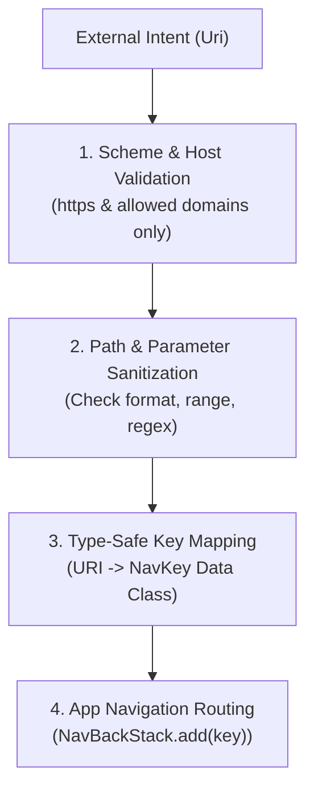

## Deep link 는 외부 URI 계약이다

상위 문서: [Deep Link 계약](deep-link.md)

관련 계약: [External URI는 navigation 전에 검증되어야 한다](external-uri-validation.md)

---

### 개념과 필요성 (What & Why)

1. **개념 (What)**:
   - **Deep Link**는 내부 앱 컴포넌트 간의 정형화된 메세지가 아니라, 외부 네트워크, 타 앱, 웹 브라우저에서 유입되는 **검증되지 않은 외부 URI(`android.net.Uri`) 계약**이다.
2. **필요성 (Why)**:
   - **보안 위협 모델 (Untrusted External Input)**: 딥링크 URI의 Scheme, Host, Path, Query Parameter는 공격자가 임의로 조작할 수 있는 외부 입력이다. 이를 그대로 내부 도메인 객체나 쿼리로 사용하면 SQL Injection, Path Traversal, Open Redirect, 내부 권한 우회 공격에 노출된다.
   - **타입 안전성 보장**: String 기반 URI를 앱 내부의 강타입 내비게이션 상태(`NavKey`)로 명시적으로 변환(Parsing & Validation)해야만 런타임 Crash 및 비정상 상태 전이를 방지할 수 있다.

---

### 입력 검증 파이프라인 (How)



---

### 핵심 구현 코드 예시

```kotlin
object DeepLinkParser {
    private const val ALLOWED_HOST = "example.com"

    fun parse(uri: Uri?): NavKey? {
        if (uri == null) return null
        
        // 1. Scheme 및 Host 검증
        if (uri.scheme != "https" || uri.host != ALLOWED_HOST) {
            return null
        }

        // 2. Path 파싱 및 인자 Sanitization
        val pathSegments = uri.pathSegments
        return when {
            pathSegments.size == 2 && pathSegments[0] == "products" -> {
                val productId = pathSegments[1]
                // 숫자 또는 UUID 정규식 검증
                if (productId.matches(Regex("^[a-zA-Z0-9_-]+$"))) {
                    ProductDetailKey(id = productId)
                } else null
            }
            else -> null
        }
    }
}
```

---

### 관련 상위 및 연관 노트

- 상위 계약: [Deep Link 계약](deep-link.md)
- 연관 계약: [External URI는 navigation 전에 검증되어야 한다](external-uri-validation.md)
