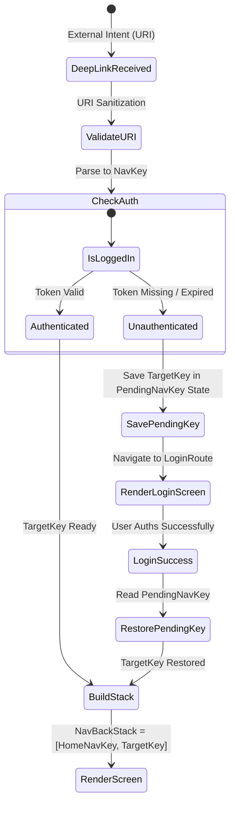

## Authenticated deep link 는 대기 목적지와 back stack 이 필요하다

상위 문서: [Deep Link 계약](deep-link.md)

관련 계약: [External URI는 navigation 전에 검증되어야 한다](external-uri-must-be-validated-before-navigation.md)

---

### 개념과 필요성 (What & Why)

1. **개념 (What)**:
   - **Authenticated Deep Link**는 마이페이지, 주문 내역, 설정 등 **사용자 로그인 인증 상태**가 필수적으로 요구되는 목적지로 진입하는 딥링크다.
2. **필요성 (Why)**:
   - **인증 분기 처리 중 목적지 손실 방지**: 사용자가 미로그인 상태에서 `https://example.com/orders/99` 딥링크를 클릭했을 때, 즉시 로그인 화면으로 리다이렉트되더라도 로그인 성공 후 사용자가 원래 가려고 했던 `orders/99` 화면으로 자동 진입할 수 있도록 **대기 목적지(`Pending NavKey`)**를 보존해야 한다.
   - **뒤로가기 맥락(Synthetic Back Stack) 보존**: 딥링크로 로그인 완료 후 상세 화면에 진입했을 때, Back 버튼을 누르면 앱이 바로 종료되는 것이 아니라 홈/메인 화면(`HomeNavKey`)으로 자연스럽게 이동하는 백스택이 구성되어야 한다.

---

### 인증 라우팅 상태 전이 메커니즘 (How)



---

### 핵심 구현 코드 예시 (Navigation 3)

```kotlin
@Composable
fun AppNavHost(
    initialIntent: Intent?,
    authRepository: AuthRepository
) {
    // 1. Pending Key 보존 상태
    var pendingDestinationKey by rememberSaveable { mutableStateOf<NavKey?>(null) }
    val backStack = rememberNavBackStack(HomeNavKey)

    // 2. 딥링크 수신 처리
    LaunchedEffect(initialIntent) {
        val targetKey = parseDeepLinkToNavKey(initialIntent?.data)
        if (targetKey != null) {
            if (authRepository.isLoggedIn()) {
                // 인증 완료 상태: 메인 백스택 위에 Target Key 추가
                backStack.add(targetKey)
            } else {
                // 미인증 상태: Pending Key로 저장 후 로그인 화면으로 전이
                pendingDestinationKey = targetKey
                backStack.add(LoginNavKey)
            }
        }
    }

    // 3. 로그인 성공 콜백
    fun onLoginSuccess() {
        backStack.remove(LoginNavKey)
        val pending = pendingDestinationKey
        if (pending != null) {
            backStack.add(pending)
            pendingDestinationKey = null
        }
    }
}
```

---

### 구시대 레거시 vs 현대 표준 비교 (Legacy vs Modern)

| 구분 | 구시대 처리 방식 (Legacy) | 현대 Authenticated Navigation 3 (Modern) |
| :--- | :--- | :--- |
| **미로그인 처리** | 미로그인 시 딥링크 거부 후 앱 초기 화면으로 튕김 | `Pending NavKey`에 목적지 저장 후 로그인 화면으로 유연하게 가이드 |
| **로그인 후 이동** | 로그인 후 기존 딥링크 정보 소멸되어 사용자가 수동으로 다시 검색 | 로그인 성공 후 `Pending NavKey`를 pop 및 restore하여 자동 직행 |
| **뒤로가기 백스택** | 딥링크 진입 후 Back 누르면 백스택이 비어있어 앱 강제 종료 | `HomeNavKey`를 바닥에 깔아주는 합성 백스택(Synthetic Back Stack) 구축 |

---

### 판단 및 검증 질문 (Audit Checklist)

- [ ] 미로그인 상태에서 인증 필요 딥링크 클릭 시 로그인 화면으로 이동하는가?
- [ ] 로그인 완료 직후 사용자가 원래 요청했던 딥링크 화면으로 자동 진입하는가?
- [ ] 딥링크 진입 화면에서 뒤로가기를 누르면 메인/홈 화면으로 안정적으로 복귀하는가?

---

### 관련 상위 및 연관 노트

- 상위 계약: [Deep Link 계약](deep-link.md)
- 연관 계약: [External URI는 navigation 전에 검증되어야 한다](external-uri-must-be-validated-before-navigation.md)
