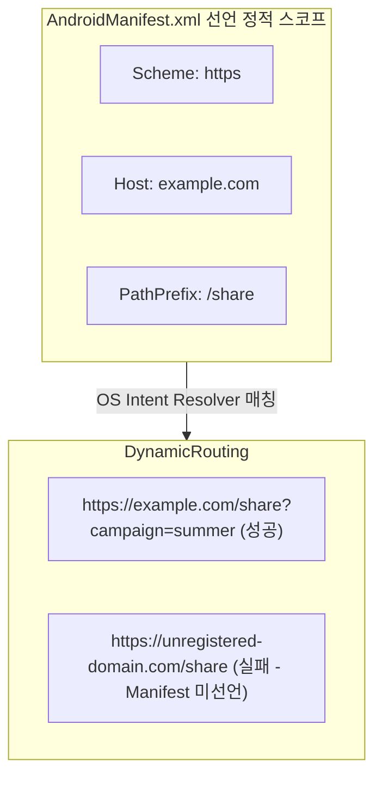

## Dynamic App Link 는 manifest 범위를 세분화할 뿐 확장하지 않는다

상위 문서: [Deep Link 계약](deep-link.md)

관련 계약: [Manifest와 assetlinks는 서로 다른 역할을 가진다](manifest-and-assetlinks-have-distinct-roles.md)

---

### 개념과 필요성 (What & Why)

1. **개념 (What)**:
   - Firebase Dynamic Links나 자체 동적 딥링크 엔진은 `AndroidManifest.xml`에 정적으로 선언된 Intent Filter 범위 내에서 쿼리 파라미터나 서브 경로를 세분화(Refine)하여 라우팅할 수 있지만, Manifest에 선언되지 않은 완전히 새로운 도메인이나 Scheme으로 딥링크 수신 권한을 확장(Expand)할 수 없다는 계약이다.
2. **필요성 (Why)**:
   - **OS Intent Resolver의 진입점 통제**: 안드로이드 OS는 앱이 수신 가능한 도메인과 스키마를 컴파일 시점의 `AndroidManifest.xml` 보고 파악한다. 동적 서버 구성만으로는 OS 레벨의 Intent 매칭 규칙을 우회하거나 새로 생성할 수 없다.

---

### 스코프 제약 구조 (How)

---

### 관련 상위 및 연관 노트

- 상위 계약: [Deep Link 계약](deep-link.md)
- 연관 계약: [Manifest와 assetlinks는 서로 다른 역할을 가진다](manifest-and-assetlinks-have-distinct-roles.md)
