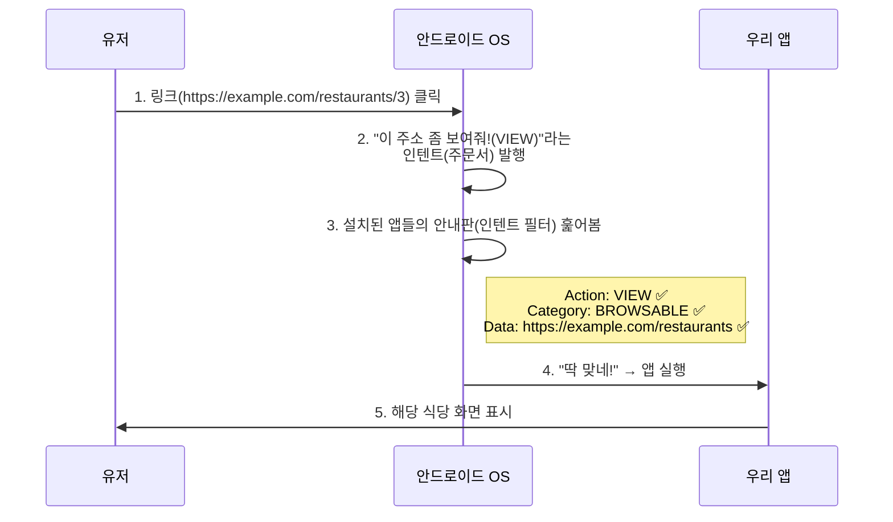

# 동작 흐름 총정리 (딥 링크 시나리오)

유저가 인터넷에서 `https://example.com/restaurants/3`이라는 링크를 클릭하면 아래의 과정이 진행됩니다:

> [!TIP]
> 이 매커니즘은 인텐트 필터를 등록하는 `AndroidManifest.xml`의 구조와 밀접하게 연결됩니다. 매니페스트 구조에 대한 상세 내용은 [[android-manifest]]를 참조하세요.
