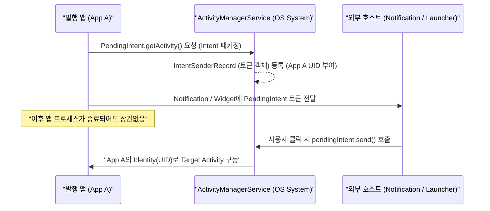

## PendingIntent는 위임된 미래 intent 토큰이다

### 1. 개념 및 비유로 이해하는 개념 (What & Analogy)

- **위임된 미래 Intent 토큰 정의**:
  `PendingIntent`는 안드로이드 OS의 알림(Notification), 위젯(AppWidget), 알람 매니저(AlarmManager) 등 외부 프로세스나 시스템 서비스에게 **발행 앱의 권한(UID 및 Identity)으로 미래 시점에 내부 Intent를 대신 실행할 수 있도록 위임하는 권한 부여 토큰(Token)**이다.

- **쉬운 비유로 이해하기**:
  - **직접 Intent 실행**: 사장이 직접 자기 도장을 찍고 문을 열어 업무를 처리하는 방식이다.
  - **PendingIntent (대리인 위임장 / Delegation Token)**: 사장이 비서나 외주 기사에게 자신의 서명이 찍힌 **공식 위임장**을 건네주는 것과 같다. 전달받은 대리인(알림 서비스/런처)은 발행 앱의 내부 사정을 몰라도, 미래 특정 시점(알림 클릭 시)에 그 위임장을 OS에 제출하여 사장(발행 앱)의 권한으로 지정된 업무를 대신 구동시킨다.

---

### 2. 왜 PendingIntent를 사용하는가? (Why)

1. **타 프로세스의 권한 부족 한계 극복**:
   - 외부 프로세스(예: 홈 화면 런처, NotificationManager)는 보안 샌드박스 정책상 제3자 앱의 비공개(exported=false) Activity나 Service를 직접 실행할 권한이 없다.
   - `PendingIntent`를 전송받으면 토큰 발행 앱의 UID 및 신원을 그대로 위임받아 타 프로세스에서도 안전하게 원본 앱의 화면을 열 수 있다.
2. **프로세스 생명주기 독립성 확보**:
   - 알림이나 알람을 등록한 후 발행 앱 프로세스가 메모리 부족으로 종료되더라도, OS 시스템 서비스(`ActivityManagerService`)에 `PendingIntent` 토큰 레코드가 영속화되어 있어 유저가 알림을 누르면 앱을 다시 깨워 정상 구동한다.

---

### 3. 내부 메커니즘 (How)

#### PendingIntent 생성 및 위임 실행 흐름



#### 주요 생성 팩토리 메서드

- `PendingIntent.getActivity()`: 미래 시점에 Activity를 실행한다.
- `PendingIntent.getBroadcast()`: 미래 시점에 BroadcastReceiver로 이벤트를 발송한다.
- `PendingIntent.getService()` / `getForegroundService()`: 미래 시점에 백그라운드/포그라운드 서비스를 시작한다.

> [!NOTE]
> `PendingIntent` 생성 시 지정해야 하는 보안 플래그(`FLAG_IMMUTABLE` vs `FLAG_MUTABLE`)의 세부 동작 및 보안 비교는 [FLAG_IMMUTABLE vs FLAG_MUTABLE 보안 비교](../pendingintent-immutable-vs-mutable.md) 문서에서 다룬다.

---

### 4. 코드 예시 (Code Example)

#### Notification 알림 연동 예시

```kotlin
// 1. 미래에 실행할 Intent 정의
val intent = Intent(context, DetailActivity::class.java).apply {
    flags = Intent.FLAG_ACTIVITY_NEW_TASK or Intent.FLAG_ACTIVITY_CLEAR_TOP
    putExtra("NOTIFICATION_ID", 101)
}

// 2. 권한 위임 토큰(PendingIntent) 패키징 (FLAG_IMMUTABLE 사용)
val pendingIntent = PendingIntent.getActivity(
    context,
    0,
    intent,
    PendingIntent.FLAG_UPDATE_CURRENT or PendingIntent.FLAG_IMMUTABLE
)

// 3. Notification에 토큰 바인딩 및 시스템 발송
val notification = NotificationCompat.Builder(context, "CHANNEL_ID")
    .setSmallIcon(R.drawable.ic_notification)
    .setContentTitle("주문 배송 시작")
    .setContentText("터치하여 배송 경로를 확인하세요.")
    .setContentIntent(pendingIntent) // 클릭 시 AMS를 통해 실행 위임
    .setAutoCancel(true)
    .build()

NotificationManagerCompat.from(context).notify(101, notification)
```

---

### 5. 관측 가능 증거 및 진단 (Observability)

- **OS 시스템 서비스(AMS)에 등록된 PendingIntent 토큰 확인**:
  ```bash
  adb shell dumpsys activity intents
  ```
  *(출력 항목 중 `PendingIntent Record` 섹션에서 발행 앱의 패키지명, Target Activity, Intent Action 및 Flags 확인 가능)*

---

### 6. 관련 문서 및 참조

- 상위 계약 문서: [Intent & Manifest 계약](./intent-manifest-contracts.md)
- 연관 atomic 보안 문서: [PendingIntent FLAG_IMMUTABLE vs FLAG_MUTABLE 보안 비교](../pendingintent-immutable-vs-mutable.md)
- 연관 딥링크 계약 문서: [Notification deep link는 명시적 task와 back stack 정책이 필요하다](../deep-link-contracts/notification-deep-link-needs-explicit-task-and-back-stack-policy.md)
- 상위 개요 문서: [Android Intent와 IPC 커뮤니케이션](../android-intent-and-ipc.md)
- 공식 문서: [PendingIntent API Reference](https://developer.android.com/reference/android/app/PendingIntent)

검증일: 2026-08-06. PendingIntent 위임 토큰 메커니즘 및 5단계 초보자친화 구조 적용 검증 완료.
