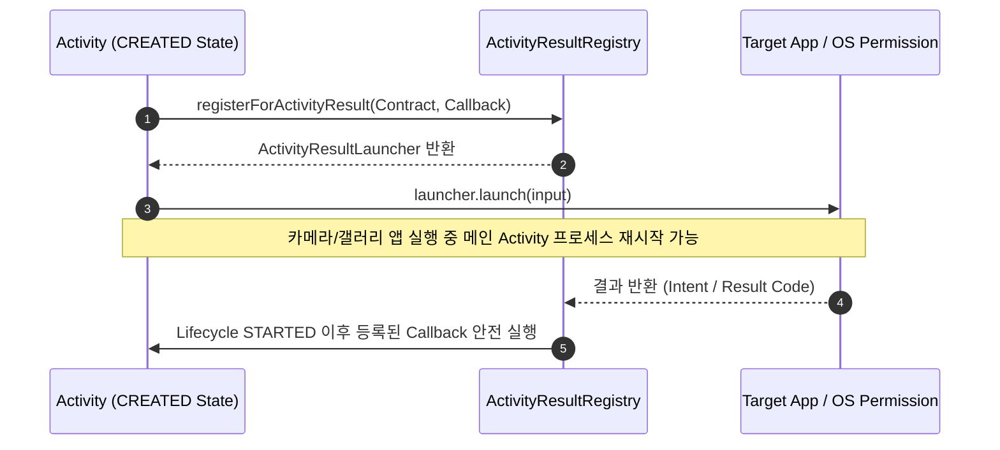

## Activity Result API 는 수명주기를 인식하는 결과 계약을 정의한다

상위 문서: [Intent & Manifest 계약](intent-manifest.md)

---

### 개념과 필요성 (What & Why)

1. **개념 (What)**:
   - **Activity Result API**는 다른 Activity나 외부 앱(카메라, 갤러리, 권한 요청 등)으로부터 결과 데이터를 수신할 때, 호출하는 컴포넌트의 **LifecycleObserver** 상태와 완벽히 동기화되어 타입 안전한 계약(`ActivityResultContract`)으로 결과를 전달받는 안드로이드 표준 API다.
2. **필요성 (Why)**:
   - **프로세스 재시작 시 상태 파기 방지**: 구시대 `startActivityForResult()` 방식은 카메라 앱 실행 중 메모리 부족으로 메인 Activity 프로세스가 재생성(Recreation)되면, `requestCode` 매칭이 꼬이거나 결과를 처리하는 콜백 객체가 널(Null)이 되어 앱이 구동 불능 상태에 빠졌다. Activity Result API는 `CREATED` 단계에서 콜백을 등록하여 프로세스 재시작 시에도 결과를 안전하게 복원 수신한다.

---

### 내부 동작 메커니즘 (How)



---

### 핵심 구현 코드 예시

```kotlin
class ProfileActivity : ComponentActivity() {
    // Lifecycle CREATED 단계에서 강타입 Launcher 등록
    private val getContentLauncher = registerForActivityResult(
        ActivityResultContracts.GetContent()
    ) { uri: Uri? ->
        // 타입 안전하게 Uri 수신
        uri?.let { updateProfileImage(it) }
    }

    fun onPickImageClick() {
        getContentLauncher.launch("image/*")
    }
}
```

---

### 구시대 레거시 vs 현대 표준 비교 (Legacy vs Modern)

| 구분 | 레거시 `onActivityResult` (Legacy) | 현대 Activity Result API (Modern) |
| :--- | :--- | :--- |
| **타입 안전성** | `Int requestCode`, `Int resultCode`, `Intent? data` 수동 캐스팅 | `ActivityResultContract<I, O>` 타입 안전 인자/결과 규정 |
| **프로세스 재생성** | Activity 재시작 시 콜백 컨텍스트 손실 및 널 예외 발생 | Lifecycle `STARTED` 전 등록을 강제하여 재시작 시에도 안전 복원 |
| **결과 분기 위치** | 단일 `onActivityResult()` 메서드 안에서 거대한 `switch(requestCode)` 작성 | 기능별로 분리된 독립 `ActivityResultLauncher` 콜백 관리 |

---

### 관련 상위 및 연관 노트

- 상위 계약: [Intent & Manifest 계약](intent-manifest.md)
- 연관 계약: [Explicit intent는 알려진 컴포넌트를 지정하고 implicit intent는 요구 능력을 선언한다](explicit-intent-targets-known-component-implicit-intent-declares-capability.md)
