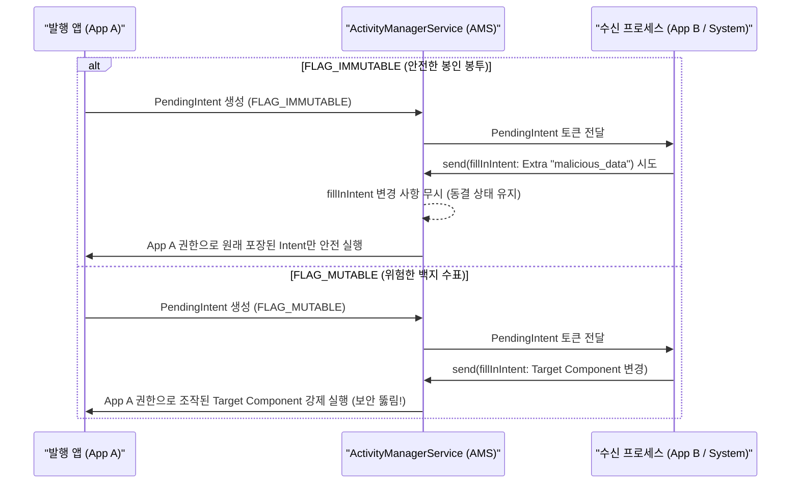

## PendingIntent FLAG_IMMUTABLE vs FLAG_MUTABLE 보안 비교

### 1. 개념 및 비유로 이해하는 개념 (What & Analogy)

- **FLAG_IMMUTABLE vs FLAG_MUTABLE 보안 정의**:
  - **`FLAG_IMMUTABLE`**: 외부 프로세스(시스템 서비스 또는 다른 앱)가 `PendingIntent` 내부에 캡슐화된 `Intent` 파라미터 및 Extra 데이터를 임의로 변경할 수 없도록 **원천 동결하는 현대 안드로이드 필수 보안 플래그**다.
  - **`FLAG_MUTABLE`**: 외부 프로세스가 `PendingIntent.send(context, code, fillInIntent)`를 호출할 때 추가적인 Intent 데이터(답장 텍스트, 위치 정보 등)를 덧붙이거나 수정할 수 있도록 허용하는 플래그다.

- **보안 비유로 이해하기**:
  - **FLAG_IMMUTABLE (서명된 봉인 봉투 / Signed Sealed Envelope)**: 내용물(Intent)과 수취인을 완벽히 작성한 뒤 풀로 봉인하고 사장 서명을 찍은 **봉인 봉투**다. 수신자는 이 봉투를 열어 실행시킬 수만 있을 뿐, 내부의 명령이나 파라미터를 임의로 수정하는 것이 불가능하다.
  - **FLAG_MUTABLE (백지 수표 / Blank Check)**: 사장의 서명은 찍혀 있으나 금액이나 수취인이 비어 있는 **백지 수표**와 같다. 수신받은 타 앱이 수표에 임의의 금액이나 대상(Intent Extra / Component)을 기재하여 발행 앱의 권한으로 의도치 않은 비공개 컴포넌트를 구동시킬 위험(Intent Redirection Attack)이 존재한다.

---

### 2. 왜 FLAG_IMMUTABLE이 기본 표준인가? (Why)

1. **권한 상승 및 Intent 탈취 공격 방지 (Privilege Escalation & Intent Redirection)**:
   - `PendingIntent`는 발행 앱의 신원(UID 및 권한)으로 실행된다.
   - 만약 `FLAG_MUTABLE`로 설정되어 있고 내부 Intent가 암시적(Implicit)이거나 필터가 느슨한 경우, 악의적인 외부 앱이 `fillInIntent`를 통해 Intent의 Target Component나 Action, Extra 데이터를 조작하여 발행 앱의 비공개 Activity나 Provider를 강제로 구동하거나 비공개 데이터를 유출할 수 있다.
2. **Android 12 (API Level 31+) 필수 보안 명세**:
   - Google은 Android 12부터 앱이 생성하는 모든 `PendingIntent`에 `FLAG_IMMUTABLE` 또는 `FLAG_MUTABLE` 중 하나를 명시하도록 강제하였다. 명시하지 않을 경우 런타임 예외가 발생하여 앱이 즉시 종료된다.

---

### 3. 내부 메커니즘 및 보안 동작 구조 (How)

#### 수신 프로세스의 Intent Modification 비교



#### FLAG_IMMUTABLE vs FLAG_MUTABLE 비교표

| 항목 | FLAG_IMMUTABLE (기본 권장 표준) | FLAG_MUTABLE (제한적 예외 허용) |
| :--- | :--- | :--- |
| **Intent 데이터 변형 여부** | 불가능 (수신 측의 Intent 수정 무시) | 가능 (수신 측이 `fillInIntent`로 데이터 주입 가능) |
| **보안 안전성** | **높음** (Intent Redirection 공격 원천 차단) | **주의 필요** (권한 상승 취약점 위험 존재) |
| **권장 유스케이스** | 알림 클릭 시 화면 이동, 단순 알람 구동, 일반 위젯 클릭 | 알림 원격 답장(Direct Reply / `RemoteInput`), Inline Action |
| **Android 12+ 규격** | 기본 지정 필수 (특별한 이유 없으면 최우선 사용) | `RemoteInput` 연동 시만 명시적 사용 |

---

### 4. 실무 안전 코드 예시 (Code Example)

#### 1) 표준 및 권장: FLAG_IMMUTABLE 사용 패턴

```kotlin
val intent = Intent(context, DetailActivity::class.java).apply {
    putExtra("ITEM_ID", 1004L)
}

// Android 12 (API 31) 이상 대응을 위한 FLAG_IMMUTABLE 명시
val pendingIntent = PendingIntent.getActivity(
    context,
    0,
    intent,
    PendingIntent.FLAG_UPDATE_CURRENT or PendingIntent.FLAG_IMMUTABLE
)
```

#### 2) 예외적 유스케이스: 알림 Direct Reply (RemoteInput)에 FLAG_MUTABLE 사용

```kotlin
// 외부 프로세스(알림창 UI)에서 사용자가 입력한 답장 텍스트를 fillInIntent로 주입받아야 하므로 FLAG_MUTABLE 필수
val replyIntent = Intent(context, ReplyBroadcastReceiver::class.java)

val mutablePendingIntent = PendingIntent.getBroadcast(
    context,
    0,
    replyIntent,
    PendingIntent.FLAG_UPDATE_CURRENT or PendingIntent.FLAG_MUTABLE
)

// RemoteInput 바인딩
val remoteInput = RemoteInput.Builder("KEY_TEXT_REPLY")
    .setLabel("답장 내용을 입력하세요")
    .build()

val action = NotificationCompat.Action.Builder(
    R.drawable.ic_reply,
    "답장",
    mutablePendingIntent
).addRemoteInput(remoteInput).build()
```

---

### 5. 관측 가능 증거 및 보안 진단 (Observability)

- **Android 12+ 플래그 미지정 시 런타임 Crash 진단**:
  플래그에 `FLAG_IMMUTABLE` 또는 `FLAG_MUTABLE`을 지정하지 않으면 다음 예외 발생 후 앱 강제 종료:
  ```text
  java.lang.IllegalArgumentException: <package>: Targeting S+ (version 31 and above) requires that one of FLAG_IMMUTABLE or FLAG_MUTABLE be specified when creating a PendingIntent.
  ```

- **Android Studio Lint 보안 경고 확인**:
  ```text
  MissingPendingIntentFlags: Missing PendingIntent mutability flag
  ```

- **시스템에 등록된 PendingIntent 보안 상태 확인 명령**:
  ```bash
  adb shell dumpsys activity intents
  ```
  *(각 PendingIntent 토큰의 `flags=0x...` 값을 통해 IMMUTABLE 여부 검증 가능)*

---

### 6. 관련 문서 및 참조

- 상위 계약 문서: [Intent & Manifest 계약](./intent-manifest-contracts/intent-manifest-contracts.md)
- 연관 atomic 계약 문서:
  - [PendingIntent는 위임된 미래 intent 토큰이다](./intent-manifest-contracts/pendingintent-is-delegated-future-intent-token.md)
  - [Notification deep link는 명시적 task와 back stack 정책이 필요하다](./deep-link-contracts/notification-deep-link-needs-explicit-task-and-back-stack-policy.md)
- 상위 개요 문서: [Android Intent와 IPC 커뮤니케이션](./android-intent-and-ipc.md)

검증일: 2026-08-06. Android 12+ PendingIntent immutability 보안 규격 검증 완료.
