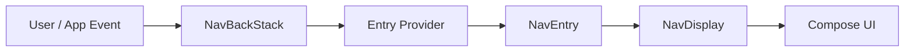

# Jetpack Navigation 3 가이드

이 문서는 Jetpack Compose 환경에서 Navigation 3를 사용하는 방법을 정리합니다. 핵심은 **화면 이동을 라이브러리 내부 상태가 아니라 앱이 소유한 `NavKey` back stack 상태로 표현한다**는 점입니다.

---

## 1. 핵심 모델

Navigation 3의 데이터 흐름은 단순합니다.



| 구성 요소 | 역할 |
|:---|:---|
| `NavKey` | 화면의 정체성과 인자를 담는 route key |
| `NavBackStack<T>` | 현재 이동 이력을 담는 앱 소유 상태 |
| `entryProvider` | `NavKey`를 `NavEntry`와 화면 content로 변환 |
| `NavEntry` | key, content, metadata를 묶은 destination 단위 |
| `NavDisplay` | back stack을 관찰해 실제 Compose 화면을 렌더링 |
| `Scene` | 하나 이상의 `NavEntry`를 표시하는 visual state |
| `SceneStrategy` | 현재 entries를 어떤 `Scene`으로 배치할지 결정 |
| `NavEntryDecorator` | entry별 state, ViewModelStore, 공통 wrapper를 제공 |
| `SceneDecoratorStrategy` | 계산된 scene을 top app bar, navigation chrome 등으로 감쌈 |

Navigation 3에서는 화면 이동이 결국 list 조작입니다.

```kotlin
backStack.add(ProductDetailRoute(id = "123")) // forward
backStack.removeLastOrNull()                  // back
```

---

## 2. 의존성

이 프로젝트 기준 버전:

| 목적 | Artifact | 프로젝트 버전 |
|:---|:---|:---|
| Navigation 3 runtime | `androidx.navigation3:navigation3-runtime` | `1.1.4` |
| Navigation 3 UI | `androidx.navigation3:navigation3-ui` | `1.1.4` |
| entry별 ViewModel scope | `androidx.lifecycle:lifecycle-viewmodel-navigation3` | `2.11.0` |
| Material adaptive scene integration | `androidx.compose.material3.adaptive:adaptive-navigation3` | `1.3.0-rc01` |
| serializable key | `org.jetbrains.kotlinx:kotlinx-serialization-core` | `1.11.0` |

`rememberNavBackStack()`을 쓰려면 route key가 `NavKey`를 구현하고 `@Serializable`이어야 합니다.

```kotlin
@Serializable
data object DashboardRoute : NavKey

@Serializable
data class TrainingDetailRoute(
    val trainingId: String,
) : NavKey
```

---

## 3. Route Key 설계

Navigation 3의 route는 문자열 주소가 아니라 Kotlin 타입입니다. 이 프로젝트에서는 marker interface로 route의 의미를 구분하는 편이 좋습니다.

```kotlin
interface AuthRoute : NavKey
interface MainFeatureTopLevelRoute : NavKey

@Serializable
data object SignInRoute : AuthRoute

@Serializable
data object DashboardRoute : MainFeatureTopLevelRoute

@Serializable
data object TrainingRoute : MainFeatureTopLevelRoute

@Serializable
data class TrainingDetailRoute(
    val id: String,
) : NavKey
```

권장 기준:

- route key에는 화면을 복원하는 데 필요한 최소 식별자만 둡니다.
- 큰 객체, repository 객체, callback은 key에 넣지 않습니다.
- 로그인 필요 여부는 marker가 아니라 정책 함수로 시작해도 충분합니다.
- top-level destination 여부는 별도 marker로 분리합니다.

```kotlin
fun requiresSignedIn(route: NavKey): Boolean {
    return route !is AuthRoute
}
```

---

## 4. Back Stack 관리

가장 단순한 형태는 시작 route 하나로 `rememberNavBackStack()`을 만드는 방식입니다.

```kotlin
val backStack = rememberNavBackStack(DashboardRoute)

NavDisplay(
    backStack = backStack,
    onBack = { backStack.removeLastOrNull() },
    entryProvider = appEntryProvider(backStack),
)
```

자주 쓰는 조작은 helper로 감싸는 편이 안전합니다.

```kotlin
fun NavBackStack<NavKey>.replaceAll(route: NavKey) {
    clear()
    add(route)
}

fun NavBackStack<NavKey>.replaceTopLevel(route: MainFeatureTopLevelRoute) {
    clear()
    add(route)
}

fun NavBackStack<NavKey>.openTrainingDetail(id: String) {
    removeIf { it is TrainingDetailRoute }
    add(TrainingDetailRoute(id))
}
```

로그인 후 main 영역은 top-level destination별 back stack을 따로 유지하는 편이 좋습니다. 탭을 바꿀 때 stack을 매번 지우면 각 탭의 detail state가 사라집니다.

```text
Dashboard stack:
DashboardRoute

Training stack:
TrainingRoute -> TrainingDetailRoute(id)

Settings stack:
SettingsRoute -> AccountSettingsRoute
```

---

## 5. Entry Provider

`entryProvider`는 route key를 실제 화면으로 바꾸는 registry입니다. feature module 경계를 유지하려면 각 feature가 자기 route entry를 제공하고 app layer에서 합치는 구조가 적합합니다.

```kotlin
fun appEntryProvider(
    backStack: NavBackStack<NavKey>,
) = entryProvider {
    entry<DashboardRoute> {
        DashboardScreen()
    }

    entry<TrainingRoute>(
        metadata = ListDetailSceneStrategy.listPane()
    ) {
        TrainingListScreen(
            onTrainingClick = { id -> backStack.openTrainingDetail(id) },
        )
    }

    entry<TrainingDetailRoute>(
        metadata = ListDetailSceneStrategy.detailPane()
    ) { route ->
        TrainingDetailScreen(trainingId = route.id)
    }
}
```

실무 기준:

- route key 타입과 screen 함수 인자를 일대일로 맞춥니다.
- navigation callback은 screen 내부에서 직접 stack을 만지기보다 route-level composable이 주입합니다.
- metadata는 화면 content가 아니라 container가 화면을 어떻게 다룰지 알려주는 정보로 사용합니다.

---

## 6. NavDisplay 기본형

앱에서 가장 흔한 `NavDisplay` 구성은 back stack, back 처리, entry decorators, entry provider를 함께 선언하는 형태입니다.

```kotlin
NavDisplay(
    backStack = backStack,
    onBack = { backStack.removeLastOrNull() },
    entryDecorators = listOf(
        rememberSaveableStateHolderNavEntryDecorator(),
        rememberViewModelStoreNavEntryDecorator(),
    ),
    entryProvider = appEntryProvider(backStack),
)
```

`entryDecorators` 기준:

- `rememberSaveableStateHolderNavEntryDecorator()`는 `rememberSaveable` 상태를 entry별로 보존합니다.
- `rememberViewModelStoreNavEntryDecorator()`는 entry별 `ViewModelStoreOwner`를 제공합니다.
- custom decorator는 logging, tracing, shared dependency scope처럼 모든 entry에 공통 적용할 일이 있을 때만 추가합니다.
- saveable state decorator는 특별한 이유가 없으면 첫 번째에 둡니다.

---

## 7. ViewModel과 State

Navigation 3에서 ViewModel scope는 `NavEntry` 단위로 잡는 것이 기본적으로 가장 예측 가능합니다. 화면이 back stack에서 제거되면 해당 entry의 ViewModel도 정리됩니다.

이 섹션은 Navigation과 ViewModel scope의 연결만 다룹니다. 수명별 state/effect owner 선택은 [[jetpack-compose-state-lifetime-api-selection]]를, ViewModel이 `UiState`, user action, 일회성 이벤트, Reducer를 어떻게 다룰지는 [[viewmodel-ui-state-reducer]]를 참조하세요.

```kotlin
NavDisplay(
    backStack = backStack,
    entryDecorators = listOf(
        rememberSaveableStateHolderNavEntryDecorator(),
        rememberViewModelStoreNavEntryDecorator(),
    ),
    entryProvider = entryProvider {
        entry<TrainingDetailRoute> { route ->
            val viewModel = viewModel<TrainingDetailViewModel>()
            TrainingDetailScreen(
                trainingId = route.id,
                state = viewModel.state,
            )
        }
    },
)
```

인자 전달 원칙:

- screen 복원에 필요한 값은 `NavKey`에 둡니다.
- ViewModel은 `NavKey`에서 받은 id로 repository 데이터를 조회합니다.
- 여러 화면이 공유해야 하는 상태는 parent composable 또는 명시적인 shared ViewModel scope를 둡니다.

---

## 8. Metadata

metadata는 `NavEntry`, `Scene`, `NavDisplay`, `SceneStrategy` 사이에서 화면 표시 정책을 전달하는 typed map입니다.

```kotlin
entry<FilterRoute>(
    metadata = DialogSceneStrategy.dialog(
        DialogProperties(windowTitle = "Filter")
    ) + metadata {
        put(NavDisplay.TransitionKey) {
            fadeIn() togetherWith fadeOut()
        }
    }
) {
    FilterScreen()
}
```

직접 metadata key를 만들 때는 값을 읽는 컴포넌트 안에 nested object로 둡니다.

```kotlin
class RequiresChromeSceneDecorator<T : Any> : SceneDecoratorStrategy<T> {
    object ChromeKey : NavMetadataKey<Boolean>

    override fun SceneDecoratorStrategyScope<T>.decorateScene(
        scene: Scene<T>,
    ): Scene<T> {
        return if (scene.metadata[ChromeKey] == false) {
            scene
        } else {
            ChromeScene(scene)
        }
    }
}
```

metadata 사용처:

- 화면별 transition override
- dialog, list pane, detail pane 같은 scene strategy hint
- scene decorator가 top app bar, bottom navigation, chrome 표시 여부를 판단하는 hint

자세한 Kotlin 문법과 metadata DSL은 [[navigation-3-metadata-kotlin-syntax]]를 함께 봅니다.

---

## 9. Scene과 기본 제공 Strategy

`Scene`은 하나 이상의 `NavEntry`를 표시하는 단위입니다. `NavDisplay`는 `sceneStrategies`를 순서대로 평가하고, 어떤 strategy도 scene을 만들지 못하면 single-pane scene으로 fallback합니다.

| Strategy | Artifact | 역할 | 사용 방식 |
|:---|:---|:---|:---|
| `SinglePaneSceneStrategy` | `androidx.navigation3:navigation3-ui` | 마지막 `NavEntry` 하나만 표시하는 기본 single-pane scene | 보통 직접 넣지 않아도 `NavDisplay`가 fallback으로 사용 |
| `DialogSceneStrategy` | `androidx.navigation3:navigation3-ui` | metadata가 붙은 destination을 dialog overlay scene으로 표시 | `sceneStrategies = listOf(DialogSceneStrategy())`, entry metadata에 `DialogSceneStrategy.dialog(...)` 지정 |
| `ListDetailSceneStrategy` | `androidx.compose.material3.adaptive:adaptive-navigation3` | list/detail/extra pane을 화면 폭과 device state에 맞춰 1~3 pane으로 표시 | `rememberListDetailSceneStrategy()`, metadata에 `listPane()`, `detailPane()`, `extraPane()` 지정 |
| `SupportingPaneSceneStrategy` | `androidx.compose.material3.adaptive:adaptive-navigation3` | main pane 옆에 supporting/extra pane을 adaptive하게 표시 | `rememberSupportingPaneSceneStrategy()`, metadata에 `mainPane()`, `supportingPane()`, `extraPane()` 지정 |

예시:

```kotlin
val dialogStrategy = remember { DialogSceneStrategy<NavKey>() }
val listDetailStrategy = rememberListDetailSceneStrategy<NavKey>()

NavDisplay(
    backStack = backStack,
    onBack = { backStack.removeLastOrNull() },
    sceneStrategies = listOf(
        dialogStrategy,
        listDetailStrategy,
    ),
    entryProvider = appEntryProvider(backStack),
)
```

판단 기준:

- 단순 push/pop 화면이면 custom scene이 필요 없습니다.
- dialog route가 있으면 `DialogSceneStrategy`를 추가합니다.
- list-detail, supporting pane은 직접 layout을 만들기 전에 Material adaptive strategy를 먼저 검토합니다.
- 공식 recipe의 `TwoPaneSceneStrategy`, `BottomSheetSceneStrategy`는 custom strategy 예시입니다. 현재 프로젝트 artifact의 기본 제공 class로 취급하지 않습니다.
- overlay 성격 strategy는 일반 multi-pane strategy보다 앞쪽에 두는 편이 안전합니다.

---

## 10. Scene Decorator

`SceneStrategy`가 "어떤 scene을 만들지" 결정한다면, `SceneDecoratorStrategy`는 "계산된 scene을 어떤 공통 UI로 감쌀지" 결정합니다.

사용 예:

- top-level destination에 top app bar 추가
- compact/expanded 조건에 따라 navigation chrome 추가
- 특정 route에서는 app chrome 숨김
- scene class와 key를 유지하면서 공통 wrapper 적용

```kotlin
NavDisplay(
    backStack = backStack,
    sceneDecoratorStrategies = listOf(
        remember { AppChromeSceneDecorator() },
    ),
    entryProvider = appEntryProvider(backStack),
)
```

주의할 점:

- `OverlayScene`은 별도 window에 렌더링되므로 `NavDisplay`가 decorate하지 않습니다.
- decorator가 scene key를 단순 복사하면 scene class 변화에 따른 animation이 막힐 수 있습니다.
- 첫 decorator에서 `scene::class to scene.key`처럼 원본 scene 정보를 반영한 key를 만드는 패턴이 안전합니다.

---

## 11. Animation

`NavDisplay`는 scene class와 `Scene.key`에서 파생된 key가 바뀔 때 transition을 실행합니다.

전역 animation:

```kotlin
NavDisplay(
    backStack = backStack,
    transitionSpec = {
        slideInHorizontally { it } togetherWith slideOutHorizontally { -it }
    },
    popTransitionSpec = {
        slideInHorizontally { -it } togetherWith slideOutHorizontally { it }
    },
    predictivePopTransitionSpec = {
        slideInHorizontally { -it } togetherWith slideOutHorizontally { it }
    },
    entryProvider = appEntryProvider(backStack),
)
```

화면별 animation은 metadata로 override합니다.

```kotlin
entry<TrainingDetailRoute>(
    metadata = metadata {
        put(NavDisplay.TransitionKey) {
            fadeIn() togetherWith fadeOut()
        }
    }
) { route ->
    TrainingDetailScreen(trainingId = route.id)
}
```

custom scene 사이에서 같은 entry가 다른 scene으로 이동하는 경우에는 `SharedTransitionLayout`으로 `NavDisplay`를 감싸고 `sharedTransitionScope`를 넘기는 방식을 검토합니다.

---

## 12. Deep Link

Navigation 3에서는 deep link도 최종적으로 `NavKey`로 변환해야 합니다. Android OS가 앱을 여는 입구는 여전히 `Activity`이므로, `MainActivity`가 `intent.data`를 받고 app layer가 이를 route key로 파싱합니다.

```kotlin
fun Uri.toNavKeyOrNull(): NavKey? {
    return when {
        scheme == "https" &&
            host == "example.com" &&
            pathSegments.firstOrNull() == "training" -> {
            TrainingDetailRoute(id = pathSegments.getOrNull(1) ?: return null)
        }

        else -> null
    }
}
```

초기 진입:

```kotlin
val startRoute = intent?.data?.toNavKeyOrNull() ?: DashboardRoute

setContent {
    val backStack = rememberNavBackStack(startRoute)
    MyBenefitApp(backStack = backStack)
}
```

실무에서는 session 상태를 함께 고려합니다.

```text
Signed in deep link:
TrainingDetailRoute(id)
 -> selectedDestination = Training
 -> trainingBackStack = [TrainingRoute, TrainingDetailRoute(id)]

Signed out deep link:
TrainingDetailRoute(id)
 -> pendingRoute = TrainingDetailRoute(id)
 -> authBackStack = [SignInRoute]
 -> 로그인 성공 후 pendingRoute 적용
```

Deep link 설계 기준:

- URL parsing은 app layer에 둡니다.
- feature module은 자신이 받을 `NavKey`와 화면을 제공하고, 외부 URL 스키마는 몰라도 되게 합니다.
- path/query argument는 `NavKey` 생성 시 타입 변환을 끝냅니다.
- 잘못된 URL은 fallback route 또는 error route로 명시적으로 보냅니다.
- synthetic back stack은 자동으로 생기지 않습니다. 앱이 원하는 `[root, detail]` stack을 직접 만듭니다.

Manifest, intent filter, Android App Links 자체는 [[intent-and-deep-link]]를 참조합니다.

---

## 13. 이 프로젝트 권장 구조

로그인 전/후 흐름을 분리하고, 로그인 후에는 top-level destination별 back stack을 유지합니다.

```text
MainActivity
 -> MyBenefitApp
     -> session loading: SplashScreen API 유지
     -> signed out: AuthFlow
     -> signed in: MainScaffold
```

```text
AuthFlow
 └─ NavDisplay
     ├─ SignInRoute
     ├─ SignUpRoute
     ├─ IdRecoveryRoute
     └─ PasswordRecoveryRoute
```

```text
MainScaffold
 ├─ NavigationSuiteScaffold
 │   ├─ compact: navigation bar
 │   └─ expanded: navigation rail / drawer
 └─ selected top-level destination NavDisplay
```

권장 적용 순서:

1. route key를 `AuthRoute`, `MainFeatureTopLevelRoute`, 일반 `NavKey`로 정리합니다.
2. `MyBenefitApp`에서 session 상태에 따라 auth/main flow를 선택합니다.
3. `MainScaffold`에서 `NavigationSuiteScaffold`를 적용합니다.
4. top-level destination별 `NavBackStack`을 유지합니다.
5. feature별 `entryProvider`를 app layer에서 조립합니다.
6. `rememberSaveableStateHolderNavEntryDecorator()`와 `rememberViewModelStoreNavEntryDecorator()`를 기본으로 넣습니다.
7. Training/Measure처럼 list-detail이 생기는 feature부터 `ListDetailSceneStrategy`를 도입합니다.
8. deep link parser를 app layer에 만들고 session gate/pending route 처리를 붙입니다.

더 구체적인 프로젝트 적용 판단은 [[adaptive-layout-navigation-project-strategy]]를 참조합니다.

---

## 14. Android Task와 App Back Stack

Navigation 3의 `NavBackStack`은 앱 내부 Compose 화면 이동 상태입니다. Android OS의 `Task`는 Activity 단위 실행 이력입니다. 둘은 이름이 비슷하지만 책임이 다릅니다.

| 항목 | 책임 |
|:---|:---|
| Android `Activity` | OS가 실행하고 intent를 전달하는 앱 창 |
| Android `Task` | 최근 앱 화면에 보이는 Activity 실행 이력 |
| Navigation 3 `NavBackStack` | Compose 화면 key의 앱 내부 이동 이력 |

Single Activity 구조에서는 외부 intent를 `MainActivity`가 받고, 이후 화면 분기는 Navigation 3 back stack 조작으로 처리합니다.

본인인증, 결제 인증처럼 외부 앱 Activity가 끼어드는 흐름에서는 Android Task 동작도 UX에 영향을 줍니다. 하지만 앱 내부 화면 이동은 여전히 `NavBackStack`을 기준으로 복원하고 검증해야 합니다.

---

## 15. 체크리스트

- route key가 `@Serializable` + `NavKey`인지 확인합니다.
- route key에 큰 객체나 callback을 넣지 않습니다.
- screen별 required argument는 key에 명시합니다.
- stack 조작은 helper로 감싸 중복 detail push를 막습니다.
- top-level destination별 stack 보존 여부를 먼저 결정합니다.
- `entryDecorators`에 saveable state와 ViewModel store decorator를 넣습니다.
- scene strategy는 필요한 feature에만 추가합니다.
- metadata는 container 정책 전달에만 사용합니다.
- deep link는 URL에서 `NavKey`로 변환한 뒤 stack을 직접 구성합니다.
- app chrome은 screen 안에 흩뿌리지 말고 scaffold 또는 scene decorator에서 처리합니다.

---

## 관련 문서

- [[navigation-3-metadata-kotlin-syntax]]
- [[adaptive-layout-and-navigation]]
- [[adaptive-layout-navigation-project-strategy]]
- [[jetpack-compose-state-lifetime-api-selection]]
- [[viewmodel-ui-state-reducer]]
- [[intent-and-deep-link]]
- [[android-build-system-and-serialization]]
- [[dependency-injection-dsl-dynamic-feature]]
- [Navigation 3 Get started](https://developer.android.com/guide/navigation/navigation-3/get-started)
- [Navigation 3 Basics](https://developer.android.com/guide/navigation/navigation-3/basics)
- [Navigation 3 Save state](https://developer.android.com/guide/navigation/navigation-3/save-state)
- [Navigation 3 Scenes](https://developer.android.com/guide/navigation/navigation-3/scenes)
- [Navigation 3 Metadata](https://developer.android.com/guide/navigation/navigation-3/metadata)
