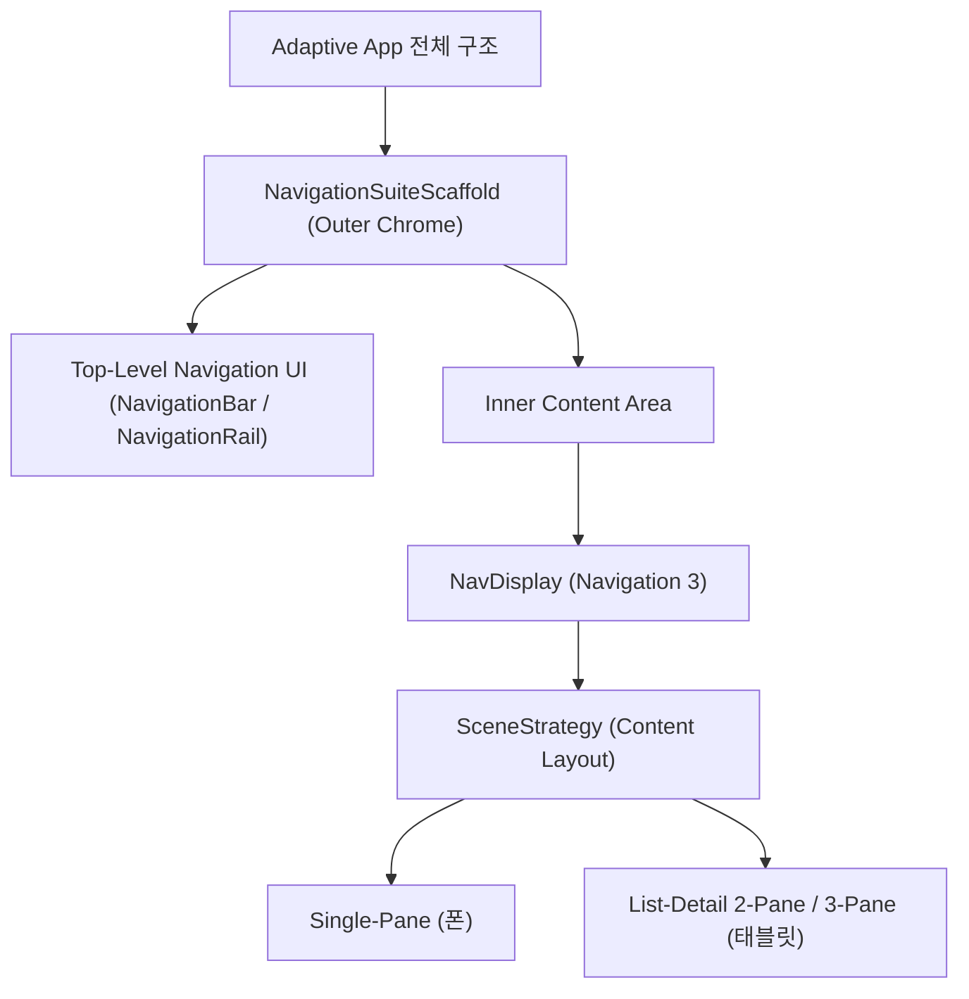

## NavigationSuiteScaffold vs Navigation 3 Scene (Adaptive Navigation 역할 비교 및 결합)

### 1. 개요 (Overview)

**NavigationSuiteScaffold vs Navigation 3 Scene** 은 안드로이드 Modern Compose Adaptive 앱 개발 시 헷갈리기 쉬운 두 개념의 **역할(Role), 라이브러리(Library), 관심사(Concern)를 명확히 비교하고, 실무에서 이 둘을 어떻게 계층 구조로 결합(Combine)하여 사용하는지 정의하는 아키텍처 가이드 노드**이다.

- **[navigation-suite-scaffold](navigation-suite-scaffold.md)** 는 **"어디로 이동할 수 있는가?" (Top-Level Navigation UI Chrome)** 에 관한 반응형 틀이다. (NavigationBar ↔ NavigationRail ↔ NavigationDrawer)
- **[navigation3-scene-and-strategy](navigation3-scene-and-strategy.md)** 는 **"현재 이동 상태의 콘텐츠를 어떻게 배치할 것인가?" (Screen Content Layout)** 에 관한 반응형 틀이다. (Single-Pane ↔ List-Detail 2-Pane ↔ Supporting-Pane 3-Pane)

---

#### 초보자를 위한 쉽게 이해하는 비유

* **Navigation Chrome vs Content Layout (건물 외관 창문 테두리 대 건물 내부 방 배치)**:
  - **NavigationSuiteScaffold**: 건물 입구 조종 버튼 위치(하단 계단 vs 좌측 복도)를 외관 구조에 맞게 바뀌는 외관 테두리.
  - **Navigation 3 Scene**: 방 내부 거실과 침실을 벽을 허물어 넓은 통유리로 한눈에 같이 보여줄지(List-Detail 2-Pane), 방 하나씩 따로 보여줄지(1-Pane) 결정하는 내부 방 배치.



---

### 2. 8대 핵심 차이점 비교표

| 구분 | [NavigationSuiteScaffold](navigation-suite-scaffold.md) | [Navigation 3 Scene](navigation3-scene-and-strategy.md) |
| :--- | :--- | :--- |
| **해결 문제** | Navigation UI (Top-Level Chrome) 위치 | Screen Content Layout 배치 |
| **관심사** | Bottom Bar / Rail / Drawer | List / Detail / Supporting Pane |
| **Adaptive 대상** | Navigation Outer Component | Screen Content Inner Layout |
| **대표 변환 예시** | `NavigationBar` ➔ `NavigationRail` | 1-Pane Detail ➔ List + Detail 2-Pane |
| **핵심 API** | `NavigationSuiteScaffold` | `Scene`, `SceneStrategy`, `NavDisplay` |
| **의존 라이브러리** | `adaptive-navigationsuite` | `adaptive-navigation3`, `navigation3-ui` |
| **Navigation 3 필수 여부** | ❌ 선택 사항 | ✅ 필수 |
| **Multi-Pane 동시 배치** | ❌ 미지언 | ✅ 지원 |

---

### 3. 실무에서의 계층 결합 아키텍처 (Combined Architecture)

두 API 는 상호 경쟁 관계가 아니라, **`NavigationSuiteScaffold` 가 외곽 Chrome 을 감싸고, 내부 `NavDisplay` 가 `SceneStrategy` 를 적용하여 결합**되는 아키텍처 구조로 사용된다.

### 실전 결합 구조 코드

```kotlin
@Composable
fun AdaptiveGmailApp(
    topLevelBackStack: List<NavKey>,
    currentTopLevel: AppDestination,
    onTopLevelSelected: (AppDestination) -> Unit,
    onBackPressed: () -> Unit
) {
    // 1. Outer Chrome Adaptive: NavigationSuiteScaffold (BottomBar ↔ Rail)
    NavigationSuiteScaffold(
        navigationSuiteItems = {
            AppDestination.entries.forEach { destination ->
                item(
                    icon = { Icon(destination.icon, null) },
                    label = { Text(destination.label) },
                    selected = currentTopLevel == destination,
                    onClick = { onTopLevelSelected(destination) }
                )
            }
        }
    ) {
        // 2. Inner Content Layout Adaptive: Navigation 3 SceneStrategy (1-Pane ↔ 2-Pane ListDetail)
        val listDetailStrategy = rememberListDetailSceneStrategy<NavKey>()

        NavDisplay(
            backStack = topLevelBackStack,
            sceneStrategy = listDetailStrategy,
            onBack = onBackPressed
        )
    }
}
```

---

### 4. 연결 문서 (Related Links)

- [navigation-suite-scaffold](navigation-suite-scaffold.md) - Material3 Top-Level Chrome API
- [navigation3-scene-and-strategy](navigation3-scene-and-strategy.md) - Navigation 3 Scene & Multi-Pane API
- [Navigation 3 계약](navigation3-contracts.md) - 상위 계약 지도
- [jetpack-navigation-3-guide](../jetpack-navigation-3-guide.md) - Jetpack Navigation 3 가이드
- [adaptive-layout-and-navigation](../../adaptive-navigation/adaptive-layout-and-navigation.md) - Compose Adaptive 가이드
