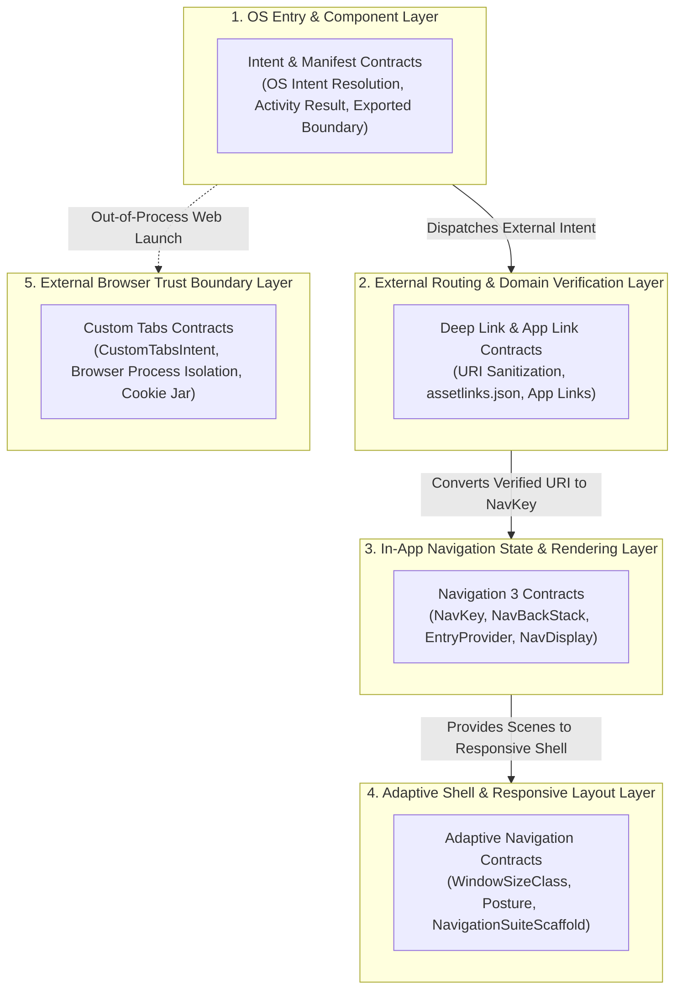

## Android Navigation 진입 계약 (Android Navigation Master Contracts)

안드로이드 애플리케이션 프레임워크 전반의 내비게이션 아키텍처를 총괄하는 **최상위 정본 계약 마스터 가이드**다.

안드로이드 내비게이션 아키텍처는 **5개의 계층(5 Architecture Layers)**으로 상호 연결되며, 외부 진입 메시지부터 내부 렌더링 및 반응형 배치까지 아래 서술된 엄격한 책임 계약에 따라 동작한다.

---

### 안드로이드 내비게이션 5대 계층 아키텍처 (5 Navigation Layers)

---

### 계층별 핵심 역할 및 책임 (What & Why)

이전 종합 색인과의 호환 경로는 **Intent와 Deep Link 종합 색인**에 유지한다. 새로운 읽기 흐름은 이 문서를 기준으로 한다.

1. **[Intent & Manifest 계약 계층](../intents-and-deep-links/intent-manifest/intent-manifest.md)**:
   - **역할**: 안드로이드 OS가 애플리케이션 컴포넌트(Activity, Service)를 인식하고 실행하는 수신 경계를 통제한다.
   - **핵심 계약**: `android:exported` 보안 경계, `PendingIntent` immutable 제어, Activity Result API.
2. **[Deep Link 계약 계층](../intents-and-deep-links/deep-link/deep-link.md)**:
   - **역할**: 외부 웹 URL 또는 파라미터를 안드로이드 앱으로 라우팅하고, 도메인 소유권을 웹 서버(`assetlinks.json`)와 연동하여 검증한다.
   - **핵심 계약**: App Links 도메인 검증, URI Sanitization, 인증 필요 딥링크의 대기 목적지(`Pending NavKey`) 관리.
3. **[Navigation 3 계약 계층](../navigation3/navigation3/navigation3.md)**:
   - **역할**: 앱 내부 화면 전환을 문자열 URL 대신 타입 안정적인 `NavKey`와 앱 소유 백스택(`NavBackStack`)으로 선언적 관리한다.
   - **핵심 계약**: `NavKey` 강타입 직렬화, `EntryProvider` 및 `NavDisplay` 렌더링 분리, `SaveableStateHolder` 상태 복원.
4. **[Adaptive Navigation 계약 계층](../adaptive-navigation/adaptive-navigation/adaptive-navigation.md)**:
   - **역할**: 윈도우 크기(`WindowSizeClass`) 및 폴더블 힌지 상태(`WindowPosture`)에 맞춰 탐색 크롬(Bar/Rail/Drawer)과 화면 구획(Pane)을 동적으로 배치한다.
   - **핵심 계약**: `NavigationSuiteScaffold` 크롬 전환, `ListDetailPaneScaffold` 선택 맥락 보존 및 Back Policy 분리.
5. **[Custom Tabs 계약 계층](../custom-tabs/custom-tabs/custom-tabs.md)**:
   - **역할**: 인앱 웹 링크 열람 시 unsafe `WebView`를 대체하여 기본 브라우저 프로세스에서 안전하고 빠른 웹 렌더링을 제공한다.
   - **핵심 계약**: 브라우저 프로세스 샌드박스 격리, 쿠키 Jar 공유, `warmup()` 사전 연결 최적화.

---

### 의사 결정 판단 체계 (Decision Flow Tree)

- **Q1. 처리하고자 하는 요청의 출처가 어디인가?**
  - **외부 시스템 / 타 앱 / 웹**: $\rightarrow$ **Layer 1 (Intent)** 및 **Layer 2 (Deep Link / App Link)** 진입 절차 수행.
  - **앱 내부 화면 간 이동**: $\rightarrow$ **Layer 3 (Navigation 3)** 타입 안정 `NavKey` 전이 수행.
  - **앱 내부 외부 웹 페이지 열람**: $\rightarrow$ **Layer 5 (Custom Tabs)** 런칭.
- **Q2. 화면이 반응형 대화면/폴더블에 대응해야 하는가?**
  - **YES**: $\rightarrow$ **Layer 4 (Adaptive Navigation)** 표준 Scaffold 연동.

---

### 하위 체계 지도

- [Intent와 Manifest 계약](../intents-and-deep-links/intent-manifest/intent-manifest.md)
- [Deep Link 계약](../intents-and-deep-links/deep-link/deep-link.md)
- [Navigation 3 계약](../navigation3/navigation3/navigation3.md)
- [Adaptive Navigation 계약](../adaptive-navigation/adaptive-navigation/adaptive-navigation.md)
- [Custom Tabs 계약](../custom-tabs/custom-tabs/custom-tabs.md)
