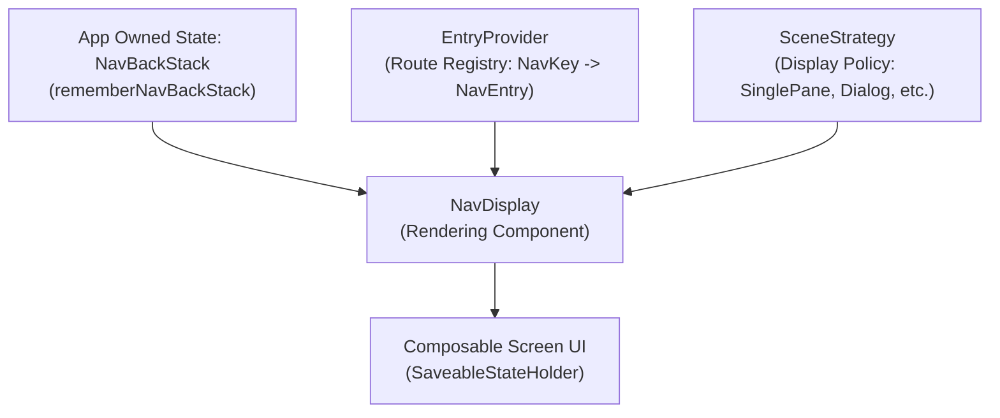

## Jetpack Navigation 3 종합 가이드: 선언적 내비게이션 아키텍처

안드로이드의 기존 XML 및 NavHostFragment/String Route 중심 구조를 완전히 탈피하여, 앱이 내비게이션 상태(`NavBackStack`)를 직접 소유하고 Kotlin 데이터 클래스(`NavKey`)로 렌더링하는 최신 표준 **Jetpack Navigation 3**의 종합 아키텍처 가이드다.

---

### 개념과 필요성 (What & Why)

1. **개념 (What)**:
   - **Navigation 3**는 내비게이션 목적지와 백스택을 거대한 라이브러리 내부 상태(`NavController`)에 숨기지 않고, 앱 개발자가 직접 소유하는 Compose State(`NavBackStack<NavKey>`)로 모델링하며, 렌더링 엔진(`NavDisplay`)과 라우트 등록 레지스트리(`EntryProvider`)를 완전히 분리한 **선언적 뷰-내비게이션 분리 라이브러리**다.
2. **필요성 (Why)**:
   - **기존 Navigation 2의 한계 극복**: Navigation 2(및 NavHostFragment)에서는 백스택이 `NavController` 블랙박스 내부에 갇혀 있어, 백스택을 직접 순회하거나 수정을 가하기 힘들었다. String 기반 라우트(`"profile/{userId}"`)는 런타임 타입 오류 및 인자 전달 런타임 에러의 주원인이었다.
   - **타입 안전성(Type Safety) 및 단방향 데이터 흐름(UDF)**: `@Serializable` Kotlin 데이터 클래스/객체를 `NavKey`로 사용함으로써 컴파일 시점에 목적지 인자 타입을 검증하며, 백스택 변경을 일반 Compose 컬렉션 조작(`add`, `removeLast`)으로 일관되게 다룰 수 있다.

---

### 내부 동작 메커니즘 (How)

1. **앱 소유 백스택 (`NavBackStack`)**:
   `rememberNavBackStack()`으로 생성되며 `SnapshotStateList<NavKey>`로 구현되어 Compose State 변경을 감지하고 리컴포지션을 유발한다.
2. **라우트 레지스트리 (`EntryProvider`)**:
   각 `NavKey`에 대응하는 UI 컴포저블을 렌더링하는 `NavEntry` 생성기를 매핑한다.
3. **렌더링 엔진 (`NavDisplay`)**:
   현재 `NavBackStack`의 키 항목들과 `EntryProvider`를 대조하여, 선택된 `SceneStrategy`에 따라 화면 UI를 컴포즈 렌더링한다.

---

### 구시대 레거시 vs 현대 Navigation 3 비교 (Legacy vs Modern)

| 구분 | 레거시 Navigation 2 (Legacy) | 현대 Navigation 3 (Modern Standard) |
| :--- | :--- | :--- |
| **목적지 정의** | XML 그래프 파싱 또는 String 경로 (`"user/{id}"`) | 타입 안전 `@Serializable` 데이터 클래스 (`UserRoute(val id: Long) : NavKey`) |
| **백스택 소유권** | 라이브러리 내부 `NavController` 블랙박스 소유 | 앱이 직접 소유하는 일반 Compose State 컬렉션 (`NavBackStack<NavKey>`) |
| **화면 이동 조작** | `navController.navigate("user/123")` 문자열 전출 | 앱 상태 변경 `backStack.add(UserRoute(id = 123))` 명시적 전이 |
| **다중 화면 구획** | Single NavHost 중심으로 Dialog/Pane 조합이 매우 복잡함 | `SceneStrategy` 및 `Metadata` 전달로 다중 씬 및 복합 레이아웃 유연 조합 |
| **상태 복원** | `SavedStateHandle` 및 Bundle 수동 파싱 | `rememberNavBackStack`과 `SaveableStateHolder`에 의한 자동 직행 복원 |

---

### 핵심 정본 지도 (Contract Index)

- [Navigation 3 계약](navigation3-contracts/navigation3-contracts.md)
- [NavKey와 back stack은 앱이 소유하는 navigation 상태다](navigation3-contracts/navkey-and-back-stack-are-app-owned-navigation-state.md)
- [Route key는 안정적인 직렬화 식별자다](navigation3-contracts/route-key-should-be-stable-and-serializable.md)
- [NavDisplay와 entry provider는 렌더링과 route registry를 분리한다](navigation3-contracts/navdisplay-and-entry-provider-separate-rendering-from-route-registry.md)
- [Metadata와 SceneStrategy는 표시 정책을 전달한다](navigation3-contracts/metadata-and-scene-strategy-carry-display-policy.md)
- [SceneStrategy는 entry를 조합하고 decorator는 렌더링을 감싼다](navigation3-contracts/scene-strategy-composes-entries-while-decorator-wraps-rendering.md)
- [Navigation 3 back stack은 저장 가능한 navigation state로 복원해야 한다](navigation3-contracts/navigation3-back-stack-needs-saveable-restoration.md)
- [Navigation 3 deep link는 URI를 NavKey로 변환한다](navigation3-contracts/navigation3-deep-link-converts-uri-to-navkey.md)
- [Navigation 3 transition과 back policy는 같은 stack 상태를 공유해야 한다](navigation3-contracts/navigation3-transition-and-back-policy-must-share-stack-state.md)
- [Android task와 app back stack은 서로 다른 스택이다](navigation3-contracts/android-task-and-app-back-stack-are-different-stacks.md)

---

### 연관 상위 및 관련 가이드

- [Android Navigation 진입 계약](../navigation-contracts/navigation-contracts.md)
- [Adaptive Layout and Navigation](../adaptive-navigation/adaptive-layout-and-navigation.md)
