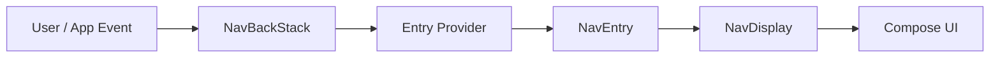

# 핵심 모델

상위 노트: [jetpack-navigation-3-guide](01_inbox/mobile/android/02_app_framework/navigation/navigation3/jetpack-navigation-3-guide.md)

Navigation 3의 데이터 흐름은 단순합니다.



| 구성 요소 | 역할 |
|:---|:---|
| `NavKey` | 화면의 정체성과 인자를 담는 route key |
| `NavBackStack<T>` | 현재 이동 이력을 담는 앱 소유 상태 |
| `entryProvider` | `NavKey`를 `NavEntry`와 화면 content로 변환 |
| `NavEntry` | key, content, metadata를 묶은 destination 단위 |
| `NavDisplay` | back stack을 관찰해 실제 Compose 화면을 렌더링 |
| `Scene` | 하나 이상의 `NavEntry`를 표시하는 visual state |
| `SceneStrategy` | 현재 entries를 어떤 `Scene`으로 배치할지 결정 |
| `NavEntryDecorator` | entry별 state, ViewModelStore, 공통 wrapper를 제공 |
| `SceneDecoratorStrategy` | 계산된 scene을 top app bar, navigation chrome 등으로 감쌈 |

Navigation 3에서는 화면 이동이 결국 list 조작입니다.

```kotlin
backStack.add(ProductDetailRoute(id = "123")) // forward
backStack.removeLastOrNull()                  // back
```

---
