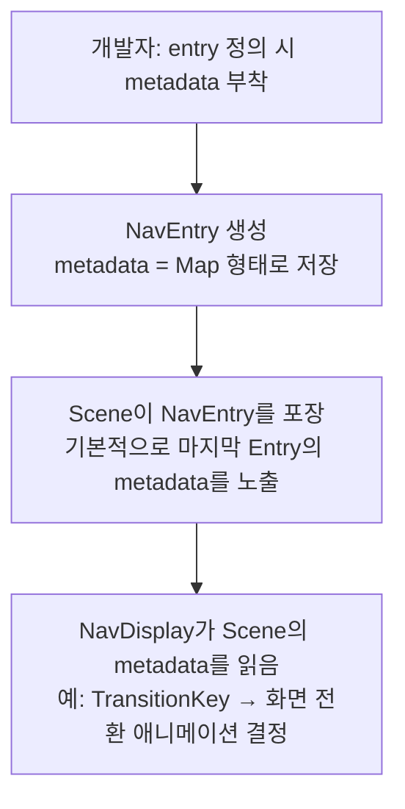

# Metadata 시스템 전체 흐름 요약

| 단계 | 역할 | 예시 |
| :--- | :--- | :--- |
| **쓰기 (Write)** | `entry<Route>()` 정의 시 `metadata = metadata { put(...) }` | 화면별 전환 효과, 커스텀 플래그 등 |
| **전달 (Carry)** | `NavEntry` → `Scene` → `NavDisplay`로 자동 전파 | Scene은 기본적으로 마지막 Entry의 metadata를 그대로 노출 |
| **읽기 (Read)** | `metadata[SomeKey]`로 타입 안전하게 꺼내 사용 | `NavDisplay`가 `TransitionKey`를 읽어 애니메이션 적용 |
