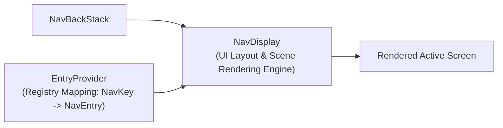

## NavDisplay 와 entry provider 는 렌더링과 route registry 를 분리한다

상위 문서: [Navigation 3 계약](navigation3-contracts.md)

관련 가이드: [Jetpack Navigation 3 가이드](../jetpack-navigation-3-guide.md)

---

### 개념과 아키텍처 분리 (What & Why)

Navigation 3는 라우트를 등록하는 역할과 실제 UI를 화면에 컴포즈 렌더링하는 역할을 다음과 같이 철저히 분리한다:

1. **`EntryProvider` (Route Registry)**:
   - **책임**: 어떤 `NavKey`가 들어왔을 때 어떤 `NavEntry`(컴포저블 화면 코드 + 메타데이터)를 반환할지 정의하는 라우트 매핑 레지스트리다.
2. **`NavDisplay` (Rendering Engine)**:
   - **책임**: 주어진 `NavBackStack`과 `EntryProvider`를 전달받아, 지정된 `SceneStrategy`에 따라 현재 백스택 항목의 화면 컴포저블을 뷰포트에 렌더링하는 UI 컴포저블 엔진이다.

---

### 구시대 레거시 vs 현대 표준 비교

| 구분 | 레거시 NavHost (Legacy) | 현대 NavDisplay & EntryProvider (Modern) |
| :--- | :--- | :--- |
| **결합도** | 렌더링 엔진과 라우트 등록 그래프가 `NavHost` 단일 컴포저블에 강결합 | `EntryProvider` 레지스트리와 `NavDisplay` 렌더러가 완전히 분리됨 |
| **멀티 모듈 라우트** | 모듈별 라우터를 하나의 거대한 NavGraph XML/DSL로 합쳐야 함 | 모듈별로 독립 `EntryProvider`를 작성한 뒤 `+` 연산자로 유연하게 합성 가능 |

---

### 관련 상위 및 연관 노트

- 상위 계약: [Navigation 3 계약](navigation3-contracts.md)
- 연관 가이드: [Jetpack Navigation 3 가이드](../jetpack-navigation-3-guide.md)
