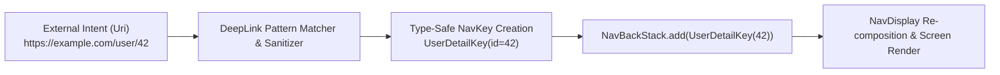

## Navigation 3 deep link 는 URI 를 NavKey 로 변환한다

상위 문서: [Navigation 3 계약](navigation3-contracts.md)

관련 가이드: [Android Deep Links 종합 가이드](../../intents-and-deep-links/android-deep-links.md)

---

### 변환 파이프라인 (What & How)

Navigation 3에서의 딥링크 처리는 외부의 비신뢰 `android.net.Uri`를 파싱하여 타입 안전한 **`NavKey`** 객체로 전환하고, 이를 앱 소유 백스택(`NavBackStack`)에 push 하는 명확한 단방향 파이프라인으로 수행된다.



---

### 핵심 구현 코드 예시

```kotlin
fun handleIncomingDeepLink(intent: Intent?, backStack: NavBackStack<NavKey>) {
    val uri = intent?.data ?: return
    val navKey = parseUriToNavKey(uri)
    if (navKey != null) {
        // 백스택에 타입 안전 키 추가
        backStack.add(navKey)
    }
}
```

---

### 관련 상위 및 연관 노트

- 상위 계약: [Navigation 3 계약](navigation3-contracts.md)
- 연관 계약: [Deep link는 외부 URI 계약이다](../../intents-and-deep-links/deep-link-contracts/deep-link-is-external-uri-contract.md)
