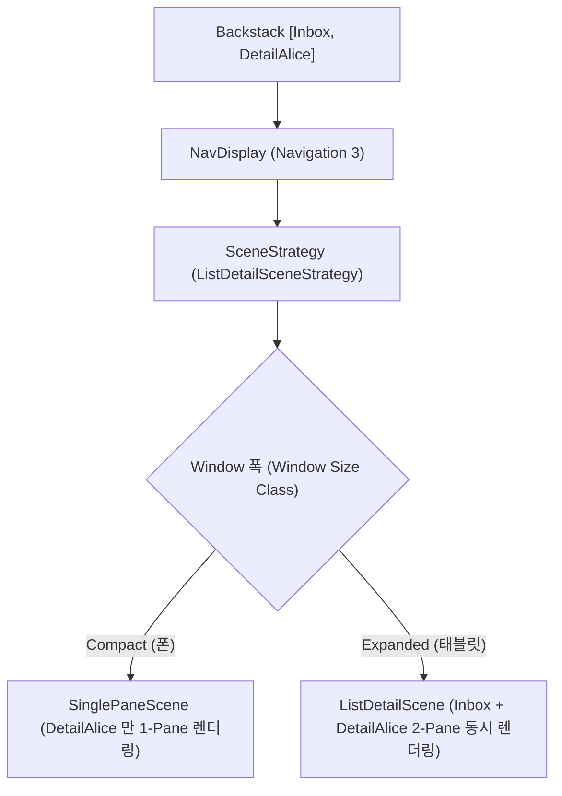

## Navigation 3 Scene & SceneStrategy (Navigation 3 Content Layout & Multi-Pane Adaptive)

배경 지식: `SceneStrategy`가 entry를 Scene으로 조합하고 `Decorator`가 렌더링을 감싸는 역할 구분 자체는 [SceneStrategy는 entry를 조합하고 decorator는 렌더링을 감싼다](scene-strategy-composes-entries-while-decorator-wraps-rendering.md)가 정본이다. 이 문서는 그 역할 구분을 전제로, window size class에 따라 실제로 `rememberListDetailSceneStrategy()`가 single-pane/multi-pane을 어떻게 전환하는지만 다룬다.

### 1. 개요 (Overview)

**Navigation 3 Scene & SceneStrategy** 는 `androidx.compose.material3.adaptive:adaptive-navigation3` 및 `androidx.navigation3:navigation3-ui` 라이브러리가 제공하는 레벨 API 로, **동일한 Navigation Backstack 상태를 유지하면서 화면 크기(Window Size)에 따라 화면 콘텐츠(Content Layout)를 Single-Pane (1개) 또는 Multi-Pane (List-Detail / Supporting Pane 등 2~3개)으로 동시 배치 렌더링하는 Content Adaptive 엔진**이다.

스마트폰(Compact)에서는 Backstack 상단의 Detail 화면만 1-Pane 으로 보여주고, 태블릿(Expanded)에서는 동일한 Backstack `[ListNavKey, DetailNavKey]` 에 대해 `rememberListDetailSceneStrategy()` 가 List Pane 과 Detail Pane 을 한 화면에 2-Pane 으로 동시 분할 렌더링한다.

---

#### 초보자를 위한 쉽게 이해하는 비유

* **Navigation 3 Scene (스마트 분할 렌더링 무대 감독)**:
  - 무대 대기실(Backstack)에 [목록, 상세] 2개의 대본이 있을 때, 무대가 좁으면 상세 대본만 무대에 올리고(1-Pane), 무대가 넓어지면 2개의 대본을 좌우 반씩 나눠 한 무대에 동시에 올려 연기시키는(2-Pane) 무대 디렉팅 감독.



---

### 2. 핵심 역할 및 실전 코드 예시

#### 1) 주요 관심사
- **해결 문제**: 이동 상태(Backstack) 내 여러 destination 들의 화면 동시 배치 ("현재 이동 상태의 콘텐츠를 어떻게 배치할 것인가?")
- **관심사**: Single-Pane vs List-Detail Pane vs Supporting Pane
- **Outer Navigation Chrome 조작 여부**: ❌ 조작하지 않음 (Bottom Bar / Rail 조작은 [navigation-suite-scaffold](navigation-suite-scaffold.md) 의 역할)

#### 2) 실전 코드 예시 (Navigation 3 `NavDisplay` + `rememberListDetailSceneStrategy`)

```kotlin
@Composable
fun AppNavDisplay(
    backStack: List<NavKey>,
    onBackPressed: () -> Unit
) {
    // Navigation 3 Material3 Adaptive 전용 List-Detail SceneStrategy 생성
    val listDetailStrategy = rememberListDetailSceneStrategy<NavKey>()

    NavDisplay(
        backStack = backStack,
        sceneStrategy = listDetailStrategy,
        onBack = onBackPressed
    )
}
```

---

### 3. 연결 문서 (Related Links)

- [navigation-suite-scaffold](navigation-suite-scaffold.md) - Material3 Top-Level Chrome Adaptive
- [navigation-suite-scaffold-vs-navigation3-scene](navigation-suite-scaffold-vs-navigation3-scene.md) - 둘의 비교 및 통합 사용 아키텍처
- [SceneStrategy는 entry를 조합하고 decorator는 렌더링을 감싼다](scene-strategy-composes-entries-while-decorator-wraps-rendering.md) - SceneStrategy/Decorator 역할 구분 정본
- [Navigation 3 계약](navigation3-contracts.md) - 상위 계약 지도
- [jetpack-navigation-3-guide](../jetpack-navigation-3-guide.md) - Jetpack Navigation 3 가이드
