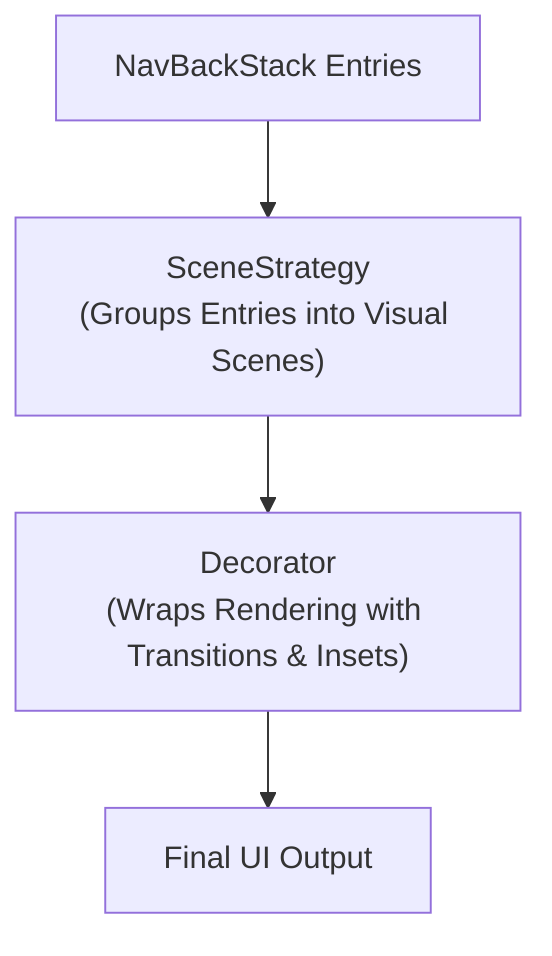

## SceneStrategy 는 entry 를 조합하고 decorator 는 렌더링을 감싼다

상위 문서: [Navigation 3 계약](navigation3-contracts.md)

관련 계약: [Metadata와 SceneStrategy는 표시 정책을 전달한다](metadata-and-scene-strategy-carry-display-policy.md)

---

### 개념 및 계층 분리 (What & Why)

Navigation 3의 화면 시각화 파이프라인에서 **`SceneStrategy`**와 **`Decorator`**는 서로 다른 범주의 UI 감싸기 역할을 수행한다:

1. **`SceneStrategy`**:
   - **역할**: 백스택에 존재하는 여러 `NavEntry`들을 검토하여 개별 시각적 조각인 **`Scene`**으로 그룹화(Compose)한다 (예: Single Pane, Dialog, Dual Pane).
2. **`Decorator`**:
   - **역할**: 생성된 Scene이나 엔트리 개별 컴포저블 주변에 화면 전환 애니메이션(Transition), 패딩/인셋(WindowInsets), 디자인 테마 래퍼를 씌워 렌더링을 감싸는(Wrap) 역할을 담당한다.

---

### 관련 상위 및 연관 노트

- 상위 계약: [Navigation 3 계약](navigation3-contracts.md)
- 연관 계약: [Metadata와 SceneStrategy는 표시 정책을 전달한다](metadata-and-scene-strategy-carry-display-policy.md)
- 실전 적용: [Navigation 3 Scene & SceneStrategy](navigation3-scene-and-strategy.md) - window size class에 따라 `rememberListDetailSceneStrategy()`가 single-pane/multi-pane을 전환하는 실제 사용법
