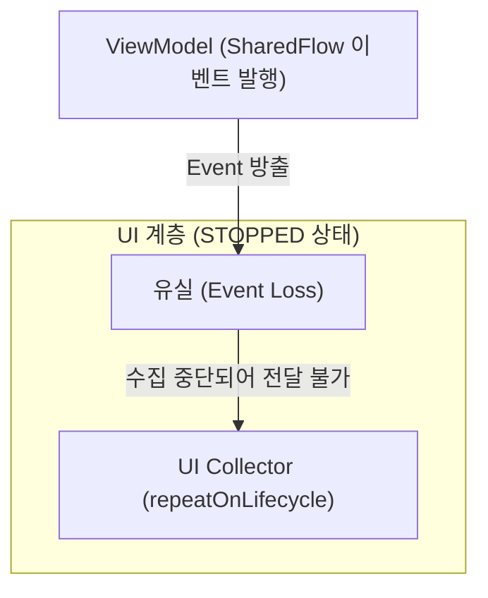

# StateFlow & SharedFlow

## 1. 개요 및 Hot Stream 이란 (Overview & Hot Stream Concept)

Kotlin Coroutines의 **`StateFlow`**와 **`SharedFlow`**는 구독자(Collector)의 존재 여부와 상관없이 메모리상에서 활성화되어 데이터를 계속 발행할 수 있는 **Hot Stream** 기반의 셰어드 파이프라인이다.

### 초보자를 위한 Cold vs Hot Stream 비유
- **Cold Stream (일반 `Flow`) = 유튜브 VOD 비디오**
  - 누군가 재생 버튼(`collect`)을 눌러야만 비디오가 처음부터 시작된다. 시청자가 없으면 아무것도 실행되지 않는다.
- **Hot Stream (`StateFlow` / `SharedFlow`) = 라디오 생방송**
  - 내가 라디오 전원을 켜든 끄든 방송국은 실시간으로 노래를 트는 중이다. 전원을 켜는 순간부터 현재 방송되는 소리를 들을 수 있다.

Android 앱 아키텍처([Single Source of Truth](single-source-of-truth.md))에서 `StateFlow`와 `SharedFlow`는 [ViewModel](viewmodel.md)이 보관하는 화면 상태(UI State) 및 비동기 이벤트를 여러 UI 구독자에게 전파(Multicast)하기 위해 사용되는 가장 핵심적인 반응형 도구이다.

---

## 2. StateFlow 상세 (State-holding Stream)

`StateFlow`는 **상태(State)를 보관하고 전달하는 데 특화된 Hot Stream**이다.

### 주요 특징 및 동작 메커니즘
- **상태 보관 (State-holding)**: 항상 최신 상태 값을 내부 필드(`value`)에 보유한다. (`stateFlow.value`로 동기적 접근 가능)
- **초기값 필수**: 객체 생성 시점에 반드시 초기 상태값(Initial Value)을 주입해야 한다.
- **Replay 버퍼 크기 = 1**: 항상 가장 최근에 업데이트된 마지막 값 1개만을 저장하므로, 새로 들어온 구독자도 구독 즉시 최신 상태를 전달받을 수 있다.
- **`distinctUntilChanged` 자동 적용**: 이전 상태값과 `equals` 비교를 수행하여 동일한 데이터가 들어오면 구독자에게 중복 통지하지 않는다.
- **주 사용 목적**: 연속적으로 유지되어야 하는 화면 상태 (예: [ViewModel](viewmodel.md)의 `UiState`, 입력 폼 데이터, 네트워크 연결 여부 등).

```kotlin
// ViewModel 내부
private val _uiState = MutableStateFlow<UserProfileUiState>(UserProfileUiState.Loading)
val uiState: StateFlow<UserProfileUiState> = _uiState.asStateFlow()
```

---

## 3. SharedFlow 상세 (Event Broadcasting Stream)

`SharedFlow`는 상태를 보관하는 것에 얽매이지 않고 **이벤트(Event)를 발행하여 여러 구독자에게 방송(Multicast)하는 범용 Hot Stream**이다.

### 주요 특징 및 동작 메커니즘
- **유연한 버퍼 및 Replay 설정**: `replay`, `extraBufferCapacity`, `onBufferOverflow` 등 다양한 버퍼 정책을 원하는 대로 커스텀 설정할 수 있다.
- **초기값 불필요**: 초기 상태값 없이 선언할 수 있다.
- **Equality 비교 없음**: 완전히 동일한 데이터 객체라도 계속 발행하면 매번 통지된다.
- **주 사용 목적**: 특정 사건/이벤트의 브로드캐스트 (예: 푸시 알림, 도메인 이벤트 처리 등).

```kotlin
// ViewModel 내부
private val _eventFlow = MutableSharedFlow<UserEvent>(
    replay = 0,
    extraBufferCapacity = 1,
    onBufferOverflow = BufferOverflow.DROP_OLDEST
)
val eventFlow: SharedFlow<UserEvent> = _eventFlow.asSharedFlow()
```

---

## 4. StateFlow vs SharedFlow 한눈에 비교 (Comparison)

| 비교 속성 | `StateFlow` | `SharedFlow` |
| :--- | :--- | :--- |
| **개념적 역할** | 현재 상태(State) 보유 및 제공 | 일회성 사건/이벤트(Event) 배출 및 알림 |
| **초기값 (Initial Value)** | **필수** (`StateFlow(initialValue)`) | **불필요** |
| **최신 값 직접 접근** | `flow.value` 동기적 접근 지원 | 불가능 (`replayCache` 목록 참조만 가능) |
| **Replay 버퍼 크기** | 고정값 `1` | 사용자 자유 지정 (`0` 이상) |
| **중복 값 검사** | **자동 적용** (이전과 같은 값이면 배출 방지) | **적용 안 됨** (동일 값도 계속 배출) |
| **인터페이스 상속 관계** | `interface StateFlow : SharedFlow` (`SharedFlow`의 특수화 버전) | 최상위 공유 Flow 인터페이스 |

---

## 5. UI 일회성 이벤트 유실(Event Loss) 위험 및 해결책

과거에는 Toast, Snackbar, 화면 이동(Navigation)과 같은 일회성(One-off) UI 이벤트를 처리하기 위해 `SharedFlow(replay = 0)`를 주로 활용했으나, **공식 Android 가이드라인에서는 일회성 UI 이벤트에 SharedFlow 사용을 지양**하도록 권장한다.

### SharedFlow 사용 시 발생하는 이벤트 유실 메커니즘
스마트폰 화면 회전(Configuration Change)이나 앱이 백그라운드로 내려가는 경우, UI는 Android 수명주기에 의해 `Lifecycle.State.STOPPED` 상태로 들어가며 Coroutine 수집(Collection)을 일시 중단한다.



- **이벤트 유실 (Event Loss)**: UI 수집기가 멈춰있는 동안 ViewModel에서 `SharedFlow(replay = 0)`로 이벤트를 보내버리면 이벤트를 들을 구독자가 없어 메시지가 완전히 사라진다.
- **재방출 부작용**: 이를 막기 위해 `replay = 1`로 지정하면, 화면을 세로에서 가로로 돌릴 때 이미 처리했던 Toast나 화면 이동 이벤트가 **다시 방출되어 이중 실행되는 버그**가 일어난다.

### 최신 권장 해결 전략 (Recommended Architecture)

1. **UDF UI State 패턴 기반 모형화 (Best Practice)**:
   - 일회성 이벤트도 독립된 이벤트 스트림으로 분리하지 않고 **`UiState` 내부 데이터로 모델링**한다.
   - 예: `data class UiState(val message: String? = null)`
   - UI가 상태를 관찰해 메시지를 보여준 후, 처리가 완료되면 ViewModel에 `onMessageShown()` 이벤트를 상향 전달하여 상태를 `null`로 되돌린다. 이 방식은 [Single Source of Truth](single-source-of-truth.md) 원칙을 완벽히 지킨다.
2. **Channel 패턴 활용 (필요 시)**:
   - 진정으로 일회성 단일 소비 이벤트여야 하는 경우, `Channel`을 정의하고 `receiveAsFlow()` 형태로 노출하면 수집자가 준비될 때까지 메시지를 보관해 주므로 안전하다.

---

## 6. 연결 문서 (Related Links)

- [Single Source of Truth (단일 진실 출처)](single-source-of-truth.md) - StateFlow 와 SharedFlow 가 관찰 가능한 상태 파이프라인으로 작동하는 아키텍처 원칙
- [ViewModel](viewmodel.md) - StateFlow 및 SharedFlow 를 생성하고 관리하는 뷰모델
- [Recomposition (재구성)](jetpack-compose/runtime/recomposition.md) - StateFlow 수집에 따라 Jetpack Compose 가 화면을 재렌더링하는 메커니즘
- [Binder IPC](../01_system_internals/binder-ipc.md) - 안드로이드 프로세스 간 데이터 통신 메커니즘
