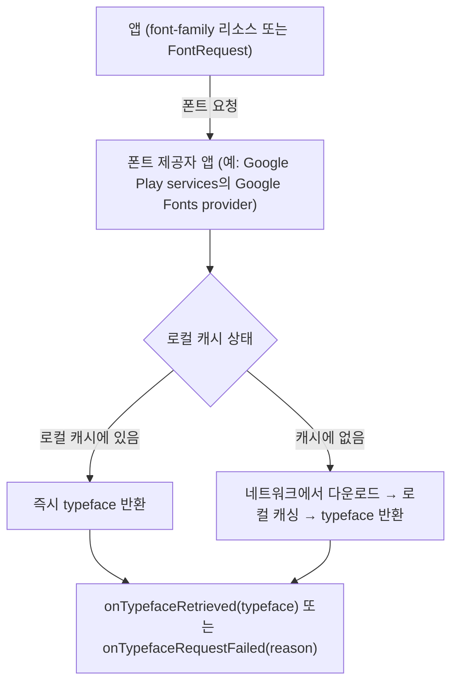

## Downloadable Fonts는 폰트를 APK에 번들하지 않고 폰트 제공자 앱에 요청 시점에 위임한다

상위 문서: [Android UI System](../android-ui-system.md)
배경 지식: [HTTP 프로토콜](../../../../../computer-science/networking/http-protocol.md)
관련 지도: [Downloadable Fonts 접근 계약](downloadable-fonts.md)

### 핵심 정의

공식 문서는 Downloadable Fonts를 다음과 같이 정의한다.

> "The Downloadable Fonts feature lets APIs request fonts from a provider application instead of bundling files into the app or letting the app download fonts. Downloadable Fonts is available on devices running Android API versions 14 and higher through the AndroidX Core library."

즉 폰트 파일 자체는 APK 안에 들어가지 않는다. 앱은 폰트 제공자 앱에게 "이 폰트가 필요하다"는 요청만 보내고, 실제 폰트 데이터는 제공자 앱이 관리한다. 공식 문서는 폰트 제공자를 이렇게 설명한다.

> "A font provider is an application that retrieves fonts and caches them locally so other apps can request and share fonts."

### 메커니즘

Google은 이 기능을 시작하기 위한 폰트 제공자로 Google Play services를 제공한다.

> "To help you get started with Downloadable Fonts features, you can use the font provider from Google Play services."
>
> "A device must have Google Play services version 11 or higher to use the Google Fonts provider."

폰트 제공자는 요청받은 폰트를 로컬에 캐싱하며, 이후 같은 폰트를 요청하는 다른 앱들도 이 캐시를 공유한다. 이 계약은 두 가지 효과를 낳는다.

- **앱 크기 절감**: 폰트 파일이 APK에 포함되지 않아 설치 성공률이 올라간다.
- **기기 전체 자원 절감**: 여러 앱이 동일한 폰트를 공유해 데이터, 메모리, 저장 공간을 아낀다.

폰트 요청은 네트워크와 제공자 앱 상태에 의존하는 비동기 작업이므로, 최초 요청 시점에는 폰트가 아직 캐시에 없어 다운로드가 필요할 수 있다.

### 코드 예시

```xml
<!-- res/font/my_downloadable_font.xml -->
<?xml version="1.0" encoding="utf-8"?>
<font-family xmlns:android="http://schemas.android.com/apk/res/android"
        android:fontProviderAuthority="com.google.android.gms.fonts"
        android:fontProviderPackage="com.google.android.gms"
        android:fontProviderQuery="name=Roboto Slab"
        android:fontProviderCerts="@array/certs">
</font-family>
```

```xml
<!-- layout XML에서 참조 -->
<TextView
    android:fontFamily="@font/my_downloadable_font"
    ... />
```

```gradle
dependencies {
    implementation("androidx.core:core-ktx:1.19.0")
}
```

### 다이어그램



### 판단 기준

- 앱 크기나 기기 저장 공간이 민감하고, 필요한 폰트가 Google Fonts 같은 공용 카탈로그에 있으면 Downloadable Fonts가 유리하다.
- 오프라인 최초 실행에서도 반드시 특정 브랜드 폰트가 보여야 한다면, 그 폰트는 APK에 직접 번들하는 편이 더 안전하다. Downloadable Fonts는 네트워크와 제공자 앱 가용성에 의존하므로 최초 요청이 실패할 가능성을 항상 고려해야 한다.

### 경계

- 이 노트는 폰트를 "언제, 어디서 가져오는가"라는 배달 모델만 다룬다. XML `font-family` 선언과 `FontRequest`/`FontsContractCompat` 코드 경로의 구체적 차이, 실패 콜백 처리는 [폰트 요청은 XML font-family 선언이나 FontRequest 코드 경로를 따르며 실패 시 폴백이 필요하다](font-request-fallback.md)가 다룬다.
- 폰트 파일 자체의 hinting, 서브셋팅, 커스텀 폰트 제공자 서버 구현은 다루지 않는다.

### 관찰 가능한 증거

`onTypefaceRequestFailed(int reason)` 콜백이 호출되면 이번 요청은 실패한 것이므로, 이 시점에 폴백 폰트로 전환하지 않으면 시스템 기본 폰트가 계속 노출된다. Google Play services가 없거나 버전이 낮은 기기(Google Fonts provider 요구 버전 11 미만)에서는 요청 자체가 이 실패 경로로 이어진다.

### 공식 문서

- [Use downloadable fonts](https://developer.android.com/develop/ui/views/text-and-emoji/downloadable-fonts)

검증일: 2026-08-05.
