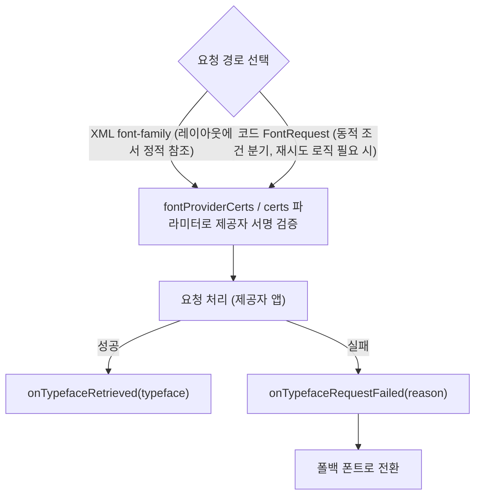

## 폰트 요청은 XML font-family 선언이나 FontRequest 코드 경로를 따르며 실패 시 폴백이 필요하다

상위 문서: [Android UI System](../android-ui-system.md)
관련 지도: [Downloadable Fonts 접근 계약](./downloadable-fonts.md)

### 핵심 정의

Downloadable Fonts를 요청하는 방법은 두 가지다.

1. **XML `font-family` 선언**: `res/font/` 아래 XML 리소스에 `android:fontProviderAuthority`, `android:fontProviderPackage`, `android:fontProviderQuery`, `android:fontProviderCerts`를 선언하고, 레이아웃이나 스타일에서 `android:fontFamily="@font/..."`로 참조한다.
2. **코드 경로**: `FontRequest` 객체를 만들고 `FontsContractCompat.requestFonts(...)`(또는 `FontsContract.requestFonts(...)`)를 호출해 `FontRequestCallback.onTypefaceRetrieved()`/`onTypefaceRequestFailed()`로 비동기 결과를 받는다.

공식 문서는 AndroidX Core 라이브러리로 요청할 때 인증서 지정이 선택이 아니라 필수라고 명시한다.

> "Note: You must provide a certificate when you request fonts through the AndroidX Core library. This is applicable even for the preinstalled font providers."

### 메커니즘

`fontProviderCerts`(XML) 또는 `FontRequest`의 `certs` 파라미터(코드)는 요청 대상 폰트 제공자 앱의 서명 인증서와 일치해야 하는 문자열 배열 리소스다. 이 인증서는 앱이 신뢰할 수 있는 제공자에게만 폰트를 요청하도록 하는 검증 수단이며, 사전 설치된 제공자(Google Play services 등)에도 예외 없이 적용된다. 요청이 실패하면 `onTypefaceRequestFailed(int reason)` 콜백으로 실패 원인 코드가 전달된다.

> "Override the `onTypefaceRequestFailed()` method to receive information about errors in the font request process."

이 콜백을 구현하지 않거나 폴백 처리를 하지 않으면, 요청이 실패했을 때 텍스트가 시스템 기본 폰트로 조용히 대체된 채 방치된다.

### 코드 예시

```kotlin
val certs: Array<List<ByteArray>> = getCerts(context) // res/values/certs.xml의 인증서 배열을 로드

val request = FontRequest(
    "com.google.android.gms.fonts",
    "com.google.android.gms",
    "name=Roboto Slab",
    certs,
)

val callback = object : FontsContractCompat.FontRequestCallback() {
    override fun onTypefaceRetrieved(typeface: Typeface) {
        textView.typeface = typeface
    }

    override fun onTypefaceRequestFailed(reason: Int) {
        // 실패 시 번들된 폴백 폰트로 전환한다.
        textView.typeface = ResourcesCompat.getFont(context, R.font.fallback_font_bundled)
    }
}

FontsContractCompat.requestFonts(context, request, mainThreadHandler, /* cancellationSignal = */ null, callback)
```

```xml
<!-- res/values/certs.xml -->
<resources>
    <string-array name="certs">
       <item>MIIEqDCCA5CgAwIBAgIJA071...</item>
    </string-array>
</resources>
```

### 다이어그램



### 판단 기준

- 레이아웃에서 정적으로 고정된 폰트라면 XML `font-family` 선언이 더 간단하다.
- 실패 시 재시도, 폴백 폰트 지정, 실패 원인 로깅 같은 제어가 필요하면 `FontRequest`/`FontsContractCompat` 코드 경로를 쓴다.
- 어떤 경로를 쓰든 `onTypefaceRequestFailed()`(또는 XML 경로에서 렌더링이 시스템 기본 폰트로 대체되는 상황)에 대비해 APK에 번들된 폴백 폰트를 항상 준비해 둔다.

### 경계

- 이 노트는 요청 API 형태와 실패 처리 계약만 다룬다. 폰트를 요청 시점에 가져오는 배달 모델 자체(왜 APK에 번들하지 않는가)는 [Downloadable Fonts는 폰트를 APK에 번들하지 않고 폰트 제공자 앱에 요청 시점에 위임한다](./downloadable-fonts-defer-font-delivery-to-a-provider-app-instead-of-bundling-in-the-apk.md)가 다룬다.
- 자체 폰트 제공자 앱을 구현하는 방법이나 Compose 전용 폰트 로딩 API의 세부는 다루지 않는다.

### 관찰 가능한 증거

`onTypefaceRequestFailed(reason)`가 호출되는지 여부로 요청 성공/실패를 직접 관찰할 수 있다. 디버그 빌드에서는 되는데 release 빌드에서만 실패한다면, `fontProviderCerts`에 release 서명 인증서가 누락되고 디버그 서명 인증서만 등록돼 있을 가능성을 우선 의심한다 — 인증서 불일치는 인증서 검증 단계에서 조용히 요청을 거부시키는 흔한 원인이다.

### 공식 문서

- [Use downloadable fonts](https://developer.android.com/develop/ui/views/text-and-emoji/downloadable-fonts)

검증일: 2026-08-05.
