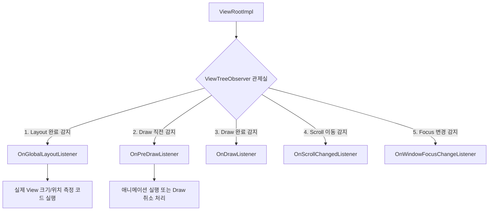

# ViewTreeObserver: 전역 View 트리 감시 관제실

`ViewTreeObserver`는 Android 화면을 구성하는 View 트리 전체의 상태 변화(레이아웃 계산, 렌더링 직전/후, 터치, 스크롤 등)를 중앙에서 감지하고 리스너를 통해 이벤트를 수신받는 **전역 이벤트 관제 및 감시 클래스**입니다.

---

## 1단계: 개념 소개 & 비유 (Core Concept & Analogy)

### 비유로 이해하기: 건물 전체의 CCTV 관제 시스템 📹

개별 `View`가 각자 방 안의 상황만 알고 있는 "방 내부 주민"이라면, `ViewTreeObserver`는 건물 전체(View Tree)를 총괄 관리하는 **중앙 CCTV 관제실**과 같습니다.

* **개별 View**: 자신의 `onMeasure()`, `onLayout()` 시점만 알며 다른 방(형제 뷰나 부모 뷰)의 정확한 위치 변화나 건물 전체의 변화를 직접 알아차리기 어렵습니다.
* **ViewTreeObserver**: 건물 전체를 실시간으로 모니터링하는 CCTV 네트워크입니다. "누군가 벽을 옮겨 크기가 바뀜(Layout)", "조명이 완전히 켜지기 직전(PreDraw)", "카메라 전원이 꺼짐(Detach)" 등 건물 내부의 전역 이벤트를 관제실로 전파합니다.

```text
[개별 View] --------------> 자기 영역만 인지
[ViewTreeObserver] --------> View Tree 전체의 레이아웃, 스크롤, 그리기 시점 전역 감시
```

---

## 2단계: 동작 원리 & 아키텍처 (Architecture & Flow)

Android의 뷰 그리기는 최상위 컨트롤러인 `ViewRootImpl`에서 시작되어 View 트리를 따라 하향식(Top-down)으로 전파됩니다. `ViewTreeObserver`는 이 순회 단계 사이사이마다 등록된 관제 리스너(Listener)들에게 콜백을 발행합니다.



### 주요 생명주기 및 관제 주기
1. **Window 연결 (Attach)**: View가 Window에 붙으면 유효한 `ViewTreeObserver` 인스턴스가 활성화됩니다.
2. **트리 탐색 시점 콜백**: `performTraversals()` 실행 과정에서 배치(Layout) 및 그리기(Draw) 타이밍에 맞춰 등록된 리스너가 순차 호출됩니다.
3. **해제 (Detach)**: View가 화면에서 제거되거나 관제가 끝나면 반드시 등록된 리스너를 제거해야 메모리 누수가 방지됩니다.

---

## 3단계: 핵심 API & 주요 이벤트 리스너 (Key APIs & Listeners)

`ViewTreeObserver`는 감시하려는 이벤트 유형에 따라 다양한 리스너 인터페이스를 제공합니다.

| 리스너 이름 | 호출 시점 | 주요 활용 사례 |
| :--- | :--- | :--- |
| `OnGlobalLayoutListener` | View 트리의 전역 레이아웃 배치/크기가 변경되었을 때 | 뷰의 실제 화면 출력 크기 측정, 소프트 키보드 올라옴 감지 |
| `OnPreDrawListener` | View 트리를 그리기(Draw) 직전 (반환값으로 Draw 진행/취소 결정) | 화면이 깜빡이기 전 동적 애니메이션 시작, 스플래시 화면 지연 |
| `OnDrawListener` | View 트리의 그리기 렌더링 단계가 실행될 때 | 렌더링 프레임 동기화 모니터링 |
| `OnScrollChangedListener` | View 트리 내부의 스크롤 위치가 변경되었을 때 | 커스텀 스크롤 헤더 패러랙스 효과 구현 |
| `OnWindowFocusChangeListener` | Window의 포커스 획득/상실 시 | 미디어 일시정지, 게임 자동 일시정지 |
| `OnGlobalFocusChangeListener` | View 트리 내에서 포커스를 가진 뷰가 변경될 때 | 접근성 및 폼 입력 뷰 포커스 트래킹 |

---

## 4단계: 실전 활용 코드 예시 (Practical Code Examples)

### 예시 1: 렌더링 완료 후 뷰의 실제 너비/높이 측정하기

뷰가 `xml`에 배치되자마자는 `width`와 `height`가 `0`입니다. `OnGlobalLayoutListener`를 통해 레이아웃이 끝난 시점의 크기를 안전하게 측정합니다.

```kotlin
import android.os.Bundle
import android.view.View
import android.view.ViewTreeObserver
import androidx.appcompat.app.AppCompatActivity

class MainActivity : AppCompatActivity() {

    private lateinit var targetView: View

    override fun onCreate(savedInstanceState: Bundle?) {
        super.onCreate(savedInstanceState)
        setContentView(R.layout.activity_main)

        targetView = findViewById(R.id.target_view)

        // ViewTreeObserver 획득 및 리스너 등록
        targetView.viewTreeObserver.addOnGlobalLayoutListener(object : ViewTreeObserver.OnGlobalLayoutListener {
            override fun onGlobalLayout() {
                // 1. 레이아웃 배치가 완료된 실제 크기 측정
                val measuredWidth = targetView.width
                val measuredHeight = targetView.height

                println("TargetView 렌더링 완료 크기: $measuredWidth x $measuredHeight")

                // 2. 단발성 측정인 경우, 중복 호출 및 메모리 누수 방지를 위해 반드시 리스너 제거!
                targetView.viewTreeObserver.removeOnGlobalLayoutListener(this)
            }
        })
    }
}
```

### 예시 2: Android KTX를 활용한 간결한 처리 (`doOnLayout`, `doOnPreDraw`)

Core KTX 라이브러리를 사용하면 리스너 해제 보일러플레이트 코드를 자동으로 처리할 수 있습니다.

```kotlin
import androidx.core.view.doOnLayout
import androidx.core.view.doOnPreDraw

// 1. 레이아웃 측정 완료 후 단 1회 실행 (내부적으로 OnGlobalLayoutListener 자동 해제)
targetView.doOnLayout { view ->
    val height = view.height
    // 필요 작업 수행
}

// 2. 그리기 직전 단 1회 실행
targetView.doOnPreDraw { view ->
    // 애니메이션 시작 시점 설정
    view.alpha = 0f
    view.animate().alpha(1f).setDuration(300).start()
}
```

---

## 5단계: 주의사항 & 꿀팁 (Pitfalls & Best Practices)

> [!CAUTION]
> **1. 메모리 누수(Memory Leak) 방지**
> 리스너를 `ViewTreeObserver`에 등록한 뒤 제거하지 않으면 View가 익명 클래스 참조를 유지하여 Activity/Fragment가 파괴되어도 GC되지 않습니다. 사용이 끝나면 반드시 `removeOnGlobalLayoutListener()`를 호출하세요.

> [!WARNING]
> **2. 무한 재배치 루프(Infinite Layout Loop) 주의**
> `onGlobalLayout()` 콜백 내부에서 `view.requestLayout()`이나 `view.layoutParams = ...` 등 레이아웃 재배치를 유발하는 코드를 작성하고 리스너를 제거하지 않으면, `Layout -> Callback -> requestLayout -> Layout -> Callback` 식의 무한 루프에 빠져 앱이 얼어붙습니다.

### 핵심 요약 체크리스트 💡
- [x] 뷰가 화면에 완전히 배치된 후 크기를 측정하고 싶은가요? -> `OnGlobalLayoutListener` 또는 `doOnLayout` 사용
- [x] 화면이 첫 프레임을 그리기 전 애니메이션 전처리가 필요한가요? -> `OnPreDrawListener` 또는 `doOnPreDraw` 사용
- [x] 리스너 수동 등록 시 `removeOn...`을 잊지 않고 처리했나요?

---

## 연관 참고 문서
* [Custom View](custom-view.md)
* [Haptic Feedback](haptic-feedback.md)
