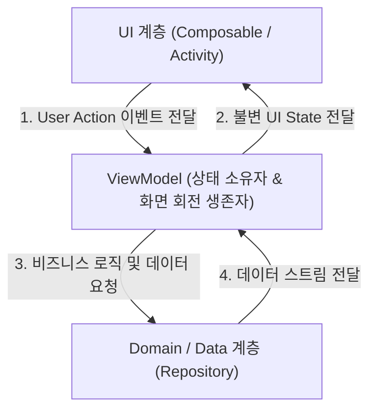

## ViewModel (뷰모델)

### 1. 개요 및 비유로 이해하는 개념 (Overview & Intuitive Analogy)

**ViewModel(뷰모델)** 은 Android 및 현대 애플리케이션 아키텍처에서 **Presentation Layer(UI 계층)의 화면 상태(UiState)를 관리하고, 비즈니스 로직 및 하위 데이터 계층(Domain/Data)과의 통신을 담당하는 핵심 아키텍처 컴포넌트**입니다.

#### 초보자를 위한 쉬운 비유

ViewModel 은 **"상태 보관 창고 & 화면 회전 생존자 (State Store & Configuration-Change Survivor)"** 라고 이해할 수 있습니다.

스마트폰 화면을 세로에서 가로로 돌리는 행위(화면 회전, Configuration Change)는 Android 시스템 내부에서 Activity 나 Fragment 라는 **임시 포장마차 건물(UI 컴포넌트)을 헐고 새 건물로 재건축하는 과정**과 같습니다. 만약 주문 내역과 요리 데이터(UI 상태)를 포장마차 테이블 위에 그냥 놓아두면, 재건축 시 모든 데이터가 흔적도 없이 파괴됩니다.

하지만 뒤쪽에 단단하게 지어진 **"중앙 창고(ViewModel)"**에 주문 상태(UiState)를 보관해 두면, 앞쪽 포장마차가 파괴되고 새로 지어져도 창고는 파괴되지 않고 메모리에 남아있으므로, 손님에게 끊김 없이 최신 주문 데이터와 화면 상태를 그대로 제공할 수 있습니다.



---

### 2. ViewModel 의 핵심 역할 (Core Responsibilities)

ViewModel 은 UI 와 데이터 레이어 사이에서 다음과 같은 3 가지 핵심 역할을 수행합니다.

#### 1) UI 상태(UiState) 관리 및 단일 진실 출처 역할

- 화면 전반에서 필요한 데이터를 `StateFlow`나 `LiveData` 형태로 캡슐화하여 UI 에 노출합니다.
- UI 계층이 직접 상태 데이터를 mutating(수정)하지 못하게 방지하며, [Compose SSOT](compose-ssot.md) 원칙을 준수합니다.

#### 2) UI 라이프사이클과의 안전한 분리 (Configuration Change 생존 & 메모리 누수 방지)

- `ViewModel` 은 Composable 이나 Activity 보다 더 긴 수명(Lifecycle)을 가집니다.
- **주의**: ViewModel 내부에서 `Activity Context`, `View`, `NavController` 등 UI 컴포넌트 참조를 절대 포함해서는 안 됩니다. UI 가 파괴된 후에도 ViewModel 이 해당 객체를 가리키고 있으면 메모리 누수(Memory Leak)가 발생합니다.

#### 3) 비즈니스 이벤트 처리 및 비동기 작업 관리

- 버튼 클릭, 텍스트 입력 등 UI 이벤트를 전달받아 적절한 UseCase 나 Repository 를 호출합니다.
- 코루틴 Scope 인 `viewModelScope` 를 사용하여 화면 비동기 작업을 안전하게 처리하고, ViewModel 이 클리어(Clear)될 때 자동으로 코루틴 작업을 취소하여 자원 낭비를 막습니다.

---

### 3. ViewModel 작성 실전 패턴 및 수명주기 흐름 (Implementation Pattern & Lifecycle Flow)

#### 1) 캡슐화 구현 패턴

ViewModel 을 작성할 때는 캡슐화 패턴을 지켜 내부에서는 가변 상태(`MutableStateFlow`)를 다루고, 외부 UI 에는 읽기 전용 불변 상태(`StateFlow`)만 노출합니다.

```kotlin
class UserProfileViewModel(
    private val userRepository: UserRepository
) : ViewModel() {

    // 1. 내부 전용 가변 상태 (Private Mutable State)
    private val _uiState = MutableStateFlow<UserProfileUiState>(UserProfileUiState.Loading)
    
    // 2. 외부 UI 노출용 읽기 전용 불변 상태 (Public Immutable StateFlow)
    val uiState: StateFlow<UserProfileUiState> = _uiState.asStateFlow()

    init {
        loadUserProfile()
    }

    fun loadUserProfile() {
        viewModelScope.launch {
            _uiState.value = UserProfileUiState.Loading
            try {
                val user = userRepository.getUserProfile()
                _uiState.value = UserProfileUiState.Success(user)
            } catch (e: Exception) {
                _uiState.value = UserProfileUiState.Error(e.message ?: "알 수 없는 에러")
            }
        }
    }
}
```

#### 2) Activity 대 ViewModel 수명주기 흐름

```mermaid
gantt
    title Activity lifecycle vs ViewModel lifecycle (Configuration Change)
    dateFormat  X
    axisFormat %s
    section Activity
    Created       :active, a1, 0, 3
    Destroyed (Rotate) :crit, a2, 3, 4
    Recreated     :active, a3, 4, 8
    section ViewModel
    Alive & Retained :done, v1, 0, 8
    Cleared       :milestone, v2, 8, 8
```



---

### 4. 초보자가 자주 범하는 안티패턴 (Anti-Patterns & Pitfalls)

1. **ViewModel 내부에 UI 객체나 UI 컨트롤러 포함**:
   - `NavController`, `SnackbarHostState`, `Toast`, `Context` 등을 ViewModel 에 저장하는 행위는 뷰 계층과의 단단한 결합(Tight Coupling)을 유발하고 메모리 누수를 야기합니다.
2. **모든 단순 UI 임시 상태를 ViewModel 에 보관하려는 오버엔지니어링**:
   - 아코디언 메뉴의 열림/닫힘 토글, TextField 가공 중 임시 커서 위치, 팝업 애니메이션 유무 등 pure UI 상태는 ViewModel 에 넣지 않고 Composable 내부에서 `remember { mutableStateOf(…) }` 로 관리하는 것이 바람직합니다.
3. **가변 상태(`MutableStateFlow`)를 외부에 직접 노출**:
   - 외부 UI 컴포넌트가 `viewModel.uiState.value = …` 로 직접 상태를 수정할 수 있게 되면 [Compose SSOT](compose-ssot.md) 원칙이 깨지고 상태 예측이 불가능해집니다.

---

### 5. 연결 문서 (Related Links)

- [Compose SSOT](compose-ssot.md) - ViewModel 이 UiState 의 단일 진실 출처가 되는 아키텍처 원칙
- [StateFlow & SharedFlow](stateflow-and-sharedflow.md) - ViewModel 에서 UI 로 상태를 안전하게 전달하기 위한 반응형 스트림
- [Recomposition (재구성)](jetpack-compose/runtime/recomposition.md) - ViewModel 의 UiState 변경에 반응하여 발생하는 Compose UI 재렌더링 메커니즘
- [Pure Function (순수 함수)](../../../computer-science/pure-function.md) - ViewModel 과 대비되는 순수 UI 컴포넌트의 성질
- [Side Effect (부작용)](../../../computer-science/side-effect.md) - ViewModel 이 비동기 작업을 안전하게 격리하여 처리하는 범위
- [Immutability (불변성)](../../../computer-science/immutability.md) - UiState 모델링 시 예측 가능성을 높이는 데이터 불변성 원칙
