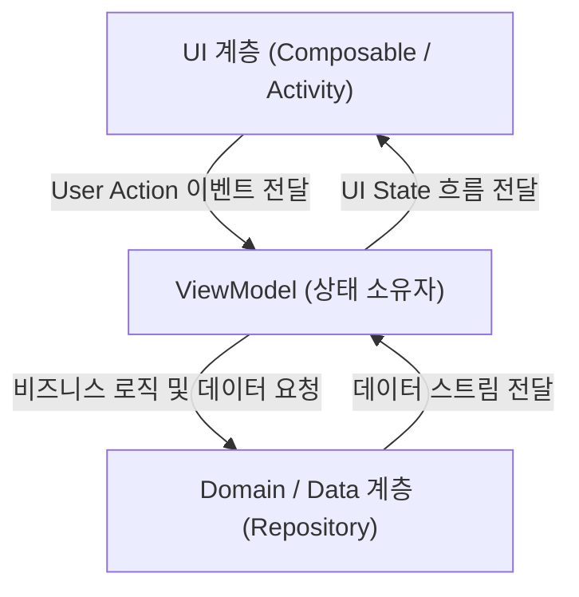

# ViewModel (뷰모델)

## 1. ViewModel 이란 무엇인가 (Overview)

**ViewModel(뷰모델)** 은 Android 및 현대 애플리케이션 아키텍처에서 **Presentation Layer(UI 계층)의 화면 상태(UiState)를 관리하고, 비즈니스 로직 및 하위 데이터 계층(Domain/Data)과의 통신을 담당하는 핵심 아키텍처 컴포넌트**이다.

초보자 관점에서 ViewModel은 **"스마트폰을 세로에서 가로로 돌려도(화면 회전, Configuration Change) 데이터가 사라지지 않고 안전하게 유지되는 상태 보관 창고"** 라고 이해할 수 있다.

Android Activity나 Fragment와 같은 UI 컴포넌트는 화면이 회전되거나 시스템 설정이 변경되면 수명주기에 의해 완전히 파괴되었다가 다시 생성된다. ViewModel을 사용하지 않으면 화면을 돌릴 때마다 기존 입력 데이터나 로딩 상태가 모두 초기화되는 문제가 발생한다. Android AAC(Android Architecture Components)의 `ViewModel` 은 이러한 UI 파괴 시점에도 파괴되지 않고 메모리에 살아남아 UI에 필요한 최신 상태를 끊김 없이 제공한다.



---

## 2. ViewModel 의 핵심 역할 (Core Responsibilities)

ViewModel은 UI와 데이터 레이어 사이에서 다음과 같은 3가지 핵심 역할을 수행한다.

### 1) UI 상태(UiState) 관리 및 단일 진실 출처 역할
- 화면 전반에서 필요한 데이터를 `StateFlow`나 `LiveData` 형태로 캡슐화하여 UI에 노출한다.
- UI 계층이 직접 상태 데이터를 mutating(수정)하지 못하게 방지하며, [Single Source of Truth (단일 진실 출처)](single-source-of-truth.md) 원칙을 준수한다.

### 2) UI 라이프사이클과의 안전한 분리 (메모리 누수 방지)
- `ViewModel` 은 Composable 이나 Activity 보다 더 긴 수명(Lifecycle)을 가진다.
- **주의**: ViewModel 내부에서 `Activity Context`, `View`, `NavController` 등 UI 컴포넌트 참조를 절대 포함해서는 안 된다. UI가 파괴된 후에도 ViewModel이 해당 객체를 가리키고 있으면 메모리 누수(Memory Leak)가 발생한다.

### 3) 비즈니스 이벤트 처리 및 비동기 작업 관리
- 버튼 클릭, 텍스트 입력 등 UI 이벤트를 전달받아 적절한 UseCase나 Repository를 호출한다.
- 코루틴 Scope인 `viewModelScope`를 사용하여 화면 비동기 작업을 안전하게 처리하고, ViewModel이 클리어(Clear)될 때 자동으로 코루틴 작업을 취소하여 자원 낭비를 막는다.

---

## 3. ViewModel 작성 실전 패턴 (Implementation Pattern)

ViewModel을 작성할 때는 캡슐화 패턴을 지켜 내부에서는 가변 상태(`MutableStateFlow`)를 다루고, 외부 UI에는 읽기 전용 불변 상태(`StateFlow`)만 노출한다.

```kotlin
class UserProfileViewModel(
    private val userRepository: UserRepository
) : ViewModel() {

    // 1. 내부 전용 가변 상태 (Private Mutable State)
    private val _uiState = MutableStateFlow<UserProfileUiState>(UserProfileUiState.Loading)
    
    // 2. 외부 UI 노출용 읽기 전용 불변 상태 (Public Immutable StateFlow)
    val uiState: StateFlow<UserProfileUiState> = _uiState.asStateFlow()

    init {
        loadUserProfile()
    }

    fun loadUserProfile() {
        viewModelScope.launch {
            _uiState.value = UserProfileUiState.Loading
            try {
                val user = userRepository.getUserProfile()
                _uiState.value = UserProfileUiState.Success(user)
            } catch (e: Exception) {
                _uiState.value = UserProfileUiState.Error(e.message ?: "알 수 없는 에러")
            }
        }
    }
}
```

---

## 4. 초보자가 자주 범하는 안티패턴 (Anti-Patterns)

1. **ViewModel 내부에 UI 객체나 UI 컨트롤러 포함**:
   - `NavController`, `SnackbarHostState`, `Toast`, `Context` 등을 ViewModel에 저장하는 행위는 뷰 계층과의 단단한 결합(Tight Coupling)을 유발하고 메모리 누수를 야기한다.
2. **모든 단순 UI 임시 상태를 ViewModel에 보관하려는 오버엔지니어링**:
   - 아코디언 메뉴의 열림/닫힘 토글, TextField 가공 중 임시 커서 위치, 팝업 애니메이션 유무 등 pure UI 상태는 ViewModel에 넣지 않고 Composable 내부에서 `remember { mutableStateOf(...) }` 로 관리하는 것이 바람직하다.
3. **가변 상태(`MutableStateFlow`)를 외부에 직접 노출**:
   - 외부 UI 컴포넌트가 `viewModel.uiState.value = ...` 로 직접 상태를 수정할 수 있게 되면 [Single Source of Truth (단일 진실 출처)](single-source-of-truth.md) 원칙이 깨지고 상태 예측이 불가능해진다.

---

## 5. 연결 문서 (Related Links)

- [Single Source of Truth (단일 진실 출처)](single-source-of-truth.md) - ViewModel 이 UiState 의 단일 진실 출처가 되는 아키텍처 원칙
- [StateFlow & SharedFlow](stateflow-and-sharedflow.md) - ViewModel 에서 UI 로 상태를 안전하게 전달하기 위한 반응형 스트림
- [Recomposition (재구성)](jetpack-compose/runtime/recomposition.md) - ViewModel 의 UiState 변경에 반응하여 발생하는 Compose UI 재렌더링 메커니즘
- [Pure Function (순수 함수)](../../../computer-science/pure-function.md) - ViewModel 과 대비되는 순수 UI 컴포넌트의 성질
- [Side Effect (부작용)](../../../../02_references/computer-science/side-effect.md) - ViewModel 이 비동기 작업을 안전하게 격리하여 처리하는 범위
- [Immutability (불변성)](../../../computer-science/immutability.md) - UiState 모델링 시 예측 가능성을 높이는 데이터 불변성 원칙
