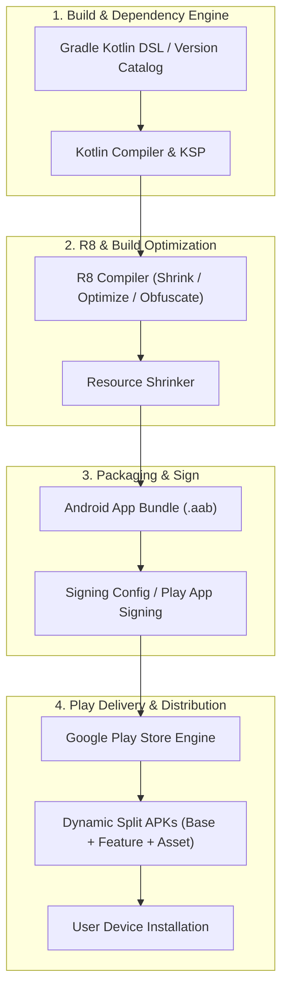

## Android 패키징과 배포 지도

이 지도는 Android 앱을 빌드 산출물(**AAB**: Android App Bundle - 게시용 분할 아티팩트 / **APK**: Android Package - 기기 설치용 바이너리)로 만들고, **R8**(자바 바이트코드 최적화 및 난독화 컴파일러) 최적화를 수행하며, 서명 및 Play Store/Dynamic Delivery를 통해 배포하고, **AGP**(Android Gradle Plugin - 빌드 파이프라인 확장 도구) 기반의 의존성·CI 파이프라인을 체계적으로 관리하는 전체 흐름을 네 개 영역으로 다룬다.



### 정본 MOC 영역
- [Gradle 빌드 계약](build/gradle/gradle-build-contracts/gradle-build-contracts.md)
- [의존성, 버전, CI 계약](build/dependency-versioning/dependency-ci-contracts/dependency-ci-contracts.md)
- [Android CI/CD 구현 계약](build/ci-cd-contracts/ci-cd-contracts.md)
- [Play 릴리스와 배포 계약](distribution/release-distribution-contracts/release-distribution-contracts.md)
- [Play Delivery 계약](distribution/play-delivery-contracts/play-delivery-contracts.md)
- [Google Play Billing 계약](distribution/billing-contracts/billing-contracts.md)
- [R8와 Gradle 빌드 최적화 계약](optimization/build-optimization-contracts/build-optimization-contracts.md)

읽는 순서: Gradle 빌드 계약 → 의존성, 버전, CI 계약 → Android CI/CD 구현 계약(그 CI 게이트를 실제로 무엇으로 구현하는지) → R8와 Gradle 빌드 최적화 계약 → Play 릴리스와 배포 계약/Play Delivery 계약(배포 대상과 산출물) → Google Play Billing 계약(디지털 상품 결제가 걸린 앱만 해당).

### 관측 가능 증거 (Observable Evidence)
```bash
# 1. 빌드 프로파일링 및 의존성 분석
./gradlew assembleRelease --scan --profile

# 2. AAB 산출물 번들 검증
bundletool build-apks --bundle=app-release.aab --output=app.apks --mode=default

# 3. 타겟 기기 APK 가상 설치 및 패키지 검증
bundletool install-apks --apks=app.apks
adb shell pm list packages | grep com.example.app
```


### Subsystem Contract Maps
- [android-default-config-defines-identity-and-version-contracts](./build/gradle/gradle-build-contracts/android-default-config-defines-identity-and-version-contracts.md)
