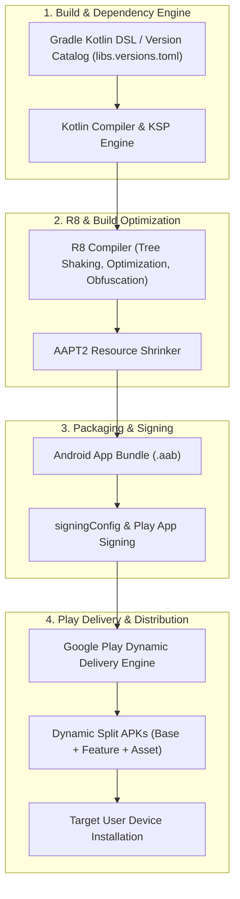

## Android 패키징과 배포 지도

### 개념 및 필요성 (What & Why)
**Android 패키징과 배포(Packaging & Deployment)** 영역은 개발자가 소스 코드를 작성한 이후 최종 사용자 디바이스에 안전하고 효율적으로 앱을 전달하기까지의 전체 엔지니어링 생태계를 다룬다.
현대 안드로이드 배포 체계는 단순한 로컬 빌드 및 APK 생성 수준을 넘어, **Gradle Kotlin DSL 및 Version Catalog** 기반의 모듈 의존성 제어, **KSP** 중심의 빠른 소스 코드 생성, **R8 및 Resource Shrinker** 기반의 바이너리 수축/난독화 최적화, **Play App Signing** 기반의 서명 보안 이원화, **AAB(Android App Bundle)** 기반의 맞춤형 Dynamic Split APK 동적 배포, 그리고 **Google Play Billing** 기반의 인앱 결제 인증에 이르기까지 정밀한 계약 체계로 얽혀 있다.
이 지도는 43개 핵심 영역의 계약 문서를 체계적으로 엮어 안드로이드 배포 툴체인의 완벽한 청사진을 제공한다.

### 전체 시스템 아키텍처 및 내부 메커니즘 (System Architecture & Mechanism)
Android 패키징 및 배포 시스템은 다음 4대 핵심 하위 시스템 파이프라인으로 구성된다:



### 정본 MOC 영역 (Master Map of Content)
1. **[Gradle 빌드 계약](build/gradle/gradle-build-contracts/gradle-build-contracts.md)**: AGP, `defaultConfig`, Build Variant 매트릭스, SourceSet 우선순위, Convention Plugin, `signingConfigs`.
2. **[의존성 및 CI 계약](build/dependency-versioning/dependency-ci-contracts/dependency-ci-contracts.md)**: Version Catalog, KSP vs KAPT, Compose BOM/Compiler, `kotlinx.serialization`, Resolution Strategy, CI 게이트.
3. **[CI/CD 계약](build/ci-cd-contracts/ci-cd-contracts.md)**: Fastlane 오케스트레이션, CI 자격증명 보안, Remote Cache & Build Matrix, 파이프라인 실패 시그널.
4. **[R8와 Gradle 빌드 최적화 계약](optimization/build-optimization-contracts/build-optimization-contracts.md)**: R8 수축/최적화/난독화, Resource Shrinker, ProGuard Keep Rules, R8 Full Mode, Incremental/Build/Configuration Cache.
5. **[Play 릴리스와 배포 계약](distribution/release-distribution-contracts/release-distribution-contracts.md)**: AAB vs APK, Play App Signing, 업그레이드 호환성, 테스트 트랙, Staged Rollout, In-App Update/Review API.
6. **[Play Delivery 계약](distribution/play-delivery-contracts/play-delivery-contracts.md)**: Play Feature Delivery(PFD), Dynamic Feature Module(DFM), Play Asset Delivery(PAD), SplitInstallManager.
7. **[Google Play Billing 계약](distribution/billing-contracts/billing-contracts.md)**: Billing Library v6+, 서버 대 서버 Purchase Token 검증, 3일 이내 Acknowledge/Consume 환불 방지, 구독 라이프사이클.

### 추천 탐색 가이드
- **초급/개념 습득**: `Gradle 빌드 계약` $
ightarrow$ `의존성 및 CI 계약` $
ightarrow$ `Play 릴리스와 배포 계약`
- **심화/배포 자동화**: `CI/CD 계약` $
ightarrow$ `R8와 Gradle 빌드 최적화 계약` $
ightarrow$ `Play Delivery 계약` $
ightarrow$ `Google Play Billing 계약`

### 관측 가능 증거 (Observable Evidence)
전체 빌드 및 배포 산출물 검증 스크립트:
```bash
# 1. 빌드 프로파일링 및 의존성 분석
./gradlew assembleRelease --scan --profile

# 2. AAB 산출물 번들 검증
bundletool build-apks --bundle=app-release.aab --output=app.apks --mode=default

# 3. 타깃 기기 APK 가상 설치 및 패키지 검증
bundletool install-apks --apks=app.apks
adb shell pm list packages | grep com.example.app
```
