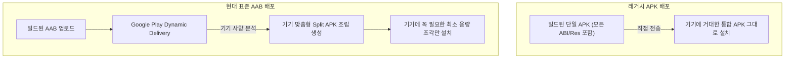

## APK vs AAB (안드로이드 배포 규격 비교)

### 1. 개요 (Overview)

**APK (Android Application Package)** 와 **AAB (Android App Bundle)** 는 Android 앱을 빌드하고 배포하기 위한 두 가지 주요 패키징 규격이다.

레거시 무차별 포함 아티팩트인 APK 와 달리, AAB 는 Google Play 의 Dynamic Delivery 기술과 결합하여 기기 맞춤형 **Split APKs** 를 생성해 내는 현대 안드로이드 게시 표준이다.

---

#### 초보자를 위한 쉽게 이해하는 비유

- **APK (통째로 다 넣어놓은 무거운 종합 선물 상자)**:
  - 어떤 스마트폰에 설치될지 모르니 모든 해상도의 이미지와 모든 CPU 지원 코드를 한 상자에 다 담아서 배달하는 방식 (설치용 용량 커짐).
- **AAB (주문 즉시 기기 사양에 맞춰 조립해 주는 맞춤 뷔페)**:
  - 개발자는 원재료 조립법(AAB)만 구글 플레이에 올려두고, 구글 플레이가 사용자의 기기 사양(arm64, xxxhdpi 등)에 꼭 필요한 조각(Split APKs)만 딱 조립해서 전송해 주는 방식 (설치 용량 대폭 감소).

---

### 2. APK vs AAB 핵심 비교표

| 비교 항목 | APK (Android Application Package) | AAB (Android App Bundle) |
| :--- | :--- | :--- |
| **주요 목적** | **기기 직접 설치 (`adb install`, 로컬 테스트)** | **Google Play 게시용 표준 아티팩트** |
| **파일 확장자** | `.apk` | `.aab` |
| **기기 맞춤 분할** | 불가 (모든 ABI/Resource 통째로 포함) | **가능 (Play 가 기기 맞춤 Split APK 생성)** |
| **앱용량 절감** | 용량 큼 (불필요 자원 상주) | **평균 15~30% 용량 절감** |
| **기기 직접 설치** | 가능 (스마트폰에서 즉시 실행) | 불가능 (APK 변환 도구 `bundletool` 필요) |
| **동적 기능 모듈** | 지원 안 함 | **On-Demand Dynamic Feature Module 지원** |

---

### 3. 연결 문서 (Related Links)

- [Play app signing은 업로드 키와 앱 서명 키를 분리한다](distribution/release-distribution-contracts/play-app-signing-separates-upload-key-and-app-signing-key.md) - Play App Signing 필수 서명 계약
- [Play app signing은 업로드 키와 앱 서명 키를 분리한다](distribution/release-distribution-contracts/play-app-signing-separates-upload-key-and-app-signing-key.md) - AAB 배포 계약 노드
- [APK (Android Application Package)](apk.md) - 직접 설치용 패키지 레퍼런스
