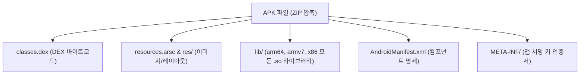

## APK (Android Application Package)

### 1. 개요 (Overview)

**APK (Android Application Package)** 는 Android 기기에 앱을 직접 설치하고 실행하기 위해 필요한 모든 바이너리(DEX), 리소스, 에셋, 매니페스트 및 네이티브 라이브러리(`.so`)를 하나의 ZIP 형식 파일로 압축한 **레거시 및 직접 설치용 파일 아티팩트**이다.

기기에 직접 개별 배포하거나 `adb install` 명령어로 즉시 기기 샌드박스에 설치가 가능하다.

---

#### 초보자를 위한 쉽게 이해하는 비유

- **APK (모든 부품이 다 포함된 완성품 종합 선물 세트)**:
  - 사용자의 스마트폰 칩셋(arm64, x86)이나 화면 해상도(xhdpi, xxxhdpi)에 관계없이 **모든 종류의 이미지와 리소스, 네이티브 코드 부품을 상자 하나에 통째로 때려 넣어 포장한 완제품 선물 세트 상자**.

---

### 2. APK 의 한계점

- **용량 낭비**: 기기에 필요 없는 타 칩셋 네이티브 라이브러리와 타 해상도 리소스까지 모두 설치 패키지에 포함되어 용량이 커진다.
- **Play Store 최적화 한계**: 개별 기기에 맞춤형 앱 분할 배포가 불가능하다.

---

### 3. APK 대 AAB 의 상세 비교

APK 와 현대 표준 배포 아티팩트인 AAB (Android App Bundle) 의 용량 절감 및 플레이 스토어 배포 방식 차이점은 독립된 [APK vs AAB 비교 문서](apk-vs-aab.md) 를 참고한다.

---

### 4. 연결 문서 (Related Links)

- [APK vs AAB 비교](apk-vs-aab.md) - APK 와 AAB 패키징 규격 상세 비교표
- [Play app signing은 업로드 키와 앱 서명 키를 분리한다](distribution/release-distribution/play-app-signing-separates-upload-key-and-app-signing-key.md) - Google Play 표준 맞춤형 앱 분할 배포 아티팩트
- [D8과 R8 컴파일러 및 덱싱(Dexing) 메커니즘](optimization/build-optimization/d8-and-r8.md) - D8/R8 을 통한 바이트코드 덱싱 및 최적화
