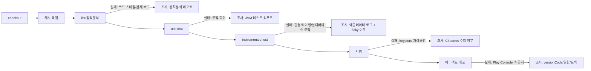

## Android CI/CD 파이프라인 단계마다 실패 신호가 다르다

상위 문서: [Android CI/CD 구현 계약](ci-cd-contracts.md)

### 내부 메커니즘 (Internal Mechanism)

Android CI/CD 파이프라인은 벤더(GitHub Actions, GitLab CI, Jenkins, Bitrise, CircleCI)에 관계없이 같은 순서의 표준 단계를 거친다. 각 단계는 서로 다른 원인의 실패를 걸러내므로, 실패한 단계 이름만으로 조사 범위를 즉시 좁힐 수 있다.

1. **checkout**: 저장소 체크아웃. 실패하면 자격증명/네트워크/서브모듈 문제이지 앱 코드 문제가 아니다.
2. **의존성/Gradle 캐시 복원**: `~/.gradle/caches`, 원격 build cache 복원. 실패해도 보통 빌드는 계속 진행되지만 느려진다 — 이 단계의 실패는 빌드 실패가 아니라 성능 저하 신호다.
3. **lint/정적분석**: `ktlint`, Android Lint, detekt. 실패하면 코드 스타일/잠재 버그이지 런타임 문제가 아니다. 빌드 산출물은 아직 생성되지 않은 시점이다.
4. **unit test**: JVM에서 도는 순수 로직 테스트. 실패하면 비즈니스 로직 회귀다. 이 시점까지는 에뮬레이터/디바이스가 전혀 필요 없다.
5. **instrumented test**: 에뮬레이터 또는 실 디바이스에서 도는 UI/통합 테스트. 실패 원인이 코드 로직, 테스트 환경(에뮬레이터 API 레벨, 디바이스 매트릭스), 타이밍(flaky) 중 어느 것인지부터 구분해야 한다 — 로컬 unit test 통과 후에만 이 단계가 실행되므로, 여기서 실패하면 "로직은 맞는데 실제 실행 환경에서만 깨진다"는 신호다.
6. **서명**: release keystore로 APK/AAB 서명. 실패하면 대부분 keystore 자격증명 접근 실패(경로, 비밀번호, CI secret 미주입)이지 앱 코드 문제가 아니다.
7. **아티팩트 배포**: Fastlane `supply` 또는 Play Developer API로 업로드. 실패하면 서명은 끝났지만 Play Console 쪽 문제(버전 코드 충돌, API 권한 부족, 트랙 설정)다.

이 순서가 중요한 이유는 **비용이 싼 검증을 비용이 비싼 검증보다 먼저 배치**하기 때문이다. lint/unit test 는 몇 초~몇 분이지만 instrumented test 는 에뮬레이터 부팅을 포함해 수 분~수십 분이 걸린다. 순서를 뒤집어 instrumented test 를 먼저 돌리면 사소한 lint 오류 하나로도 비싼 단계를 낭비하게 된다.



### 코드 예시 (GitHub Actions, 단계 순서를 명시적으로 구성)

```yaml
# .github/workflows/android-ci.yml
name: Android CI
on: [pull_request]

jobs:
  build:
    runs-on: ubuntu-latest
    steps:
      - uses: actions/checkout@v4

      - uses: actions/setup-java@v4
        with:
          distribution: 'zulu'
          java-version: '17'

      - uses: gradle/actions/setup-gradle@v3
        with:
          cache-read-only: false

      - name: Lint
        run: ./gradlew lintDebug

      - name: Unit test
        run: ./gradlew testDebugUnitTest

      - name: Instrumented test
        uses: reactivecircus/android-emulator-runner@v2
        with:
          api-level: 34
          script: ./gradlew connectedDebugAndroidTest

      - name: Assemble release (서명 포함)
        env:
          KEYSTORE_BASE64: ${{ secrets.RELEASE_KEYSTORE_BASE64 }}
        run: |
          echo "$KEYSTORE_BASE64" | base64 -d > release.keystore
          ./gradlew bundleRelease
```

### 관측 가능 증거 (Observable Evidence)

```bash
# 어느 step에서 실패했는지 CI 로그에서 바로 구분된다
gh run view <run-id> --log-failed

# 예시 출력: step 이름 자체가 실패 범위를 알려준다
#   ✗ Lint             -> 정적분석 리포트부터 본다
#   ✗ Instrumented test -> 에뮬레이터 logcat부터 본다
```

### 경계

- 이 노트는 "단계가 무엇이고 실패 신호가 어떻게 다른가"만 다룬다. Fast Gate와 Release Gate로 어떤 단계 조합을 언제 실행하는가는 [Android CI/CD 게이트는 빠른 검증과 릴리스 검증을 분리한다](../dependency-versioning/dependency-ci-contracts/android-cicd-gates-separate-fast-validation-and-release-validation.md) 가 다룬다.
- 캐시 복원 단계의 내부 메커니즘(증분 빌드, build cache, configuration cache)은 [증분 빌드, 캐시, 구성 캐시는 빌드 작업량을 줄인다](../../optimization/build-optimization-contracts/incremental-build-cache-and-configuration-cache-reduce-build-work.md) 를 참조한다.

관련 노트: [Android CI/CD 구현 계약](ci-cd-contracts.md)
