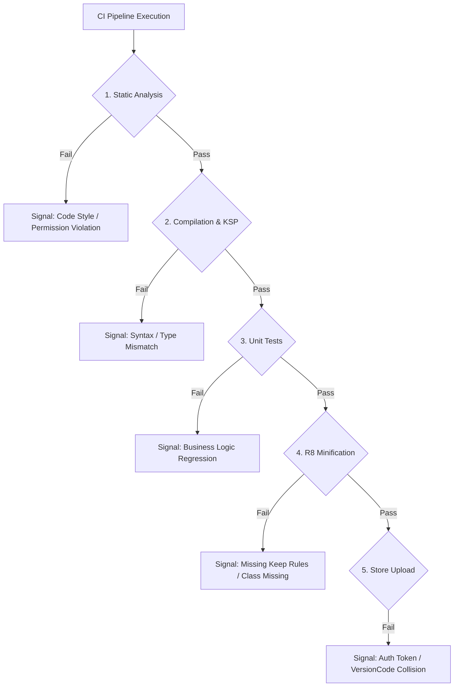

## Android CI/CD 파이프라인 단계는 서로 다른 실패 시그널을 가진다

상위 문서: [CI/CD 계약](ci-cd-contracts.md)

### 개념 및 필요성 (What & Why)
Android CI/CD 파이프라인에서 발생하는 원인 모를 빌드 실패를 신속하게 해결하기 위해서는 각 스테이지별로 유발되는 **실패 시그널(Failure Signal)** 의 고유 패턴을 정확히 구별해야 한다.
정적 린트 실패, 컴파일 타임 에러, 단위 테스트 실패, R8 수축 규약 위반, API 자격증명 거부 에러는 모두 상이한 원인과 대책을 갖는다.
원인을 명확히 나타내는 실패 시그널 분류 체계를 수립하면 디버깅 대기 시간을 대폭 줄일 수 있다.

### 내부 메커니즘 (Internal Mechanism)
**5대 파이프라인 스테이지별 실패 시그널 분류**:
1. **Lint & Code Style Stage (`ktlint`, `detekt`, `androidLint`)**: 코드 스타일 위반, 널 위험, 권한 누락 시 발생하며, 빠른 가이드 메시지를 출력함.
2. **Compile Stage (`compileDebugKotlin`)**: 타입 불일치, 구문 오류, KSP 심볼 처리 오류로 발생함.
3. **Unit Test Stage (`testDebugUnitTest`)**: 비즈니스 로직 단정문(Assertion) 실패로 발생함.
4. **R8 / Packaging Stage (`minifyReleaseWithR8`)**: R8 난독화 과정에서 리플렉션 대상 클래스의 Keep 규칙 누락이나 인터페이스 파괴로 발생함.
5. **Signing & Deployment Stage (AGP signing, APK `apksigner` 검증, Fastlane `supply`)**: Keystore 비밀번호 불일치, APK 서명 검증 실패, Google Play Developer API OAuth 토큰 만료, `versionCode` 중복 등으로 발생한다. AAB 배포 파이프라인에서 `apksigner`를 AAB 서명 도구로 취급하지 않는다.



### 코드 예시 (Pipeline Failure Exit Code Handling)
```bash
# 특정 스테이지의 실패 시그널을 분리 관측하는 CI 스크립트 예시
if ! ./gradlew lintDebug; then
  echo "[FAILURE SIGNAL 1] Static Code Analysis Failed. Check detekt/lint reports."
  exit 1
fi

if ! ./gradlew testDebugUnitTest; then
  echo "[FAILURE SIGNAL 2] Unit Test Regression Detected."
  exit 2
fi

if ! ./gradlew bundleRelease; then
  echo "[FAILURE SIGNAL 3] R8 Shrinking or Packaging Failed. Check ProGuard keep rules."
  exit 3
fi
```

### 관측 가능 증거 (Observable Evidence)
실패 시그널 및 스택 트레이스는 CI 파이프라인로그 아티팩트에서 파악할 수 있다:
```bash
./gradlew bundleRelease --stacktrace
```

관련 노트: [Android CI/CD 게이트는 빠른 검증과 릴리스 검증을 분리한다](../dependency-versioning/dependency-ci-contracts/android-cicd-gates-separate-fast-validation-and-release-validation.md), [CI/CD 계약](ci-cd-contracts.md)
