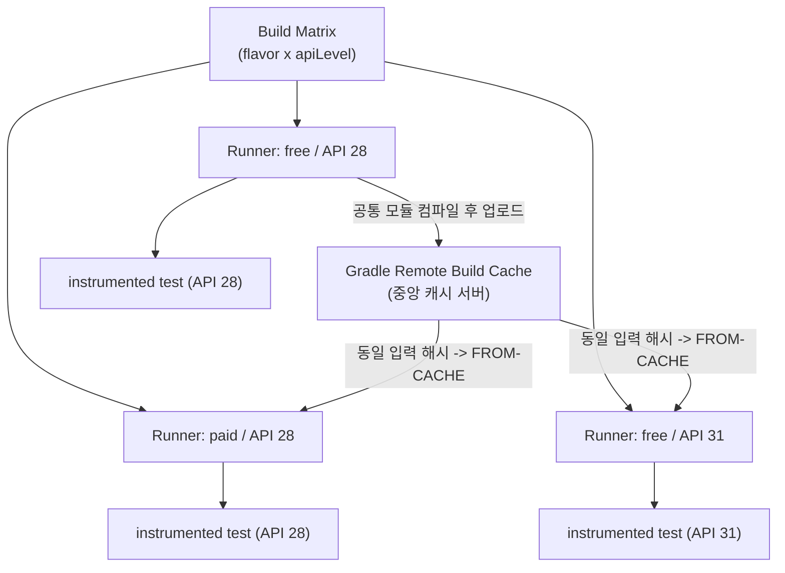

## 빌드 매트릭스와 Gradle 원격 캐시를 함께 쓰면 매트릭스 빌드 시간이 줄어든다

상위 문서: [Android CI/CD 구현 계약](ci-cd-contracts.md)

### 내부 메커니즘 (Internal Mechanism)

CI가 여러 API level, 기기 프로필, product flavor 조합을 각각 검증해야 할 때 파이프라인은 **빌드 매트릭스(build matrix)** 로 job을 병렬 확장한다. 예를 들어 `flavor = {free, paid}` 와 `apiLevel = {28, 31, 34}` 조합을 모두 검증하면 job 수가 곱셈으로 늘어난다. 문제는 각 매트릭스 셀이 별도의 CI 러너/컨테이너에서 독립적으로 시작되므로, 아무 최적화 없이 매트릭스를 돌리면 **동일한 모듈을 매트릭스 셀 수만큼 반복 컴파일**하게 된다는 점이다 — flavor가 달라도 공통 모듈 소스는 바뀌지 않았는데도 매번 처음부터 컴파일한다.

이를 줄이는 표준 전략은 매트릭스 병렬성과 **Gradle 원격 빌드 캐시(remote build cache)** 를 조합하는 것이다. 원격 캐시는 태스크 입력 해시를 키로 컴파일 산출물을 중앙 캐시 서버에 저장하므로, 한 매트릭스 셀(예: `free/api28`)이 먼저 컴파일한 공통 모듈의 캐시 엔트리를 다른 셀(`paid/api28`, `free/api31`)이 그대로 재사용(`FROM-CACHE`)할 수 있다. 매트릭스 셀은 물리적으로 다른 러너에서 실행되므로 로컬 캐시만으로는 이 재사용이 불가능하고, 반드시 셀 사이에서 공유되는 원격 캐시가 필요하다.



이 전략은 테스트 실행 자체를 얼마나 나눠 도는지(디바이스 팜 sharding)와는 다른 층위다 — 여기서 다루는 것은 **컴파일 단계의 중복 제거**이고, 테스트 실행을 과거 실행 시간 기준으로 shard하는 전략은 별도 계약이다.

### 코드 예시 (GitHub Actions 매트릭스 + Gradle 원격 캐시)

```yaml
# .github/workflows/matrix-test.yml
jobs:
  instrumented-test:
    strategy:
      matrix:
        flavor: [free, paid]
        api-level: [28, 31, 34]
    runs-on: ubuntu-latest
    steps:
      - uses: actions/checkout@v4
      - uses: gradle/actions/setup-gradle@v3

      - name: Run instrumented test (${{ matrix.flavor }} / API ${{ matrix.api-level }})
        uses: reactivecircus/android-emulator-runner@v2
        with:
          api-level: ${{ matrix.api-level }}
          script: ./gradlew connected${{ matrix.flavor }}DebugAndroidTest
```

```properties
# gradle.properties — 모든 매트릭스 러너가 같은 원격 캐시 서버를 공유하도록 지정
org.gradle.caching=true
```

```kotlin
// settings.gradle.kts
buildCache {
    remote<HttpBuildCache> {
        url = uri("https://build-cache.internal.example.com/cache/")
        isPush = System.getenv("CI") == "true" // CI만 캐시를 채우고, 로컬 개발자는 읽기만
        credentials {
            username = System.getenv("BUILD_CACHE_USER")
            password = System.getenv("BUILD_CACHE_PASSWORD")
        }
    }
}
```

### 관측 가능 증거 (Observable Evidence)

```bash
# 매트릭스 셀 간 캐시 재사용률을 Build Scan에서 확인
./gradlew connectedFreeDebugAndroidTest --scan

# 두 번째 이후 매트릭스 셀의 출력 예시:
#   Task :core:compileDebugKotlin FROM-CACHE
#   Task :feature-auth:compileDebugKotlin FROM-CACHE
# (같은 커밋에서 먼저 실행된 다른 매트릭스 셀이 이미 채운 원격 캐시를 재사용)
```

### 경계

- Gradle 증분 빌드/로컬 build cache/configuration cache의 기본 메커니즘 자체는 이 노트가 아니라 [증분 빌드, 캐시, 구성 캐시는 빌드 작업량을 줄인다](../../optimization/build-optimization-contracts/incremental-build-cache-and-configuration-cache-reduce-build-work.md) 가 다룬다. 이 노트는 그 메커니즘을 **여러 러너에 흩어진 CI 매트릭스**에 적용할 때 원격 캐시가 왜 필수인지만 다루며, 캐시 자체의 해시/직렬화 동작은 중복 설명하지 않는다.
- 테스트 개수가 아니라 과거 실행 시간 기준으로 테스트를 shard해 디바이스 팜에 분배하는 전략은 `06_testing_performance/testing/testing-quality-contracts` 클러스터가 다루는 별도 주제다.

관련 노트: [Android CI/CD 구현 계약](ci-cd-contracts.md)
