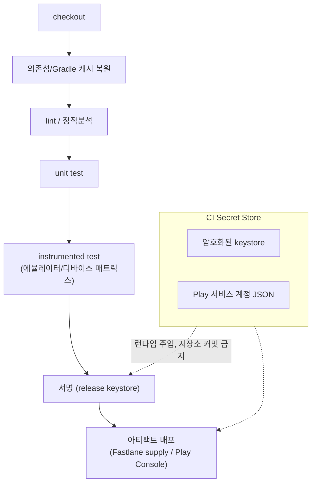

## Android CI/CD 구현 계약

이 지도는 Android CI/CD 파이프라인을 **실제로 무엇으로 구현하는가**를 다룬다. [Android CI/CD 게이트는 빠른 검증과 릴리스 검증을 분리한다](../dependency-versioning/dependency-ci-contracts/android-cicd-gates-separate-fast-validation-and-release-validation.md) 가 "어떤 게이트를 언제 도는가"(Fast PR Gate vs Release Validation Gate)를 다룬다면, 이 지도는 그 게이트를 구성하는 파이프라인 단계, 오케스트레이션 도구(Fastlane), 서명/자격증명 취급 방식, 빌드 매트릭스 최적화를 다룬다.



### 정본 노트

- [Android CI/CD 파이프라인 단계마다 실패 신호가 다르다](android-cicd-pipeline-stages-have-different-failure-signals.md)
- [Fastlane은 Gradle 빌드를 대체하지 않고 그 위에서 오케스트레이션한다](fastlane-orchestrates-android-builds-without-replacing-gradle.md)
- [CI 서명 keystore와 Play 서비스 계정 자격증명은 암호화 저장과 최소 권한을 요구한다](ci-signing-and-service-account-credentials-must-stay-out-of-source-control.md)
- [빌드 매트릭스와 Gradle 원격 캐시를 함께 쓰면 매트릭스 빌드 시간이 줄어든다](build-matrix-and-remote-cache-together-reduce-ci-matrix-time.md)

관련 지도: [의존성, 버전, CI 계약](../dependency-versioning/dependency-ci-contracts/dependency-ci-contracts.md), [Gradle 빌드 계약](../gradle/gradle-build-contracts/gradle-build-contracts.md), [Play 릴리스와 배포 계약](../../distribution/release-distribution-contracts/release-distribution-contracts.md), [R8와 Gradle 빌드 최적화 계약](../../optimization/build-optimization-contracts/build-optimization-contracts.md)

### 관측 가능 증거 (Observable Evidence)

```bash
# 파이프라인 단계별 소요 시간과 실패 지점을 CI 로그에서 구분
# (GitHub Actions 예시: 각 step이 별도로 pass/fail을 기록한다)
gh run view <run-id> --log-failed

# Fastlane 실행 로그에서 어떤 Gradle task를 호출했는지 확인
bundle exec fastlane android release --verbose
```
