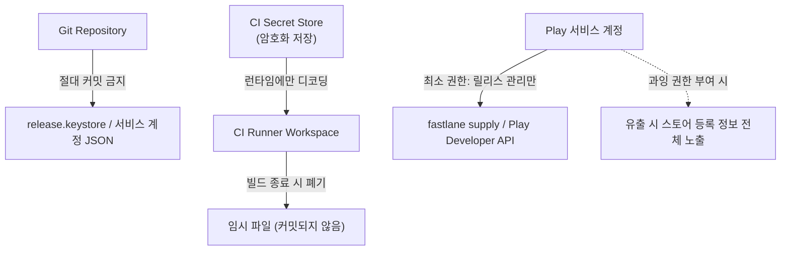

## CI 서명 keystore와 Play 서비스 계정 자격증명은 암호화 저장과 최소 권한을 요구한다

상위 문서: [Android CI/CD 구현 계약](ci-cd-contracts.md)
배경 지식: [Git 버전 관리](../../../../../../02_references/git/git.md)

### 내부 메커니즘 (Internal Mechanism)

CI 환경에서 release 서명을 자동화하려면 두 종류의 비밀을 러너에 전달해야 한다: **release keystore(.jks/.keystore 파일과 비밀번호)** 와 **Play 업로드용 서비스 계정 JSON 키**. 둘 다 유출되면 공격자가 앱을 사칭해 서명하거나 개발자 대신 Play Console에 릴리스를 올릴 수 있다는 점에서 소스 저장소에 평문으로 두면 안 되는 비밀이다.

안전한 패턴은 다음 세 가지를 조합한다.

1. **CI provider의 암호화된 secret store 사용**: keystore 파일을 base64로 인코딩해 CI secret(예: GitHub Actions `secrets.RELEASE_KEYSTORE_BASE64`)으로 등록하고, 빌드 단계에서만 디코딩해 임시 파일로 복원한다. 이 파일은 워크스페이스가 종료되면 함께 폐기된다.
2. **저장소에 평문 커밋 금지**: `.gitignore`로 `*.keystore`, `*.jks`, `google-services.json` 중 서비스 계정 키, `fastlane/*.json` 등을 원천 차단한다. 이미 커밋된 이력이 있다면 파일 삭제만으로는 부족하다 — git history에서 완전히 제거하고 키를 재발급해야 한다.
3. **최소 권한 서비스 계정**: Play Console 서비스 계정에는 "릴리스 관리" 등 업로드에 필요한 최소 역할만 부여한다. 계정 전체 관리자 권한을 CI에 주면 CI 자격증명 유출 시 피해 범위가 앱 배포를 넘어 스토어 등록 정보 전체로 커진다.

이 패턴을 어기면 관찰 가능한 사고 신호가 뚜렷하게 남는다. 저장소 secret scanning(GitHub Secret Scanning, `gitleaks`)이 커밋 diff에서 keystore 바이너리나 JSON private key 패턴을 감지해 알림을 보낸다. 이미 유출된 서비스 계정 키는 Google Cloud IAM 감사 로그에 CI IP 대역이 아닌 곳에서의 호출 기록으로 나타난다.



### 코드 예시 (GitHub Actions에서 keystore/서비스 계정 안전 주입)

```yaml
# .github/workflows/release.yml
jobs:
  release:
    runs-on: ubuntu-latest
    steps:
      - uses: actions/checkout@v4

      - name: Decode release keystore
        env:
          KEYSTORE_BASE64: ${{ secrets.RELEASE_KEYSTORE_BASE64 }}
        run: echo "$KEYSTORE_BASE64" | base64 -d > release.keystore

      - name: Write Play service account key
        env:
          PLAY_JSON_KEY: ${{ secrets.PLAY_SERVICE_ACCOUNT_JSON }}
        run: echo "$PLAY_JSON_KEY" > play-service-account.json

      - name: Build and deploy
        env:
          KEYSTORE_PASSWORD: ${{ secrets.KEYSTORE_PASSWORD }}
          KEY_ALIAS: ${{ secrets.KEY_ALIAS }}
          KEY_PASSWORD: ${{ secrets.KEY_PASSWORD }}
        run: bundle exec fastlane android release

      - name: Cleanup secrets
        if: always()
        run: rm -f release.keystore play-service-account.json
```

```gitignore
# .gitignore
*.keystore
*.jks
play-service-account.json
fastlane/*.json
```

### 관측 가능 증거 (Observable Evidence)

```bash
# 저장소에 비밀이 남아있는지 이력 전체를 스캔
gitleaks detect --source . --verbose

# Google Cloud IAM 감사 로그에서 서비스 계정 사용 위치 확인
# (CI 러너의 알려진 IP 대역이 아닌 곳에서 호출되면 유출 의심)
gcloud logging read \
  'protoPayload.authenticationInfo.principalEmail="ci-release@my-project.iam.gserviceaccount.com"' \
  --limit 20 --format json
```

### 경계

- 로컬 개발 환경에서 signing config를 구성하는 방식(Play App Signing과 업로드 키 분리 포함)은 이 노트가 아니라 [Signing config는 로컬 서명과 Play 배포 정체성을 연결한다](../gradle/gradle-build-contracts/signing-config-connects-local-signing-and-play-release-identity.md) 와 [Play App Signing은 업로드 키와 앱 서명 키를 분리한다](../../distribution/release-distribution-contracts/play-app-signing-separates-upload-key-and-app-signing-key.md) 가 다룬다. 이 노트는 그 자격증명을 **CI 환경에서 안전하게 다루는 방법**만 다룬다.

관련 노트: [Fastlane은 Gradle 빌드를 대체하지 않고 그 위에서 오케스트레이션한다](fastlane-orchestrates-android-builds-without-replacing-gradle.md), [Android CI/CD 구현 계약](ci-cd-contracts.md)
