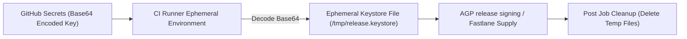

## CI 서명과 서비스 계정 자격증명은 소스 제어에 남아선 안 된다

상위 문서: [CI/CD 계약](ci-cd-contracts.md)

### 개념 및 필요성 (What & Why)
Android 앱 서명 키스토어 파일(`.jks`/`.keystore`), 키 비밀번호, 그리고 Google Play Console API 서비스 계정 자격증명 JSON 키(`service-account.json`)는 앱의 배포 권한 및 정체성을 결정짓는 **최상위 기밀 자산(Secret Asset)** 이다.
이러한 파일이나 비밀번호가 실수로 Git 소스 제어 레포지토리에 커밋되어 노출되면, 악의적인 공격자가 기존 앱을 위조하고 탈취하여 해킹된 APK를 유포할 수 있다.
따라서 모든 비밀값은 레포지토리 저장에서 철저히 제외되어야 하며, CI 런타임에 동적으로 주입되어야 한다.

### 내부 메커니즘 (Internal Mechanism)
1. **`.gitignore` 격리**: `*.jks`, `*.keystore`, `*.json` (서비스 계정 키), `local.properties`를 `.gitignore`에 선언하여 Git 추적을 차단한다.
2. **Base64 인코딩 주입**: Keystore 파일과 JSON 서비스 계정 키를 Base64 문자열로 인코딩하여 CI 시크릿(GitHub Secrets / GitLab CI Variables)에 안전하게 저장한다.
3. **CI 런타임 동적 디코딩**: CI 러너가 작업을 시작할 때 시크릿 문자열을 파일 형태로 주시 디렉터리에 일시 복호화하고, 빌드가 끝나면 즉시 삭제한다.



### 코드 예시 (.github/workflows/deploy.yml)
```yaml
# .github/workflows/deploy.yml
name: Deploy Release AAB

on:
  push:
    tags:
      - "v*"

jobs:
  deploy:
    runs-on: ubuntu-latest
    steps:
      - uses: actions/checkout@v4

      # 1. Base64로 저장된 Keystore 시크릿을 임시 파일로 복호화
      - name: Decode Signing Keystore
        run: |
          echo "${{ secrets.RELEASE_KEYSTORE_BASE64 }}" | base64 --decode > app/release.keystore

      # 2. Fastlane 및 Gradle 실행 (환경 변수로 자격증명 전달)
      - name: Run Fastlane Deploy
        env:
          KEYSTORE_PATH: "release.keystore"
          KEYSTORE_PASSWORD: ${{ secrets.KEYSTORE_PASSWORD }}
          KEY_ALIAS: ${{ secrets.KEY_ALIAS }}
          KEY_PASSWORD: ${{ secrets.KEY_PASSWORD }}
          PLAY_SERVICE_ACCOUNT_JSON: ${{ secrets.PLAY_SERVICE_ACCOUNT_JSON }}
        run: bundle exec fastlane android internal_deploy

      # 3. 보안 조치: 임시 복호화된 Keystore 파일 즉시 삭제
      - name: Clean Up Secrets
        if: always()
        run: rm -f app/release.keystore
```

### 관측 가능 증거 (Observable Evidence)
Git 커밋 이력 내 자격증명 파일 누출 유무는 `git log` 수색 도구나 `gitleaks`로 검증할 수 있다:
```bash
git log -p -- "*.keystore" "*.jks" "*service-account*.json"
```

관련 노트: [Signing config는 로컬 서명과 Play 배포 정체성을 연결한다](../gradle/gradle-build-contracts/signing-config-connects-local-signing-and-play-release-identity.md), [CI/CD 계약](ci-cd-contracts.md)
