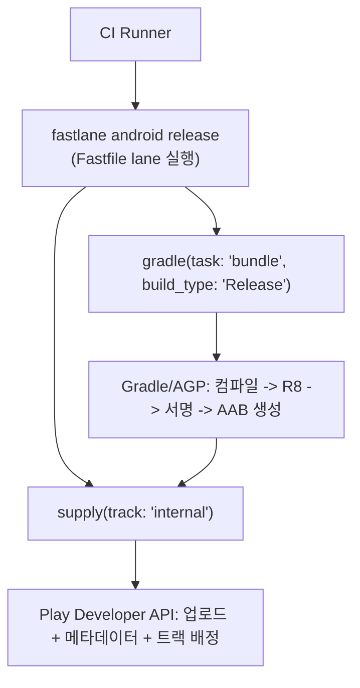

## Fastlane은 Gradle 빌드를 대체하지 않고 그 위에서 오케스트레이션한다

### 내부 메커니즘 (Internal Mechanism)

Fastlane 은 Android(및 iOS) 빌드/테스트/서명/스토어 업로드를 하나의 Ruby DSL 스크립트(`Fastfile`)로 순서대로 실행하는 **스크립트 오케스트레이션 계층**이다. Fastlane 자체는 컴파일러도 빌드 시스템도 아니다 — Android 앱을 실제로 컴파일하고 패키징하는 것은 여전히 Gradle/AGP이고, Fastlane 의 `gradle` action은 내부적으로 `./gradlew <task>` 를 호출하는 얇은 래퍼다. 이 경계를 혼동하면 "Fastlane이 느리다"는 잘못된 진단을 하게 된다 — 실제 병목은 대부분 그 아래에서 도는 Gradle task 자체다.

두 핵심 action의 책임은 다음과 같이 나뉜다.

- **`gradle` action**: `task:` 파라미터로 지정한 Gradle task(`assemble`, `bundle`, `test`, `clean` 등)를 `flavor`/`build_type` 과 함께 호출한다. 즉 Fastlane 은 어떤 variant 를 어떤 순서로 빌드할지만 조립하고, 실제 컴파일·R8·서명 로직은 AGP/Gradle 이 수행한다.
- **`supply` action**: 빌드 산출물(APK/AAB)과 메타데이터(제목, 설명, 스크린샷, changelog)를 Google Play Developer API로 업로드한다. Google 서비스 계정 JSON 키로 인증하며, 트랙 지정과 단계적 출시 비율(`rollout`)도 이 action이 다룬다.

즉 파이프라인 관점에서 Fastlane 은 "여러 Gradle task와 Play 업로드 API 호출을 하나의 재현 가능한 순서로 묶어주는 스크립트"이며, CI 러너가 이 스크립트 하나만 실행하면 로컬 개발자도 동일한 명령으로 같은 순서를 재현할 수 있다는 것이 핵심 가치다.



### 코드 예시 (Fastfile)

```ruby
# fastlane/Fastfile
default_platform(:android)

platform :android do
  desc "테스트 실행 후 내부 테스트 트랙에 배포"
  lane :release do
    gradle(task: "test")
    gradle(
      task: "bundle",
      build_type: "Release",
      properties: {
        "android.injected.signing.store.file" => ENV["KEYSTORE_PATH"],
        "android.injected.signing.store.password" => ENV["KEYSTORE_PASSWORD"],
        "android.injected.signing.key.alias" => ENV["KEY_ALIAS"],
        "android.injected.signing.key.password" => ENV["KEY_PASSWORD"],
      }
    )
    supply(
      track: "internal",
      aab: "app/build/outputs/bundle/release/app-release.aab",
      json_key: ENV["PLAY_SERVICE_ACCOUNT_JSON"],
    )
  end
end
```

```bash
# CI에서 호출
bundle exec fastlane android release
```

### 관측 가능 증거 (Observable Evidence)

```bash
# --verbose로 실행하면 Fastlane이 호출하는 실제 gradlew 명령이 로그에 그대로 노출된다
bundle exec fastlane android release --verbose

# 예시 출력 (Fastlane이 내부적으로 실행하는 것은 결국 gradlew):
#   $ ./gradlew bundleRelease -Pandroid.injected.signing.store.file=...
#   $ ./gradlew test
```

### 경계

- Fastlane 실행 로그에 등장하는 Gradle task 실패(`bundleRelease` 실패 등)는 [Android CI/CD 파이프라인 단계마다 실패 신호가 다르다](android-cicd-pipeline-stages-have-different-failure-signals.md) 의 "서명"/"assemble" 단계 진단 절차를 그대로 따른다 — Fastlane 자체 버그가 아니라 그 아래 Gradle 문제일 가능성이 높다.
- `supply` action이 쓰는 서비스 계정 JSON을 CI에서 안전하게 다루는 방법은 [CI 서명 keystore와 Play 서비스 계정 자격증명은 암호화 저장과 최소 권한을 요구한다](ci-signing-and-service-account-credentials-must-stay-out-of-source-control.md) 를 참조한다.

관련 노트: [Android CI/CD 구현 계약](ci-cd-contracts.md)
