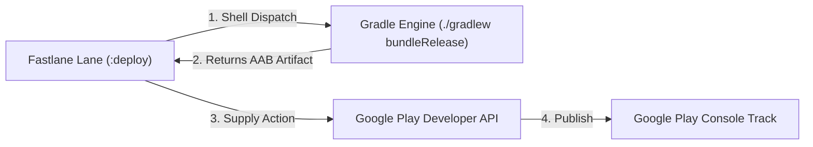

## Fastlane은 Gradle을 대체하지 않고 Android 빌드를 조율한다

상위 문서: [CI/CD 계약](ci-cd-contracts.md)

### 개념 및 필요성 (What & Why)
**Fastlane(패스트레인)** 은 모바일 앱의 빌드, 서명, 스크린샷 생성, Google Play Console 업로드 파이프라인을 자동화하는 상위 오케스트레이션 도구 도메인이다.
일각에서는 Fastlane이 Gradle을 대체한다고 오해하지만, **Fastlane은 절대 Gradle을 대체하지 않는다**.
Gradle은 Android APK/AAB 아티팩트를 컴파일하고 수축하는 실제 빌드 엔진이며, Fastlane은 Gradle 태스크 실행(`gradle(task: "bundleRelease")`), Google Play Developer API 연동(`upload_to_play_store`), Slack 알림 발송 등 외부 워크플로를 연결해주는 상위 레이어 래퍼(Wrapper) 오케스트레이터로 동작한다.

### 내부 메커니즘 (Internal Mechanism)
1. **`Fastfile` Lane 정의**: Ruby 기반의 DSL로 파이프라인 흐름(Lane)을 정의한다 (예: `lane :deploy do ... end`).
2. **Gradle Action 연동**: Fastlane 내부에서 `gradle(task: "bundle", build_type: "Release")` 구문을 실행하면, Fastlane은 시스템 쉘을 통해 `./gradlew app:bundleRelease`를 디스패치한다.
3. **`supply` 도구 연동**: 빌드가 완료된 AAB 아티팩트와 메타데이터, 릴리스 노트(Changelog)를 Google Play Developer API v3를 통해 Play Console 트랙(Internal / Alpha / Beta / Production)에 자동으로 업로드한다.



### 코드 예시 (fastlane/Fastfile)
```ruby
# fastlane/Fastfile
default_platform(:android)

platform :android do
  desc "Deploy a new version to Google Play Internal Track"
  lane :internal_deploy do
    # 1. Gradle 빌드 디스패치
    gradle(
      task: "bundle",
      build_type: "Release"
    )

    # 2. Google Play 업로드 (supply 도구)
    upload_to_play_store(
      track: internal,
      aab: app/build/outputs/bundle/release/app-release.aab,
      skip_upload_images: true,
      skip_upload_screenshots: true
    )

    # 3. 배포 성공 Slack 알림
    slack(message: "Successfully deployed release AAB to Google Play Internal Track!")
  end
end
```

### 관측 가능 증거 (Observable Evidence)
Fastlane 레인 셋업 및 드라이런 검증은 터미널 명령으로 관측할 수 있다:
```bash
bundle exec fastlane android internal_deploy --dry_run
```

관련 노트: [CI 서명과 서비스 계정 자격증명은 소스 제어에 남아선 안 된다](ci-signing-and-service-account-credentials-must-stay-out-of-source-control.md), [CI/CD 계약](ci-cd-contracts.md)
