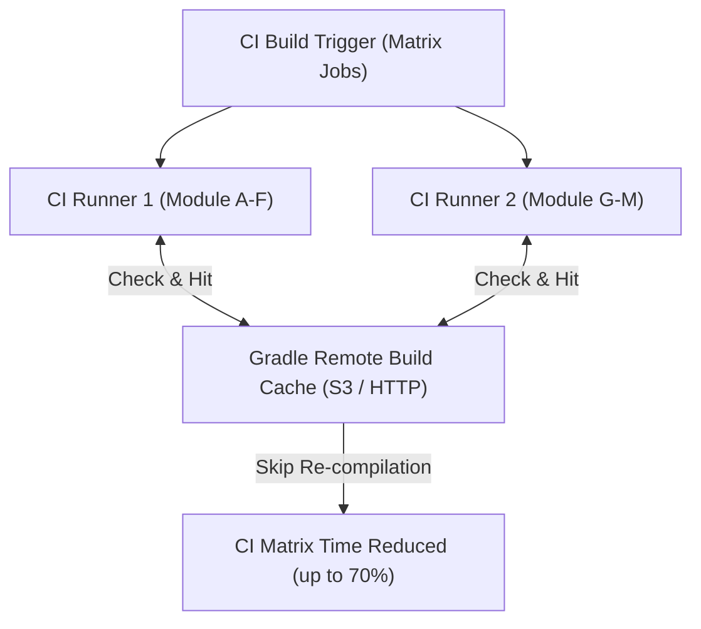

## 빌드 매트릭스와 원격 캐시는 함께 CI 매트릭스 시간을 줄인다

상위 문서: [Android CI/CD](ci-cd.md)

### 개념 및 필요성 (What & Why)
안드로이드 대규모 프로젝트에서 단일 CI 러너가 모든 빌드 변형(Build Variant)과 테스트 작업을 순차 실행하면 빌드 시간이 극도로 증가한다.
**CI Build Matrix(빌드 매트릭스)** 와 **Gradle Remote Build Cache(원격 캐시)** 의 결합은 전체 빌드 시간을 병렬화 및 캐싱을 통해 획기적으로 단축시키는 표준 파이프라인 기법이다.
- **Build Matrix**: 빌드 작업을 서브모듈 단위나 모듈 그룹 단위로 여러 분산 CI 러너에 동시 분산(Parallelization)한다.
- **Remote Cache**: 한 CI 러너나 개발자 머신에서 이미 컴파일된 태스크 아티팩트 결과를 중앙 HTTP/S3 캐시 서버에 공유하여, 타 러너가 동일 입력을 재컴파일하지 않고 즉시 재사용(Cache Hit)하게 만든다.

### 내부 메커니즘 (Internal Mechanism)
1. **Gradle Build Cache Key 생성**: 태스크의 Input(소스 코드 파일, SDK 버전, 클래스패스)을 셰이핑(Hashing)하여 고유 캐시 키를 생성한다.
2. **Remote Cache Pull/Push**:
   - PR 빌드 러너: Remote Cache에서 `Pull` 전용으로 다운로드하여 캐시 히트(Cache FROM-CACHE)를 누림.
   - Main 브랜치 빌드 러너: 검증이 완료된 태스크 결과를 Remote Cache로 `Push`하여 캐시 업데이트.
3. **Configuration Cache 결합**: Configuration Phase 시간까지 절약하여 매트릭스 태스크 실행 대기 시간을 극소화한다.



### 코드 예시 (settings.gradle.kts)
```kotlin
// settings.gradle.kts (Gradle Remote Cache 설정 예시)
buildCache {
    local {
        isEnabled = true
    }
    remote<HttpBuildCache> {
        url = uri("https://cache.example.com/gradle/")
        push = (System.getenv("CI_BRANCH") == "main") // main 브랜치에서만 Push 허용
        credentials {
            username = System.getenv("GRADLE_CACHE_USER")
            password = System.getenv("GRADLE_CACHE_PASSWORD")
        }
    }
}
```

### 관측 가능 증거 (Observable Evidence)
Gradle 빌드 시 캐시 히트율 및 FROM-CACHE 태스크 적용 현황을 관측할 수 있다:
```bash
./gradlew app:assembleDebug --build-cache --info | grep "FROM-CACHE"
```

관련 노트: [Gradle 캐싱 및 빌드 최적화](../gradle/gradle-caching-and-optimization.md), [Android CI/CD](ci-cd.md)
