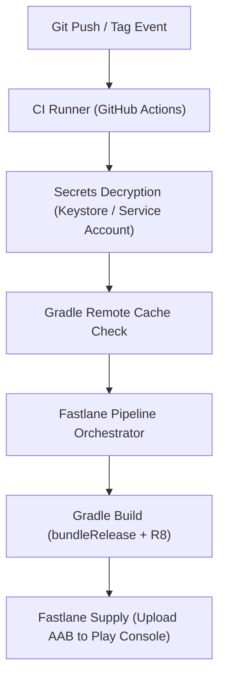

## Android CI/CD


상위 문서: [Android 패키징과 배포 지도](../../android-packaging-deployment.md)

### 개념 및 필요성 (What & Why)
**CI/CD 계약(CI/CD Contracts)** 은 Android 애플리케이션의 소스 코드 변경부터 배포 자동화에 이르는 빌드, 검증, 패키징, 스토어 출시 파이프라인 전 과정의 규약을 정의한다.
안드로이드 CI/CD 파이프라인은 신속한 코드 검증(Fast Validation), 서명 자격증명 보안, Gradle Remote Cache 연동을 통한 빌드 속도 최적화, 그리고 Fastlane을 통한 Play Store 배포 자동화를 완벽히 조율해야 한다.
잘 구축된 CI/CD 계약은 인간의 실수를 방지하고 배포 주기를 혁신적으로 단축시킨다.

### 내부 메커니즘 (How / Internal Mechanism)
1. **Fastlane 조율 엔진**: Fastlane은 Gradle을 대체하는 것이 아니라, Gradle 태스크(`bundleRelease`)와 Google Play Developer API(`supply`)를 상위 오케스트레이션 레이어에서 결합한다.
2. **보안 계층 격리**: KeyStore 및 Google Play Service Account JSON 비밀키를 소스 제어(Git)에서 완전 배제하고, CI 환경변수(GitHub Secrets)를 통해 런타임에 동적 복호화 및 오버레이 주입한다.
3. **Build Matrix & Remote Cache**: Gradle Build Cache와 Remote HTTP/S3 캐시를 빌드 매트릭스와 결합하여 컴파일 작업을 최소화한다.
4. **단계별 실패 시그널 분리**: 정적 분석/린트, 단위 테스트, R8 수축 패키징, 서명, API 업로드 등 각 단계별 실패 시그널을 세분화하여 빠른 디버깅을 유도한다.



### 관련 세부 문서
1. [Gradle 코어 엔진 및 아키텍처](../gradle/gradle-build-contracts/gradle-core-engine-and-architecture.md)
2. [Fastlane Android 코어 및 Actions](fastlane-android-core-and-actions.md)
3. [Gradle 과 Fastlane CI/CD 파이프라인](gradle-fastlane-ci-cd-pipeline.md)
4. [Fastlane은 Gradle을 대체하지 않고 Android 빌드를 조율한다](fastlane-orchestrates-android-builds-without-replacing-gradle.md)
5. [CI 서명과 서비스 계정 자격증명은 소스 제어에 남아선 안 된다](ci-signing-and-service-account-credentials-must-stay-out-of-source-control.md)
6. [빌드 매트릭스와 원격 캐시는 함께 CI 매트릭스 시간을 줄인다](build-matrix-and-remote-cache-together-reduce-ci-matrix-time.md)
7. [Android CI/CD 파이프라인 단계는 서로 다른 실패 시그널을 가진다](android-cicd-pipeline-stages-have-different-failure-signals.md)

### 관측 가능 증거 (Observable Evidence)
CI 파이프라인의 캐시 히트율 및 Fastlane 레인 실행 이력은 다음 명령어로 관측할 수 있다:
```bash
fastlane android release --dry_run
```
