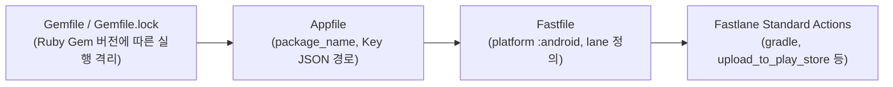

## Fastlane Android 코어 및 Actions

### 개요 및 Fastlane 본질

**Fastlane(패스트레인)** 은 모바일 앱의 빌드, 서명 자격증명 관리, 스크린샷 생성, Google Play Console / Firebase 배포 작업을 자동화하는 **Ruby 기반의 릴리스 오케스트레이션 도구**이다.

Fastlane 은 스스로 코드 컴파일이나 패키징을 수행하지 않으며, 안드로이드 빌드의 실제 구동은 시스템 쉘을 통해 `gradlew` 실행 명령을 디스패치하고, 배포 단계에서는 Google Play Developer API 및 외부 알림 Webhook 을 연결하는 상위 자동화 래퍼(Wrapper) 레이어로 동작한다.

---

### Fastlane 툴체인 구조 및 환경 파일 역할

Fastlane 프로젝트 환경은 다음 파일들의 조합으로 구성된다.



1. **`Gemfile` / `Gemfile.lock` (Bundler 관리)**:
   - 개발자 및 CI 러너 환경 간 Fastlane 및 관련 Ruby Gem(예: `fastlane-plugin-firebase_app_distribution`) 버전을 고정한다.
   - 모든 Fastlane 명령어는 `bundle exec fastlane <lane>` 형태로 실행하여 버전에 따른 불일치를 방지한다.
2. **`Appfile`**:
   - Android 애플리케이션의 기본 정보를 정의한다 (`json_key_file("path/to/key.json")`, `package_name("com.example.app")`).
3. **`Fastfile`**:
   - 실제 배포 및 빌드 파이프라인(Lane)을 작성하는 핵심 루비 스크립트이다.
4. **`Pluginfile`**:
   - 타사 커스텀 플러그인(예: Slack, Firebase, App Center) 확장 목록을 관리한다.

---

### `Fastfile` 레인(Lane) 구조 표준

`Fastfile`은 `platform :android do ... end` 블록 내부에서 예외 처리 콜백과 레인을 정의한다.

```ruby
# fastlane/Fastfile
default_platform(:android)

platform :android do
  before_all do
    # 레인 실행 직전 전처리 (예: git pull, 파이프라인 상태 점검)
  end

  desc "Internal QA 배포 레인"
  lane :qa do |options|
    # 1. Gradle 빌드 호출
    gradle(
      task: "assemble",
      build_type: "Debug"
    )

    # 2. Firebase App Distribution 배포
    firebase_app_distribution(
      app: ENV["FIREBASE_APP_ID"],
      groups: "qa-team"
    )
  end

  after_all do |lane|
    # 레인 정상 종료 후 후처리 (예: Slack 성공 알림)
  end

  error do |lane, exception|
    # 레인 실패 시 예외 처리 (예: Slack 에러 로그 전송)
  end
end
```

---

### Android 전용 핵심 Action API

Fastlane 은 빌드 및 배포 작업을 수행할 수 있도록 검증된 내장 Action(액션)들을 제공한다.

#### 1. `gradle(...)` Action
Android Gradle 빌드를 디스패치한다.

```ruby
gradle(
  task: "bundle",
  build_type: "Release",
  flavor: "Prod",
  properties: {
    "android.injected.version.code" => "105",
    "android.injected.version.name" => "1.5.0"
  },
  flags: "--no-daemon --stacktrace"
)
```

#### 2. `upload_to_play_store(...)` (`supply`) Action
빌드 완료된 AAB 파일과 메타데이터/릴리스 노트를 Google Play Console API 로 업로드한다.

```ruby
upload_to_play_store(
  track: "internal", # internal, alpha, beta, production
  aab: "app/build/outputs/bundle/prodRelease/app-prod-release.aab",
  skip_upload_images: true,
  skip_upload_screenshots: true,
  track_promote_to: "alpha" # 선택사항: 트랙 승격
)
```

#### 3. `firebase_app_distribution(...)` Action
QA 및 내부 테스터에게 테스트용 APK/AAB 를 배포한다.

```ruby
firebase_app_distribution(
  app: ENV["FIREBASE_APP_ID"],
  release_notes: "QA 테스트 빌드입니다.",
  groups: "internal-testers"
)
```

#### 4. `lane_context` 및 `SharedValues`
Fastlane 레인 내부에서는 이전 Action 이 생성한 결과물(예: AAB 출력 경로)을 전역 컨텍스트 매핑으로 읽을 수 있다.

```ruby
aab_path = Actions.lane_context[SharedValues::GRADLE_AAB_OUTPUT_PATH]
```

---

### Fastlane CLI 및 디버깅 가이드

```bash
# Bundler 기반 레인 안전 실행
bundle exec fastlane android qa

# 특정 옵션 전달 실행
bundle exec fastlane android internal_deploy build_number:123

# 파이프라인 드라이런 (실제 업로드 없이 구문 검증)
bundle exec fastlane android internal_deploy --dry_run

# 특정 Action 정보 및 파라미터 문서 조회
bundle exec fastlane action upload_to_play_store
```

---

### 상위 및 연관 문서

- [Android 패키징과 배포 지도](../../android-packaging-deployment.md)
- [Android CI/CD](../../ci-cd/ci-cd.md)
- [Gradle 코어 엔진 및 아키텍처](../gradle/gradle-build-contracts/gradle-core-engine-and-architecture.md)
- [Gradle 과 Fastlane CI/CD 파이프라인](../../ci-cd/gradle-fastlane-ci-cd-pipeline.md)
