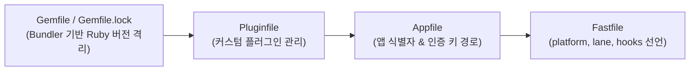

## Fastlane 코어 엔진 및 툴체인

### 개요 및 Fastlane 본질

**Fastlane(패스트레인)** 은 모바일 및 교차 플랫폼 앱의 빌드, 코드 서명 자격증명 관리, 스크린샷 생성, 스토어 출시 파이프라인을 자동화하는 **Ruby 기반의 릴리스 오케스트레이션 엔진**이다.

Fastlane 은 특정 컴파일러나 빌드 도구를 내장하고 있지 않으며, 독립적인 Action(액션) 연동 및 시스템 쉘 호출을 통해 빌드 도구(Gradle, xcodebuild 등)를 디스패치하고 스토어 API 로 아티팩트를 배포하는 상위 자동화 래퍼(Wrapper) 레이어로 작동한다.

---

### Fastlane 툴체인 구조 및 환경 파일 역할

Fastlane 프로젝트 툴체인은 다음 파일들의 조합으로 실행 환경을 구성한다.



1. **`Gemfile` / `Gemfile.lock` (Bundler 환경 관리)**:
   - 로컬 개발 장비와 CI 러너 간 Fastlane 및 관련 루비 젬 버전을 명시적으로 격리·고정한다.
   - 실행 시 `bundle exec fastlane <lane>` 명령으로 구동하여 환경별 버전 불일치를 방지한다.
2. **`Appfile`**:
   - 플랫폼별 앱 식별자 및 스토어 API 인증 키 경로를 선언하는 전역 설정 파일이다.
3. **`Fastfile`**:
   - 파이프라인(Lane) 실행 흐름과 스크립팅 로직을 선언하는 루비 DSL 파일이다.
4. **`Pluginfile`**:
   - 서드파티 커스텀 Action 및 외부 통합 플러그인을 관리한다.

---

### `Fastfile` 레인(Lane) 및 훅(Hooks) 아키텍처

`Fastfile`은 `platform` 블록 내에서 파이프라인 실행 단위인 **Lane**과 생명주기 **Hook**을 제공한다.

```ruby
# fastlane/Fastfile
default_platform(:android)

platform :android do
  before_all do |lane, options|
    # 레인 실행 시작 직전 훅 (예: git 상태 점검, 의존성 확인)
  end

  desc "배포 전용 레인 예시"
  lane :deploy do |options|
    # 레인 본문: 순차적 Action 실행
  end

  after_all do |lane|
    # 레인 성공 종료 후 훅 (예: 성공 알림 디스패치)
  end

  error do |lane, exception|
    # 레인 예외 발생 시 훅 (예: 실패 로그 수집 및 알림)
  end
end
```

---

### 컨텍스트 및 환경변수 데이터 공유

Fastlane 은 레인 실행 동안 Action 간 데이터 교환 및 실행 환경 제어를 위해 컨텍스트 메커니즘을 제공한다.

1. **`lane_context` / `SharedValues`**:
   - 레인 실행 중 선행 Action 이 생성한 출력 아티팩트 경로나 빌드 결과를 후속 Action 이 수집할 수 있도록 전역 딕셔너리로 저장한다.
2. **`.env` 환경변수 관리**:
   - `.env`, `.env.default` 파일 또는 CI 비밀변수(Secrets)를 자동 파싱하여 `ENV["KEY"]` 형태로 레인 스크립트 내부에서 읽어온다.

---

### Fastlane CLI 및 디버깅 명령어

```bash
# Bundler 격리 환경에서 특정 레인 실행
bundle exec fastlane <platform> <lane_name>

# 특정 Action 실행 파라미터 및 설명 조회
bundle exec fastlane action <action_name>

# 파이프라인 구문 검증 및 드라이런
bundle exec fastlane <platform> <lane_name> --dry_run

# 세부 로그 출력 디버깅
bundle exec fastlane <platform> <lane_name> --verbose
```

---

### 상위 및 연관 문서

- [Gradle 코어 엔진 및 아키텍처](../gradle/gradle-build/gradle-core.md)
- [Fastlane Android 플랫폼 연동](fastlane-android.md)
- [Gradle 과 Fastlane CI/CD 파이프라인](gradle-fastlane-pipeline.md)
