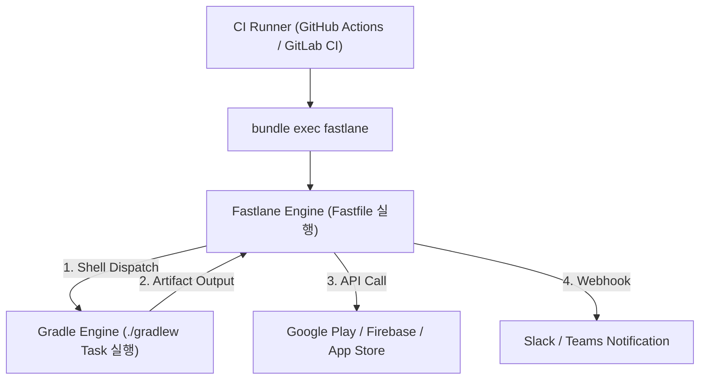

## Gradle 과 Fastlane CI/CD 파이프라인

### 개요 및 통합 아키텍처

소프트웨어 지속적 통합 및 배포(CI/CD) 파이프라인은 빌드 엔진인 **Gradle**과 릴리스 오케스트레이터인 **Fastlane**의 명확한 역할 분담을 기반으로 작동한다.

CI 서브시스템(GitHub Actions, GitLab CI 등)은 두 도구를 쉘 환경에서 디스패치하며, 전체 프로세스는 아래 구조로 흐른다.

---

### 역할 분담 아키텍처 패턴 및 선택 가이드

프로젝트 요구사항과 팀의 성격에 따라 Gradle 과 Fastlane 의 역할 비중을 결정하는 2가지 대표적 아키텍처 패턴이 존재한다.

#### 패턴 1: Thin Fastlane 패턴 (Gradle 중심 오케스트레이션 - 권장)

- **핵심 구조**:
  - 빌드 변체 설정, 버전 산출 logic, 서명 설정, 바이트코드 최적화 규칙 등 **모든 빌드 로직을 Gradle 스크립트(`build.gradle.kts` / Convention Plugin)에 100% 집약**한다.
  - Fastlane 은 오직 `./gradlew <task>`를 간단히 디스패치하고, 생성된 아티팩트를 외부 서비스에 업로드하거나 Slack 알림을 전송하는 **얇은 API 호출 래퍼(Thin Wrapper)**로만 사용한다.
- **장점**:
  - 개발자가 개발 장비(로컬 터미널)에서 `./gradlew build`를 실행할 때와 CI 환경에서 실행할 때의 빌드 조건이 100% 동일하다.
  - Fastlane 의 Ruby 환경에 의존하지 않고 Gradle 의 Build Cache 및 Configuration Cache 이점을 극대화할 수 있다.

#### 패턴 2: Heavy Fastlane 패턴 (Fastlane 중심 제어)

- **핵심 구조**:
  - 빌드 버전, 빌드 타입 동적 변경, 서명 키 복호화 및 환경 변수 가공을 Fastlane 루비 스크립트(`Fastfile`) 내부에서 제어한 뒤, 그 결과를 Gradle 의 `-P` 프로퍼티 인자로 전달한다.
- **트레이드오프**:
  - Fastlane 을 통해서만 빌드가 가능해지므로, 로컬 개발 환경에서 단독 `./gradlew` 실행 시 동일한 빌드 결과를 얻기 힘들어질 수 있다.

---

### CI 러너 캐싱 전략 (2중 레이어 캐싱)

CI 파이프라인의 속도를 극대화하기 위해 CI 러너에서는 2가지 레이어의 캐시를 구성한다.

1. **Ruby Gems 캐시 (`vendor/bundle`)**:
   - `bundle install` 속도를 단축하여 Fastlane 실행 전 준비 시간을 최적화한다.
2. **Gradle Cache (`~/.gradle/caches`)**:
   - 의존성 라이브러리와 Gradle Build Cache 결과를 러너 간에 공유하여 컴파일 속도를 최적화한다.

---

### 보안 및 자격증명 관리 계약

1. **소스 제어(Git) 금지 대상**:
   - 앱 서명 키스토어 파일 및 비밀번호
   - API 접근용 서비스 계정 JSON 키
2. **CI 환경변수 동적 주입 메커니즘**:
   - CI Secrets 의 Base64 인코딩 스트링으로 보안 키를 보관한다.
   - CI 러너 실행 시점에 환경변수에서 디코딩하여 임시 디렉토리에 복호화 파일을 생성하거나, Fastlane `Appfile`에서 환경변수로 디렉토리 경로를 주입한다.

---

### 상위 및 연관 문서

- [Gradle 코어 엔진 및 아키텍처](../gradle/gradle-build/gradle-core.md)
- [Fastlane 코어 엔진](fastlane.md)
- [Fastlane Android 플랫폼 연동](fastlane-android.md)
- [Android CI/CD](ci-cd.md)
