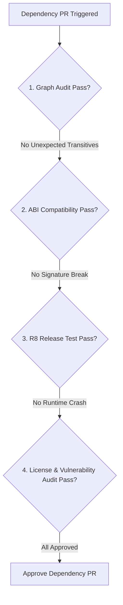

## 의존성 변경 체크리스트는 그래프, ABI, 테스트, 릴리스 위험을 검토한다

상위 문서: [의존성 및 CI 계약](dependencies.md)

### 개념 및 필요성 (What & Why)
서드파티 라이브러리의 버전 업그레이드나 신규 의존성 추가는 보기에는 단 한 줄의 `libs.versions.toml` 수정에 불과하지만, 실제로는 예리한 **릴리스 위험(Release Risk)** 을 포함한다.
라이브러리 내부에서 사용하는 전이적 의존성의 버전 충돌, ABI(Application Binary Interface) 변경으로 인한 클래스/메서드 서명 파괴, R8 난독화 규칙 누락으로 인한 런타임 릴리스 크래시가 대표적이다.
의존성 변경 시 4가지 검토 축을 기준으로 한 체크리스트 검증을 의무화해야 한다.

### 내부 메커니즘 (Internal Mechanism)
**의존성 변경 4대 체크리스트 게이트**:
1. **의존성 그래프 검토 (Graph Audit)**: `dependencies` diff를 추출하여 의도치 않은 전이적 무거운 라이브러리(예: Guava, Jackson)가 유입되었는지 확인.
2. **ABI 및 호환성 검토 (ABI Review)**: public 시그니처 및 인터페이스 변경으로 인한 하위 상위 호환성 파괴 유무 점검.
3. **테스트 검증 (Regression Test)**: 회귀 테스트 수트 및 R8 풀 옵션이 적용된 릴리스 아티팩트에서의 정상 작동 검증.
4. **보안 및 라이선스 위험 검토 (License & Security Audit)**: 오픈소스 라이선스(GPL 등) 충돌 여부 및 알려진 보안 취약점(CVE) 점검.



### 코드 예시 (build.gradle.kts - Dependency Diff Detection)
```bash
# PR 검증 시 기존 메인 브랜치 대비 의존성 그래프 diff 추출 명령
./gradlew app:dependencies > new_deps.txt
git checkout main
./gradlew app:dependencies > old_deps.txt
diff -u old_deps.txt new_deps.txt
```

### 관측 가능 증거 (Observable Evidence)
의존성 변경 후 아티팩트 용량 변화 및 R8 수축 결과 분석은 `apkanalyzer` 도구로 증거를 수집할 수 있다:
```bash
apkanalyzer apk summary build/outputs/apk/release/app-release.apk
```

관련 노트: [Version catalog는 의존성과 플러그인 좌표를 명명한다](gradle-version-catalog.md), [의존성 및 CI 계약](dependencies.md)
