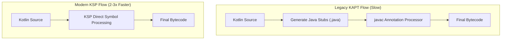

## KSP는 Kotlin 퍼스트 코드 생성이며 KAPT는 유지보수 모드다

상위 문서: [의존성 및 CI 계약](dependencies.md)

### 개념 및 필요성 (What & Why)
**KSP(Kotlin Symbol Processing)** 는 Kotlin 컴파일러에 직접 통합되어 작동하는 Kotlin 전용 차세대 소스 코드 분석 및 생성 컴파일러 플러그인 도구이다.
과거에 사용되던 **KAPT(Annotation Processing for Kotlin)** 는 Java 컴파일러의 Annotation Processor(`javac`)를 재활용하기 위해 비효율적인 Java Stub 클래스 생성 단계를 강제 유발하여 빌드 속도를 심각하게 저하시켰다.
KSP는 KAPT 대비 빌드 속도를 **최대 2~3배 향상**시키며, Kotlin 언어의 널 가능성(Nullability), sealed class, value class 등의 메타데이터를 정밀하게 인지한다. 현재 KAPT는 유지보수 모드(Maintenance Mode)로 전환되어 방치 상태이므로 신규 프로젝트에서는 반드시 KSP를 채택해야 한다.

### 내부 메커니즘 (Internal Mechanism)
1. **Java Stub 생략**: KAPT는 `.kt` 소스를 자바 어노테이션 프로세서가 읽을 수 있는 더미 `.java` 스텁 파일로 변환하는 작업을 거치지만, KSP는 Kotlin AST(Abstract Syntax Tree) 심볼을 직접 분석하여 이 단계를 통째로 생략한다.
2. **Kotlin Compiler Plugin 바인딩**: KSP 프로세서는 `kotlinc` 파이프라인 내부에서 심볼 레벨 분석 및 새 파일 작성을 처리하므로 Gradle 증분 빌드 캐싱과 완벽하게 통합된다.
3. **주요 라이브러리 마이그레이션**: Room, Hilt, Moshi, Glide, AutoFactory 등 안드로이드 핵심 라이브러리들이 모두 KSP 전용 프로세서를 완비하고 있다.



### 코드 예시 (build.gradle.kts)
```kotlin
// app/build.gradle.kts
plugins {
    alias(libs.plugins.kotlin.android)
    alias(libs.plugins.google.ksp) // KSP 플러그인 적용
}

dependencies {
    // KAPT 대신 KSP 프로세서 지정
    implementation(libs.androidx.room.runtime)
    ksp(libs.androidx.room.compiler)
}
```

### 관측 가능 증거 (Observable Evidence)
KSP를 통한 소스 생성 태스크 및 빌드 시간 절감은 다음 태스크 실행으로 관측 가능하다:
```bash
./gradlew app:kspDebugKotlin
```

관련 노트: [kotlinx.serialization은 컴파일러 플러그인과 런타임 포맷이 모두 필요하다](kotlinx-serialization-plugin.md), [의존성 및 CI 계약](dependencies.md)
