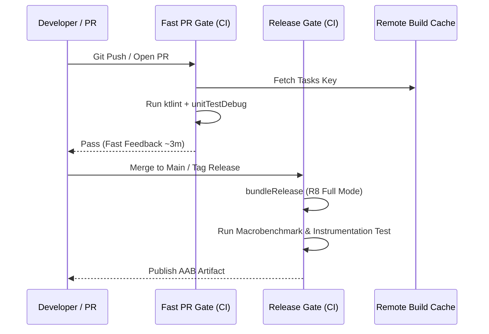

## Android CI/CD 게이트는 빠른 검증과 릴리스 검증을 분리한다

상위 문서: [의존성, 버전, CI 계약](dependency-ci-contracts.md)

### 내부 메커니즘 (Internal Mechanism)
Android CI/CD 파이프라인은 리소스와 시간 비용의 균형을 위해 계층화된 품질 게이트(Tiered Quality Gates)를 유지한다:
- **Fast PR Gate (5분 이내)**: 커밋 단위 검증. Lint, ktlint, 린트 스태틱 분석, 단위 테스트(Unit Tests), 그리고 Gradle Build Cache / Configuration Cache 기반의 증분 컴파일만 실행한다.
- **Release Validation Gate (30분 이상)**: 릴리스 또는 Nightly 파이프라인. R8 Full Mode 축소/난독화 빌드, UI/Macrobenchmark 테스트, APK/AAB 생성 및 서명, 바이너리 용량 비교(Binary Size Diff)를 수행한다.



### 코드 예시 (GitHub Actions Workflow)
```yaml
# .github/workflows/pr-validation.yml
name: Fast PR Validation
on: [pull_request]

jobs:
  fast-gate:
    runs-on: ubuntu-latest
    steps:
      - uses: actions/checkout@v4
      - uses: actions/setup-java@v4
        with:
          distribution: 'zulu'
          java-version: '17'
      - uses: gradle/actions/setup-gradle@v3
        with:
          cache-read-only: false

      - name: Run Fast Checks
        run: ./gradlew lintDebug testDebugUnitTest --continue --configuration-cache
```

### 관측 가능 증거 (Observable Evidence)
CI 로그에서 Fast Gate와 Release Gate의 태스크 수행 시간 및 캐시 적중률(Cache Hit Ratio)을 Gradle Build Scan metrics로 파악할 수 있다:

```bash
# Build Scan 확인 명령
./gradlew testDebugUnitTest --scan

# 실행 결과 출력 예시 (Build Scan Summary):
# Task execution: 142 tasks executed, 89 UP-TO-DATE, 45 FROM-CACHE
# Total Build Time: 1m 42s (Configuration phase: 1.2s)
```

관련 노트: [Gradle 빌드 성능은 앱 런타임 성능과 다르다](../../../optimization/build-optimization-contracts/gradle-build-performance-is-not-app-runtime-performance.md), [의존성, 버전, CI 계약](dependency-ci-contracts.md)
