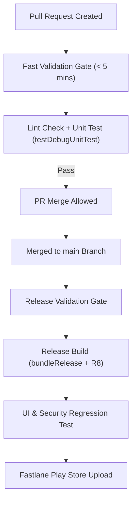

## Android CI/CD 게이트는 빠른 검증과 릴리스 검증을 분리한다

상위 문서: [의존성 및 CI 계약](dependency-ci-contracts.md)

### 개념 및 필요성 (What & Why)
Android CI/CD 빌드 파이프라인에서 모든 검증 작업(단위 테스트, 정적 분석, R8 풀 최적화 컴파일, UI 계측 테스트, 서명, AAB 생성)을 모든 PR(Pull Request) 시마다 단일 파이프라인으로 실행하면 빌드 피드백 시간이 30분 이상으로 길어져 개발 생산성이 마비된다.
**CI/CD 게이트 분리 전략**은 빠르게 피드백을 제공해야 하는 **패스트 검증 게이트(Fast Validation Gate - 5분 이내)** 와 릴리스 안정성을 보장하는 **릴리스 검증 게이트(Release Validation Gate)** 로 스테이지를 엄격히 계층화하는 전략이다.

### 내부 메커니즘 (Internal Mechanism)
1. **Fast Validation Gate (PR Trigger)**:
   - PR 작성 및 커밋 시 즉시 트리거.
   - 린트 체크(`ktlint`, `detekt`, `androidLintDebug`), 빠른 단위 테스트(`testDebugUnitTest`), 변경 모듈 의존성 그래프 검증 수행.
   - R8 최적화 및 AAB 패키징은 완전히 생략하여 개발자 대기 시간 최소화.
2. **Release Validation Gate (Merge / Tag Trigger)**:
   - `main` 브랜치 병합 또는 릴리스 태그 생성 시 트리거.
   - R8 수축/난독화 릴리스 빌드(`bundleRelease`), APKAnalyzer 용량 회귀 검증, 계측 UI 테스트(Firebase Test Lab / 에뮬레이터), Fastlane 연동 Play Console 업로드 실행.



### 코드 예시 (.github/workflows/ci.yml)
```yaml
# .github/workflows/fast-validation.yml (PR 패스트 게이트)
name: Fast PR Validation
on:
  pull_request:
    branches: [ main ]

jobs:
  fast-checks:
    runs-on: ubuntu-latest
    steps:
      - uses: actions/checkout@v4
      - uses: actions/setup-java@v4
        with:
          distribution: zulu
          java-version: 17
      - name: Run Fast Checks
        run: ./gradlew lintDebug testDebugUnitTest --continue
```

### 관측 가능 증거 (Observable Evidence)
CI 단계별 성공/실패 시그널 및 빌드 소요 시간 통계는 GitHub Actions 워크플로 실행 이력에서 확인할 수 있다:
```bash
./gradlew testDebugUnitTest lintDebug
```

관련 노트: [Android CI/CD 파이프라인 단계는 서로 다른 실패 시그널을 가진다](../../ci-cd-contracts/android-cicd-pipeline-stages-have-different-failure-signals.md), [의존성 및 CI 계약](dependency-ci-contracts.md)
