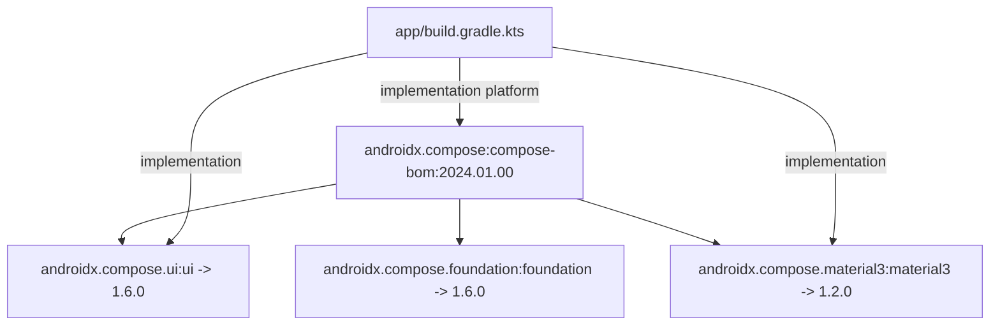

## Compose BOM은 Compose 라이브러리 버전 집합을 관리한다

상위 문서: [의존성, 버전, CI 계약](dependency-ci-contracts.md)

### 내부 메커니즘 (Internal Mechanism)
Jetpack **Compose BOM**(Bill of Materials - 라이브러리 호환 버전 정렬용 메타데이터 세트)은 Gradle의 `platform()` 메커니즘을 사용하여 호환성이 검증된 Compose 라이브러리 모듈 버전들의 맵(Mapping Table)을 제공한다.
BOM 자체는 실제 라이브러리 바이너리를 포함하지 않으며, Maven POM / Gradle Module Metadata 형태로 버전 선언 매핑 정보만을 제공한다. Developer가 각 Compose 라이브러리(`compose.ui`, `compose.material3`)의 버전을 개별 지정하지 않아도 BOM 버전 하나만 업데이트하면 호환 라이브러리들이 일괄 정렬된다. 특정 라이브러리 버전만 재정의(Override)해야 할 경우 `platform()` 선언 후에 개별 버전을 명시하면 Gradle Dependency Constraint 메커니즘에 의해 해당 버전이 우선 적용된다.



### 코드 예시 (build.gradle.kts)
```kotlin
// build.gradle.kts
dependencies {
    // BOM 선언 (버전 명시)
    val composeBom = platform(libs.androidx.compose.bom)
    implementation(composeBom)
    androidTestImplementation(composeBom)

    // individual artifacts do not state version
    implementation(libs.androidx.compose.ui)
    implementation(libs.androidx.compose.material3)
    
    // Specific Library Override (BOM 버전 대신 특정 alpha/rc 버전 사용 시)
    implementation("androidx.compose.material3:material3:1.3.0-alpha01")
}
```

### 관측 가능 증거 (Observable Evidence)
Gradle 의존성 트리에서 BOM에 의해 버전이 어떻게 매핑되어 해결(Resolved)되는지 직접 확인할 수 있다:

```bash
./gradlew app:dependencies --configuration releaseRuntimeClasspath | grep "androidx.compose"

# Output Output Example:
# +--- androidx.compose.ui:ui -> 1.6.0 (c)
# +--- androidx.compose.material3:material3 -> 1.2.0 (c)
# \--- androidx.compose:compose-bom:2024.01.00
# (*: constraint applied by platform)
```

관련 노트: [Compose compiler는 BOM이 아니라 Kotlin compiler 흐름에 속한다](compose-compiler-belongs-to-kotlin-compiler-flow-not-bom.md), [Version Catalog는 의존성 좌표와 플러그인 좌표의 이름표다](version-catalog-names-dependency-and-plugin-coordinates.md)
