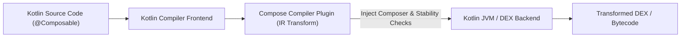

## Compose compiler는 BOM이 아니라 Kotlin compiler 흐름에 속한다

### 내부 메커니즘 (Internal Mechanism)
Compose Runtime 및 UI 라이브러리는 Compose BOM에 의해 버전이 관리되는 반면, **Compose Compiler Plugin**은 Kotlin 컴파일러의 IR (Intermediate Representation) 변환 플러그인이다.
Kotlin 2.0.0 이전에는 Kotlin 컴파일러 버전과 Compose Compiler 버전 간에 1:1 강한 결합(Strict Matrix)이 존재했으나, Kotlin 2.0.0부터 Compose Compiler가 JetBrains Kotlin 리포지토리로 이관되어 `org.jetbrains.kotlin.plugin.compose` Gradle 플러그인으로 통합되었다. Compose Compiler는 `@Composable` 함수에 런타임 추적 코드를 주입하고, 파라미터의 변경 가능성(Stability / Immutability)을 분석하여 불필요한 Recomposition을 건너뛰는(Restartable & Skippable) 코드를 바이트코드로 변환한다.



### 코드 예시 (build.gradle.kts)
```kotlin
// settings.gradle.kts / build.gradle.kts (Kotlin 2.0+)
plugins {
    alias(libs.plugins.kotlin.android)
    alias(libs.plugins.kotlin.compose) // Compose Compiler Gradle Plugin
}

android {
    buildFeatures {
        compose = true
    }
    // Kotlin 2.0+ 옵션 설정
    composeCompiler {
        enableStrongSkippingMode = true
        reportsDestination = layout.buildDirectory.dir("compose_compiler")
    }
}
```

### 관측 가능 증거 (Observable Evidence)
Compose Compiler 리포트 옵션을 활성화하면 컴파일 시점에 클래스/함수의 Stability 및 Skippable 여부가 리포트 파일로 출력된다:

```bash
./gradlew assembleRelease -Pplugin:androidx.compose.compiler.plugins.kotlin:reportsDestination=build/compose_reports

# Generated Report File: build/compose_reports/app_release-classes.txt
# Output Example:
# unskippable struct RowItem {
#   unstable val items: List<String>   <-- Unstable property triggers recomposition!
# }
# restartable skippable fun HeaderComponent(...)
```

관련 노트: [Compose BOM은 Compose 라이브러리 버전 집합을 관리한다](compose-bom-manages-compose-library-version-set.md), [의존성, 버전, CI 계약](dependency-ci-contracts.md)
