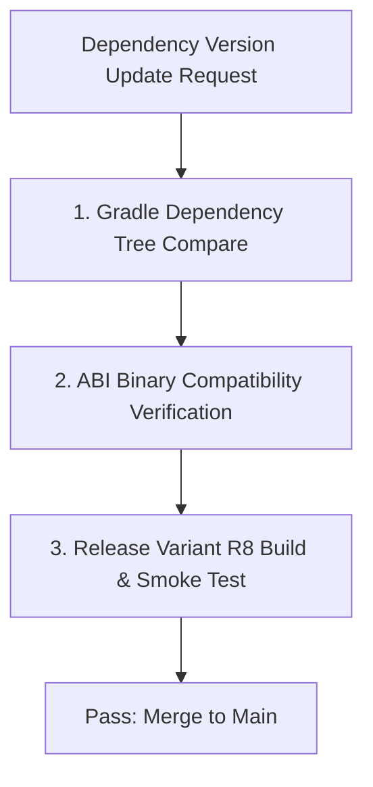

## 의존성 변경 체크리스트는 그래프, ABI, 테스트, 배포 위험을 함께 본다

상위 문서: [의존성, 버전, CI 계약](dependency-ci-contracts.md)

### 내부 메커니즘 (Internal Mechanism)
라이브러리 버전 업그레이드나 의존성 추가 시 단순 컴파일 성공 여부만 확인해서는 안 된다:
1. **Transitive Graph Drift**: 하위 전이 의존성의 버전 변경으로 인한 런타임 클래스 충돌(`NoSuchMethodError`) 검증.
2. **Binary Compatibility (ABI) Drift**: **ABI**(Application Binary Interface: 모듈 간 바이너리 수준 인터페이스 계약) 시그니처 변경으로 다른 모듈 컴파일 재수행 여부 검증. (Kotlin Binary Compatibility Validator 사용)
3. **R8 Keep Rule & Shrinking Risk**: 새 라이브러리가 포함하는 ProGuard 룰이 불필요한 클래스를 keep하거나 반대로 reflection 코드를 누락시켜 런타임 크래시를 유발하는지 확인.
4. **License & Security Audit**: 새로 유입된 전이 라이브러리의 보안 취약점(CVE) 및 라이선스 위반 검사.



### 코드 예시 (build.gradle.kts & Dependency Guard)
```kotlin
// build.gradle.kts (Dependency Guard or API Check)
plugins {
    id("com.dropbox.dependency-guard") version "0.4.3"
    id("org.jetbrains.kotlinx.binary-compatibility-validator") version "0.14.0"
}

dependencyGuard {
    configuration("releaseRuntimeClasspath") {
        allowedTypes = setOf(com.dropbox.dependencyguard.DependencyType.JAR, com.dropbox.dependencyguard.DependencyType.AAR)
    }
}
```

### 관측 가능 증거 (Observable Evidence)
의존성 변경으로 발생한 전이 의존성 차이를 CI 커맨드로 검증하고 디프를 관측할 수 있다:

```bash
# Dependency Guard 검증 (변경된 런타임 의존성이 미리 승인된 리스트와 다르면 실패)
./gradlew dependencyGuard

# ABI 검증 (Kotlin binary compatibility validator)
./gradlew apiCheck

# Output Example:
# > Task :app:dependencyGuard FAILED
# Dependency guard baseline mismatch for configuration 'releaseRuntimeClasspath':
# + com.squareup.okhttp3:okhttp:4.12.0
# - com.squareup.okhttp3:okhttp:4.11.0
```

관련 노트: [Gradle 의존성 관리는 요청 버전이 아니라 해석 그래프를 관리한다](gradle-dependency-management-controls-resolution-graph-not-requested-versions.md), [Android CI/CD 게이트는 빠른 검증과 릴리스 검증을 분리한다](android-cicd-gates-separate-fast-validation-and-release-validation.md)
