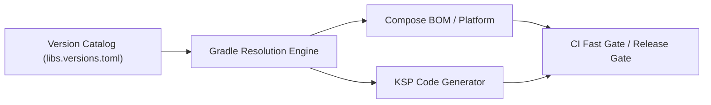

## 의존성, 버전, CI 계약

이 지도는 Gradle dependency resolution, version catalog (`libs.versions.toml`), Compose BOM 및 Compiler, KSP/kapt 코드 생성, kotlinx.serialization, 그리고 CI/CD 품질 게이트 운영 계약을 다룬다.



### 정본 노트
- [Gradle 의존성 관리는 요청 버전이 아니라 해석 그래프를 관리한다](gradle-dependency-management-controls-resolution-graph-not-requested-versions.md)
- [Version Catalog는 의존성 좌표와 플러그인 좌표의 이름표다](version-catalog-names-dependency-and-plugin-coordinates.md)
- [Compose BOM은 Compose 라이브러리 버전 집합을 관리한다](compose-bom-manages-compose-library-version-set.md)
- [Compose compiler는 BOM이 아니라 Kotlin compiler 흐름에 속한다](compose-compiler-belongs-to-kotlin-compiler-flow-not-bom.md)
- [KSP는 Kotlin-first 코드 생성이고 kapt는 유지보수 모드다](ksp-is-kotlin-first-code-generation-and-kapt-is-maintenance-mode.md)
- [kotlinx serialization은 컴파일러 플러그인과 런타임 포맷을 함께 요구한다](kotlinx-serialization-requires-compiler-plugin-and-runtime-format.md)
- [Android CI/CD 게이트는 빠른 검증과 릴리스 검증을 분리한다](android-cicd-gates-separate-fast-validation-and-release-validation.md)
- [의존성 변경 체크리스트는 그래프, ABI, 테스트, 배포 위험을 함께 본다](dependency-change-checklist-reviews-graph-abi-tests-and-release-risk.md)

관련 지도: [Gradle 빌드 계약](../../gradle/gradle-build-contracts/gradle-build-contracts.md), [Play 릴리스와 배포 계약](../../../distribution/release-distribution-contracts/release-distribution-contracts.md)

### 관측 가능 증거 (Observable Evidence)
```bash
# 의존성 그래프 및 충돌 분석
./gradlew app:dependencies --configuration releaseRuntimeClasspath
./gradlew app:dependencyInsight --dependency okhttp --configuration releaseRuntimeClasspath
```
