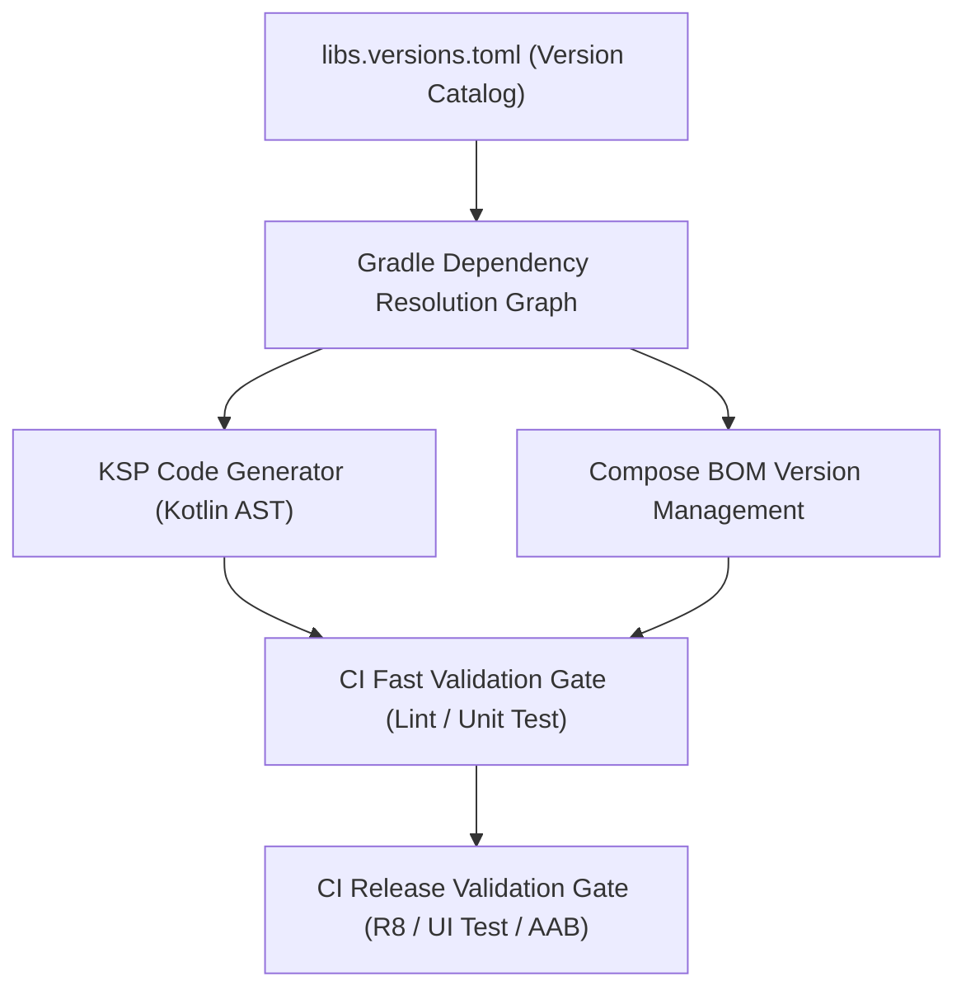

## 의존성 및 CI 계약

상위 문서: [Android 패키징과 배포 지도](../../../android-packaging-deployment.md)

### 개념 및 필요성 (What & Why)
**의존성 및 CI 계약(Dependency & CI Contracts)** 은 Android 프로젝트의 외부 서드파티 라이브러리 버저닝, 코드 생성 컴파일러 도구(KSP/KAPT), UI 프레임워크(Jetpack Compose) 제어, 그리고 빌드 파이프라인의 지속적 통합(CI) 검증 게이트를 통합 관리하는 핵심 규약이다.
안드로이드 개발 생태계는 빠르게 진화하며 라이브러리 간 의존성 그래프 충돌, ABI(Application Binary Interface) 하위 호환성 파괴, 코드 생성 도구의 빌드 성능 저하 문제 등이 빈번히 발생한다.
중앙집중화된 Version Catalog, KSP 중심 코드 생성, Compose BOM 기반버전 통제, 그리고 CI/CD 게이트 분리를 통해 빌드 재현 가능성(Reproducibility)과 검증 안정성을 확보한다.

### 내부 메커니즘 (How / Internal Mechanism)
1. **Version Catalog (`libs.versions.toml`)**: 모든 의존성과 플러그인의 좌표 및 버전을 단일 TOML 파일로 통합 선언하고 타입 세이프 접근자를 생성한다.
2. **KSP vs KAPT**: Java Stub 생성을 유발하는 유산 KAPT(Annotation Processing)를 배제하고, Kotlin AST(Abstract Syntax Tree) 분석 기반의 2~3배 빠르고 메타데이터 보존율이 높은 KSP(Kotlin Symbol Processing)를 적극 채택한다.
3. **Compose BOM vs Compose Compiler**: Compose 라이브러리 모듈 버전은 `compose-bom`에 위임하고, Kotlin 컴파일러 버전에 종속적인 `compose-compiler`는 독립 컴파일러 플러그인 또는 최신 AGP 내장 컴파일러 흐름으로 제어한다.
4. **Gradle Resolution Strategy**: 요청된 버전을 그대로 쓰지 않고 해소 그래프(Resolution Graph) 탐색 알고리즘에 의해 최상위 버전을 선택하거나 `strictly` 및 `force` 규칙으로 버전을 고정한다.
5. **CI/CD Gates 분리**: 빠른 PR 피드백을 위한 패스트 검증(Fast Validation)과 릴리스용 풀 체인 검증(Release Validation) 게이트를 분리 운영한다.



### 관련 세부 계약 문서
1. [Version catalog는 의존성과 플러그인 좌표를 명명한다](version-catalog-names-dependency-and-plugin-coordinates.md)
2. [Gradle 의존성 관리는 요청된 버전이 아니라 해소 그래프를 제어한다](gradle-dependency-management-controls-resolution-graph-not-requested-versions.md)
3. [KSP는 Kotlin 퍼스트 코드 생성이며 KAPT는 유지보수 모드다](ksp-is-kotlin-first-code-generation-and-kapt-is-maintenance-mode.md)
4. [Compose BOM은 Compose 라이브러리 버전 세트를 관리한다](compose-bom-manages-compose-library-version-set.md)
5. [Compose compiler는 BOM이 아니라 Kotlin 컴파일러 흐름에 속한다](compose-compiler-belongs-to-kotlin-compiler-flow-not-bom.md)
6. [kotlinx.serialization은 컴파일러 플러그인과 런타임 포맷이 모두 필요하다](kotlinx-serialization-requires-compiler-plugin-and-runtime-format.md)
7. [Android CI/CD 게이트는 빠른 검증과 릴리스 검증을 분리한다](android-cicd-gates-separate-fast-validation-and-release-validation.md)
8. [의존성 변경 체크리스트는 그래프, ABI, 테스트, 릴리스 위험을 검토한다](dependency-change-checklist-reviews-graph-abi-tests-and-release-risk.md)

### 관측 가능 증거 (Observable Evidence)
의존성 해소 결과 그래프와 KSP 생성 산출물은 다음 명령어로 관측 가능하다:
```bash
./gradlew app:dependencies
./gradlew app:kspDebugKotlin
```
