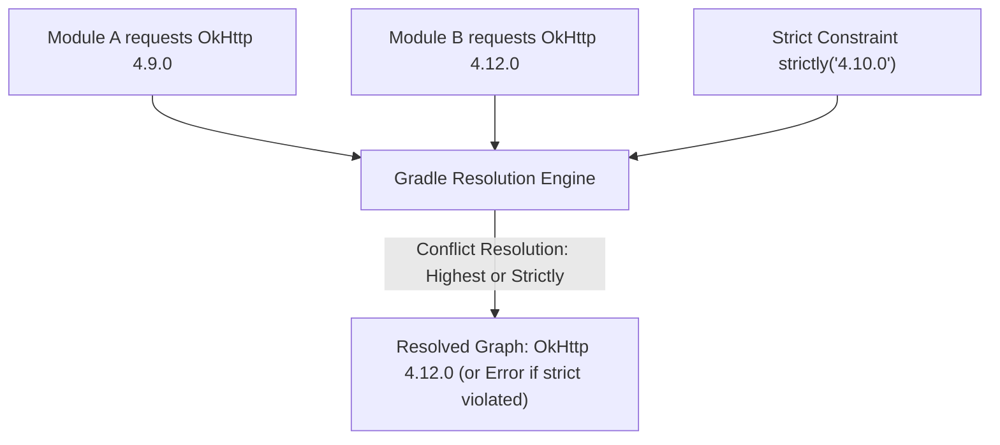

## Gradle 의존성 관리는 요청 버전이 아니라 해석 그래프를 관리한다

상위 문서: [의존성, 버전, CI 계약](dependency-ci-contracts.md)

### 내부 메커니즘 (Internal Mechanism)
Gradle의 **Dependency Resolution Engine**(의존성 그래프 해석 엔진)은 `build.gradle.kts`에 선언된 요청 버전(**Requested Version**)을 그대로 받아들이지 않는다.
대신 모든 직/간접 전이 의존성을 모아 최신 버전 우선 규칙(Highest Version Wins), 버전 제약조건(`strictly`, `require`, `reject`), 그리고 Capability Matching 및 Resolution Strategy를 거쳐 최종 해석된 그래프(**Resolved Graph**)를 구성한다.
따라서 특정 모듈에서 `okhttp:4.9.0`을 요청하더라도, 다른 의존성이 `okhttp:4.12.0`을 전이적으로 요구하면 Gradle은 전체 그래프의 okhttp 버전을 `4.12.0`으로 승격(Conflict Resolution)시킨다.



### 코드 예시 (build.gradle.kts)
```kotlin
// build.gradle.kts
dependencies {
    implementation("com.squareup.okhttp3:okhttp:4.9.0")
    
    // Strict Constraint 설정 (특정 버전으로 강제 제한)
    implementation("com.squareup.okhttp3:okhttp") {
        version {
            strictly("4.10.0")
        }
    }
}

// Global Resolution Strategy (특정 버전을 전역으로 강제 교체)
configurations.all {
    resolutionStrategy {
        force("org.jetbrains.kotlin:kotlin-reflect:1.9.22")
        failOnVersionConflict() // 버전 충돌 시 빌드 에러 유발
    }
}
```

### 관측 가능 증거 (Observable Evidence)
특정 라이브러리가 어떠한 경로로 해석되고 승격(Selection Reason)되었는지 `dependencyInsight` 태스크로 관측할 수 있다:

```bash
./gradlew app:dependencyInsight --dependency okhttp --configuration releaseRuntimeClasspath

# Output Example:
# com.squareup.okhttp3:okhttp:4.12.0 (selected by rule)
#   --- com.squareup.retrofit2:retrofit:2.9.0
#       \--- releaseRuntimeClasspath
# com.squareup.okhttp3:okhttp:4.9.0 -> 4.12.0 (conflict resolution)
```

관련 노트: [Version Catalog는 의존성 좌표와 플러그인 좌표의 이름표다](version-catalog-names-dependency-and-plugin-coordinates.md), [의존성, 버전, CI 계약](dependency-ci-contracts.md)
